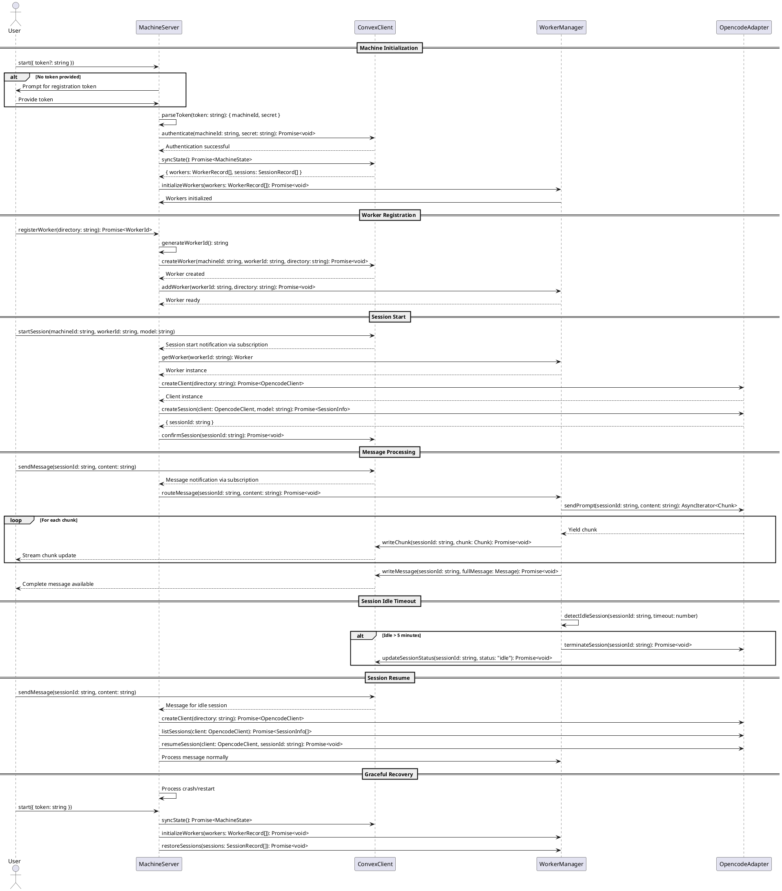

# Assistant Worker Runtime Codemap

## Title

Assistant Worker Runtime - Machine Process and Worker Management

## Description

The worker runtime is a Node.js application that runs on a user's local machine to orchestrate OpenCode assistants. It handles machine registration with Convex, manages multiple directory-bound workers (assistants), and processes chat sessions by spawning and managing OpenCode processes. The system is stateless and recovers all state from Convex using a machine token, enabling graceful failure recovery.

Key responsibilities:
- Machine registration and authentication with Convex backend
- Worker (assistant) lifecycle management per directory
- OpenCode process spawning and session management
- Real-time message processing via Convex subscriptions
- Dual-channel response streaming (chunks + full messages)
- Graceful recovery from crashes using Convex as source of truth

## Sequence Diagram



## Core Architecture (Clean Architecture)

The worker follows Clean Architecture principles with clear separation of concerns:

**Domain Layer** (Innermost)
- Pure business logic and entities
- No external dependencies
- Technology-agnostic

**Application Layer** (Use Cases)
- Application-specific business rules
- Orchestrates domain entities
- Defines interfaces for infrastructure

**Infrastructure Layer** (Adapters)
- External service implementations (Convex, OpenCode)
- Configuration management
- File system operations

**Presentation Layer** (Entry Point)
- CLI interface
- Server initialization
- User interaction

## Entry Point

- `services/worker/src/index.ts` - Main entry point and CLI
  - **Functions**:
    ```typescript
    main(): Promise<void>
    ```

- `services/worker/src/presentation/MachineServer.ts` - Server orchestrator class
  - **Functions**:
    ```typescript
    start(config: StartConfig): Promise<void>
    stop(): Promise<void>
    registerWorker(directory: string): Promise<WorkerId>
    getStatus(): MachineStatus
    ```

## Domain Layer

### Entities

- `services/worker/src/domain/entities/Machine.ts` - Machine aggregate root
  ```typescript
  export interface IMachine {
    readonly id: MachineId;
    readonly secret: MachineSecret;
    readonly rootDirectory: string;
    readonly status: MachineStatus;
    getToken(): MachineToken;
    isOnline(): boolean;
  }
  
  export class Machine implements IMachine {
    constructor(config: MachineConfig);
    getToken(): MachineToken;
    isOnline(): boolean;
  }
  ```

- `services/worker/src/domain/entities/Worker.ts` - Worker (Assistant) entity
  ```typescript
  export interface IWorker {
    readonly id: WorkerId;
    readonly machineId: MachineId;
    readonly directory: string;
    readonly sessions: Map<SessionId, ISession>;
    addSession(session: ISession): void;
    removeSession(sessionId: SessionId): void;
    getSession(sessionId: SessionId): ISession | undefined;
  }
  
  export class Worker implements IWorker {
    constructor(config: WorkerConfig);
    addSession(session: ISession): void;
    removeSession(sessionId: SessionId): void;
    getSession(sessionId: SessionId): ISession | undefined;
  }
  ```

- `services/worker/src/domain/entities/Session.ts` - Chat session entity
  ```typescript
  export interface ISession {
    readonly id: SessionId;
    readonly workerId: WorkerId;
    readonly model: string;
    status: SessionStatus;
    lastActivity: number;
    isIdle(timeout: number): boolean;
    updateActivity(): void;
  }
  
  export class Session implements ISession {
    constructor(config: SessionConfig);
    isIdle(timeout: number): boolean;
    updateActivity(): void;
  }
  ```

### Value Objects

- `services/worker/src/domain/valueObjects/MachineToken.ts` - Machine token value object
  ```typescript
  export class MachineToken {
    private constructor(
      private readonly machineId: string,
      private readonly secret: string
    );
    
    static create(machineId: string, secret: string): MachineToken;
    static parse(token: string): MachineToken;
    toString(): string;
    getMachineId(): string;
    getSecret(): string;
  }
  ```

- `services/worker/src/domain/valueObjects/Ids.ts` - ID types and generators
  ```typescript
  export type MachineId = string & { __brand: 'MachineId' };
  export type WorkerId = string & { __brand: 'WorkerId' };
  export type SessionId = string & { __brand: 'SessionId' };
  
  export function generateWorkerId(): WorkerId;
  export function validateMachineId(id: string): MachineId;
  export function validateWorkerId(id: string): WorkerId;
  export function validateSessionId(id: string): SessionId;
  ```

### Domain Interfaces

- `services/worker/src/domain/interfaces/IMachineRepository.ts` - Machine state persistence
  ```typescript
  export interface IMachineRepository {
    authenticate(machineId: MachineId, secret: MachineSecret): Promise<void>;
    syncState(): Promise<MachineState>;
    updateStatus(machineId: MachineId, status: MachineStatus): Promise<void>;
  }
  
  export interface MachineState {
    workers: WorkerRecord[];
    sessions: SessionRecord[];
  }
  ```

- `services/worker/src/domain/interfaces/IWorkerRepository.ts` - Worker management
  ```typescript
  export interface IWorkerRepository {
    create(machineId: MachineId, workerId: WorkerId, directory: string): Promise<void>;
    list(machineId: MachineId): Promise<WorkerRecord[]>;
    updateStatus(workerId: WorkerId, status: WorkerStatus): Promise<void>;
  }
  
  export interface WorkerRecord {
    workerId: WorkerId;
    machineId: MachineId;
    directory: string;
    status: WorkerStatus;
  }
  ```

- `services/worker/src/domain/interfaces/ISessionRepository.ts` - Session management
  ```typescript
  export interface ISessionRepository {
    confirm(sessionId: SessionId, workerId: WorkerId): Promise<void>;
    updateStatus(sessionId: SessionId, status: SessionStatus): Promise<void>;
    writeChunk(sessionId: SessionId, chunk: MessageChunk): Promise<void>;
    writeMessage(sessionId: SessionId, message: ChatMessage): Promise<void>;
  }
  
  export interface SessionRecord {
    sessionId: SessionId;
    workerId: WorkerId;
    model: string;
    status: SessionStatus;
    createdAt: number;
  }
  
  export interface MessageChunk {
    content: string;
    index: number;
    timestamp: number;
  }
  
  export interface ChatMessage {
    id: string;
    role: 'user' | 'assistant' | 'system';
    content: string;
    timestamp: number;
  }
  ```

- `services/worker/src/domain/interfaces/IOpencodeClient.ts` - OpenCode SDK abstraction
  ```typescript
  export interface IOpencodeClient {
    createClient(directory: string): Promise<IOpencode>;
    createSession(client: IOpencode, model: string): Promise<SessionInfo>;
    listSessions(client: IOpencode): Promise<SessionInfo[]>;
    resumeSession(client: IOpencode, sessionId: SessionId): Promise<void>;
    sendPrompt(
      client: IOpencode,
      sessionId: SessionId,
      content: string
    ): AsyncIterator<string>;
    terminateSession(client: IOpencode, sessionId: SessionId): Promise<void>;
  }
  
  export interface IOpencode {
    // Opaque type representing OpenCode client instance
    readonly __brand: 'OpencodeClient';
  }
  
  export interface SessionInfo {
    sessionId: SessionId;
    model: string;
    status: string;
    createdAt: number;
  }
  ```

- `services/worker/src/domain/interfaces/IEventSubscriber.ts` - Convex subscription abstraction
  ```typescript
  export interface IEventSubscriber {
    subscribeToMessages(
      machineId: MachineId,
      handler: MessageHandler
    ): Promise<Subscription>;
    subscribeToSessions(
      machineId: MachineId,
      handler: SessionHandler
    ): Promise<Subscription>;
  }
  
  export interface Subscription {
    unsubscribe(): Promise<void>;
  }
  
  export type MessageHandler = (event: MessageEvent) => Promise<void>;
  export type SessionHandler = (event: SessionEvent) => Promise<void>;
  
  export interface MessageEvent {
    sessionId: SessionId;
    content: string;
    timestamp: number;
  }
  
  export interface SessionEvent {
    type: 'start' | 'end';
    sessionId: SessionId;
    workerId: WorkerId;
    model?: string;
  }
  ```

## Application Layer (Use Cases)

- `services/worker/src/application/usecases/StartMachine.ts` - Machine initialization use case
  ```typescript
  export interface IStartMachineUseCase {
    execute(input: StartMachineInput): Promise<StartMachineOutput>;
  }
  
  export interface StartMachineInput {
    token?: string;
  }
  
  export interface StartMachineOutput {
    machineId: MachineId;
    status: MachineStatus;
    workerCount: number;
  }
  
  export class StartMachineUseCase implements IStartMachineUseCase {
    constructor(
      private readonly machineRepo: IMachineRepository,
      private readonly workerRepo: IWorkerRepository,
      private readonly subscriber: IEventSubscriber
    );
    
    execute(input: StartMachineInput): Promise<StartMachineOutput>;
  }
  ```

- `services/worker/src/application/usecases/RegisterWorker.ts` - Worker registration use case
  ```typescript
  export interface IRegisterWorkerUseCase {
    execute(input: RegisterWorkerInput): Promise<RegisterWorkerOutput>;
  }
  
  export interface RegisterWorkerInput {
    machineId: MachineId;
    directory: string;
  }
  
  export interface RegisterWorkerOutput {
    workerId: WorkerId;
    directory: string;
  }
  
  export class RegisterWorkerUseCase implements IRegisterWorkerUseCase {
    constructor(private readonly workerRepo: IWorkerRepository);
    
    execute(input: RegisterWorkerInput): Promise<RegisterWorkerOutput>;
  }
  ```

- `services/worker/src/application/usecases/ProcessMessage.ts` - Message processing use case
  ```typescript
  export interface IProcessMessageUseCase {
    execute(input: ProcessMessageInput): Promise<ProcessMessageOutput>;
  }
  
  export interface ProcessMessageInput {
    sessionId: SessionId;
    content: string;
  }
  
  export interface ProcessMessageOutput {
    messageId: string;
    chunksWritten: number;
  }
  
  export class ProcessMessageUseCase implements IProcessMessageUseCase {
    constructor(
      private readonly sessionRepo: ISessionRepository,
      private readonly opencodeClient: IOpencodeClient
    );
    
    execute(input: ProcessMessageInput): Promise<ProcessMessageOutput>;
  }
  ```

- `services/worker/src/application/usecases/ManageSessionLifecycle.ts` - Session lifecycle management
  ```typescript
  export interface IManageSessionLifecycleUseCase {
    startSession(input: StartSessionInput): Promise<StartSessionOutput>;
    resumeSession(input: ResumeSessionInput): Promise<ResumeSessionOutput>;
    checkIdleSessions(): Promise<void>;
  }
  
  export interface StartSessionInput {
    workerId: WorkerId;
    model: string;
  }
  
  export interface StartSessionOutput {
    sessionId: SessionId;
  }
  
  export interface ResumeSessionInput {
    sessionId: SessionId;
    workerId: WorkerId;
  }
  
  export interface ResumeSessionOutput {
    restored: boolean;
  }
  
  export class ManageSessionLifecycleUseCase implements IManageSessionLifecycleUseCase {
    constructor(
      private readonly sessionRepo: ISessionRepository,
      private readonly opencodeClient: IOpencodeClient,
      private readonly idleTimeout: number = 300000 // 5 minutes
    );
    
    startSession(input: StartSessionInput): Promise<StartSessionOutput>;
    resumeSession(input: ResumeSessionInput): Promise<ResumeSessionOutput>;
    checkIdleSessions(): Promise<void>;
  }
  ```

## Infrastructure Layer

### Convex Adapter

- `services/worker/src/infrastructure/convex/ConvexMachineRepository.ts` - Convex machine persistence
  ```typescript
  export class ConvexMachineRepository implements IMachineRepository {
    constructor(private readonly client: ConvexReactClient);
    
    authenticate(machineId: MachineId, secret: MachineSecret): Promise<void>;
    syncState(): Promise<MachineState>;
    updateStatus(machineId: MachineId, status: MachineStatus): Promise<void>;
  }
  ```

- `services/worker/src/infrastructure/convex/ConvexWorkerRepository.ts` - Convex worker persistence
  ```typescript
  export class ConvexWorkerRepository implements IWorkerRepository {
    constructor(private readonly client: ConvexReactClient);
    
    create(machineId: MachineId, workerId: WorkerId, directory: string): Promise<void>;
    list(machineId: MachineId): Promise<WorkerRecord[]>;
    updateStatus(workerId: WorkerId, status: WorkerStatus): Promise<void>;
  }
  ```

- `services/worker/src/infrastructure/convex/ConvexSessionRepository.ts` - Convex session persistence
  ```typescript
  export class ConvexSessionRepository implements ISessionRepository {
    constructor(private readonly client: ConvexReactClient);
    
    confirm(sessionId: SessionId, workerId: WorkerId): Promise<void>;
    updateStatus(sessionId: SessionId, status: SessionStatus): Promise<void>;
    writeChunk(sessionId: SessionId, chunk: MessageChunk): Promise<void>;
    writeMessage(sessionId: SessionId, message: ChatMessage): Promise<void>;
  }
  ```

- `services/worker/src/infrastructure/convex/ConvexEventSubscriber.ts` - Convex real-time subscriptions
  ```typescript
  export class ConvexEventSubscriber implements IEventSubscriber {
    constructor(private readonly client: ConvexReactClient);
    
    subscribeToMessages(
      machineId: MachineId,
      handler: MessageHandler
    ): Promise<Subscription>;
    
    subscribeToSessions(
      machineId: MachineId,
      handler: SessionHandler
    ): Promise<Subscription>;
  }
  ```

### OpenCode Adapter

- `services/worker/src/infrastructure/opencode/OpencodeClientAdapter.ts` - OpenCode SDK wrapper
  ```typescript
  export class OpencodeClientAdapter implements IOpencodeClient {
    createClient(directory: string): Promise<IOpencode>;
    createSession(client: IOpencode, model: string): Promise<SessionInfo>;
    listSessions(client: IOpencode): Promise<SessionInfo[]>;
    resumeSession(client: IOpencode, sessionId: SessionId): Promise<void>;
    sendPrompt(
      client: IOpencode,
      sessionId: SessionId,
      content: string
    ): AsyncIterator<string>;
    terminateSession(client: IOpencode, sessionId: SessionId): Promise<void>;
  }
  ```

### Configuration

- `services/worker/src/infrastructure/config/WorkerConfig.ts` - Configuration management
  ```typescript
  export interface WorkerConfiguration {
    convex: {
      url: string;
    };
    machine: {
      idleTimeout: number;
      syncInterval: number;
    };
    storage: {
      configPath: string;
    };
  }
  
  export class ConfigLoader {
    static load(): WorkerConfiguration;
    static save(config: Partial<WorkerConfiguration>): void;
  }
  ```

- `services/worker/src/infrastructure/config/StorageAdapter.ts` - Local storage for machine token
  ```typescript
  export interface IStorageAdapter {
    saveToken(token: MachineToken): Promise<void>;
    loadToken(): Promise<MachineToken | null>;
    deleteToken(): Promise<void>;
  }
  
  export class FileStorageAdapter implements IStorageAdapter {
    constructor(private readonly configPath: string);
    
    saveToken(token: MachineToken): Promise<void>;
    loadToken(): Promise<MachineToken | null>;
    deleteToken(): Promise<void>;
  }
  ```

## Testing Strategy

### Unit Tests (High Coverage Required)

- `services/worker/src/__tests__/domain/entities/` - Entity tests
  - `Machine.test.ts` - Machine entity behavior
  - `Worker.test.ts` - Worker entity behavior
  - `Session.test.ts` - Session entity and idle detection

- `services/worker/src/__tests__/domain/valueObjects/` - Value object tests
  - `MachineToken.test.ts` - Token parsing and validation
  - `Ids.test.ts` - ID generation and validation

- `services/worker/src/__tests__/application/usecases/` - Use case tests (with mocks)
  - `StartMachine.test.ts` - Machine startup logic
  - `RegisterWorker.test.ts` - Worker registration
  - `ProcessMessage.test.ts` - Message processing flow
  - `ManageSessionLifecycle.test.ts` - Session lifecycle

### Integration Tests

- `services/worker/src/__tests__/integration/` - Integration tests
  - `ConvexRepositories.test.ts` - Test Convex repository implementations
  - `OpencodeAdapter.test.ts` - Test OpenCode SDK integration
  - `EventSubscription.test.ts` - Test Convex subscriptions

### E2E Tests

- `services/worker/src/__tests__/e2e/` - End-to-end scenarios
  - `MachineRegistration.test.ts` - Full registration flow
  - `SessionLifecycle.test.ts` - Start, process, idle, resume
  - `CrashRecovery.test.ts` - State recovery from Convex

## Project Setup Files

- `services/worker/package.json` - Dependencies and scripts
  ```json
  {
    "name": "@opencode-orchestrator/worker",
    "version": "0.1.0",
    "type": "module",
    "scripts": {
      "start": "tsx src/index.ts",
      "dev": "tsx watch src/index.ts",
      "test": "vitest",
      "test:coverage": "vitest --coverage",
      "build": "tsc",
      "lint": "biome check src/",
      "lint:fix": "biome check --write src/"
    },
    "dependencies": {
      "@opencode-ai/sdk": "latest",
      "convex": "^1.0.0",
      "nanoid": "^5.0.0",
      "dotenv": "^16.0.0"
    },
    "devDependencies": {
      "@types/node": "^20.0.0",
      "typescript": "^5.0.0",
      "tsx": "^4.0.0",
      "vitest": "^1.0.0",
      "@vitest/coverage-v8": "^1.0.0"
    }
  }
  ```

- `services/worker/tsconfig.json` - TypeScript configuration
  ```json
  {
    "compilerOptions": {
      "target": "ES2022",
      "module": "ESNext",
      "moduleResolution": "bundler",
      "strict": true,
      "esModuleInterop": true,
      "skipLibCheck": true,
      "forceConsistentCasingInFileNames": true,
      "resolveJsonModule": true,
      "outDir": "./dist",
      "rootDir": "./src",
      "paths": {
        "@domain/*": ["./src/domain/*"],
        "@application/*": ["./src/application/*"],
        "@infrastructure/*": ["./src/infrastructure/*"],
        "@presentation/*": ["./src/presentation/*"]
      }
    },
    "include": ["src/**/*"],
    "exclude": ["node_modules", "dist", "**/*.test.ts"]
  }
  ```

- `services/worker/vitest.config.ts` - Test configuration
  ```typescript
  import { defineConfig } from 'vitest/config';
  import path from 'path';
  
  export default defineConfig({
    test: {
      globals: true,
      environment: 'node',
      coverage: {
        provider: 'v8',
        reporter: ['text', 'json', 'html'],
        include: ['src/**/*.ts'],
        exclude: [
          'src/**/*.test.ts',
          'src/**/__tests__/**',
          'src/index.ts'
        ],
        thresholds: {
          lines: 80,
          functions: 80,
          branches: 80,
          statements: 80
        }
      }
    },
    resolve: {
      alias: {
        '@domain': path.resolve(__dirname, './src/domain'),
        '@application': path.resolve(__dirname, './src/application'),
        '@infrastructure': path.resolve(__dirname, './src/infrastructure'),
        '@presentation': path.resolve(__dirname, './src/presentation')
      }
    }
  });
  ```

- `services/worker/.env.example` - Environment variables template
  ```
  CONVEX_URL=https://your-convex-deployment.convex.cloud
  MACHINE_TOKEN=
  ROOT_DIRECTORY=
  IDLE_TIMEOUT=300000
  ```

- `services/worker/README.md` - Worker documentation
  - Installation instructions
  - Configuration guide
  - Development setup
  - Testing guide
  - Architecture overview

## Directory Structure

```
services/worker/
├── src/
│   ├── index.ts                           # Entry point
│   ├── domain/                            # Domain layer (business logic)
│   │   ├── entities/                      # Domain entities
│   │   │   ├── Machine.ts
│   │   │   ├── Worker.ts
│   │   │   └── Session.ts
│   │   ├── valueObjects/                  # Value objects
│   │   │   ├── MachineToken.ts
│   │   │   └── Ids.ts
│   │   └── interfaces/                    # Port interfaces
│   │       ├── IMachineRepository.ts
│   │       ├── IWorkerRepository.ts
│   │       ├── ISessionRepository.ts
│   │       ├── IOpencodeClient.ts
│   │       └── IEventSubscriber.ts
│   ├── application/                       # Application layer (use cases)
│   │   └── usecases/
│   │       ├── StartMachine.ts
│   │       ├── RegisterWorker.ts
│   │       ├── ProcessMessage.ts
│   │       └── ManageSessionLifecycle.ts
│   ├── infrastructure/                    # Infrastructure layer (adapters)
│   │   ├── convex/                        # Convex implementations
│   │   │   ├── ConvexMachineRepository.ts
│   │   │   ├── ConvexWorkerRepository.ts
│   │   │   ├── ConvexSessionRepository.ts
│   │   │   └── ConvexEventSubscriber.ts
│   │   ├── opencode/                      # OpenCode implementations
│   │   │   └── OpencodeClientAdapter.ts
│   │   └── config/                        # Configuration
│   │       ├── WorkerConfig.ts
│   │       └── StorageAdapter.ts
│   ├── presentation/                      # Presentation layer
│   │   └── MachineServer.ts               # Main server class
│   └── __tests__/                         # Tests
│       ├── domain/
│       │   ├── entities/
│       │   └── valueObjects/
│       ├── application/
│       │   └── usecases/
│       ├── integration/
│       └── e2e/
├── package.json
├── tsconfig.json
├── vitest.config.ts
├── .env.example
└── README.md
```

## Implementation Notes

### Key Design Decisions

1. **Clean Architecture**: Strict separation of concerns with dependency inversion
2. **Stateless Design**: All state recoverable from Convex using machine token
3. **Test-Driven**: High coverage requirement (80%+ for all layers)
4. **Type Safety**: Branded types for IDs, strict TypeScript configuration
5. **Graceful Recovery**: Automatic state restoration on restart

### Next Steps for Implementation

1. [ ] Initialize project with package.json and dependencies
2. [ ] Set up TypeScript configuration with path aliases
3. [ ] Configure Vitest with coverage thresholds
4. [ ] Create domain layer interfaces and entities (TDD approach)
5. [ ] Implement value objects with comprehensive tests
6. [ ] Build application layer use cases with mocked dependencies
7. [ ] Implement infrastructure adapters (Convex, OpenCode)
8. [ ] Create presentation layer (MachineServer class)
9. [ ] Develop CLI entry point
10. [ ] Write integration and E2E tests
11. [ ] Document API and usage patterns

### Future Enhancements (Out of Scope)

- Web UI for worker management
- Health check endpoints
- Metrics and monitoring
- Worker auto-discovery
- Distributed tracing

