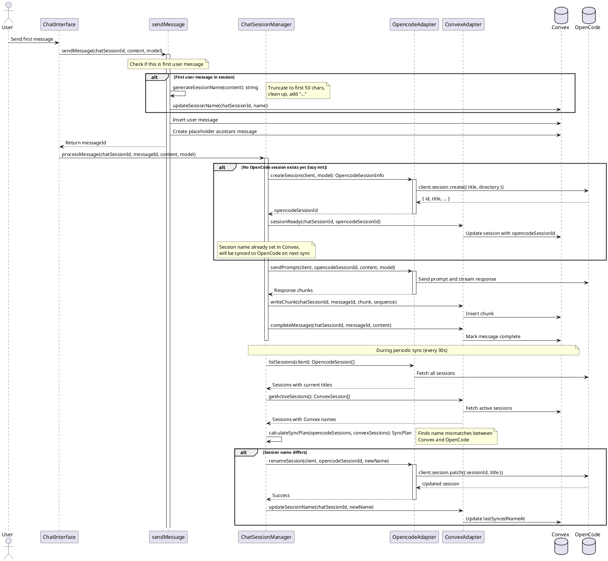

# Auto Session Naming Codemap

## Title

Automatic Session Naming from First User Prompt

## Description

Automatically generates and sets session names based on the first message sent by the user. When a user creates a new session and sends their first prompt, the system:
1. Generates a meaningful name from the prompt content (truncated summary)
2. Updates the session name in Convex immediately
3. Updates the session name in OpenCode via the rename API (when OpenCode session is created)

This replaces the default timestamp-based names with contextual, user-friendly titles.

## Sequence Diagram



## Key Implementation Points

### 1. Name Generation Strategy
- Take first 50 characters of user prompt
- Remove newlines and extra whitespace
- Add "..." suffix if truncated
- Fallback to "New Chat" if empty

### 2. Dual Update Flow
- **Convex**: Updated immediately when first message is sent (synchronous)
- **OpenCode**: Synced during next periodic sync cycle (asynchronous)

### 3. OpenCode Session Creation
- Sessions are created lazily on first message
- Initial OpenCode session gets default timestamp title
- Name is updated to user's prompt on next sync cycle (happens within 30s)

### 4. Sync Reconciliation
- Sync process detects name mismatches between Convex and OpenCode
- Convex is source of truth for user-generated names
- OpenCode sessions are updated to match Convex

## Frontend Files

### Components

- `apps/webapp/src/modules/assistant/components/ChatInterface.tsx`
  - Triggers `sendMessage` with user content
  - No direct changes needed (existing flow handles this)

### Service Layer

- `apps/webapp/src/modules/assistant/hooks/useAssistantChat.ts`
  - Uses `sendMessageMutation` to send messages
  - No changes needed (existing implementation)

## Backend Files

### Convex Mutations

- `services/backend/convex/chat.ts`
  - **Functions**:
    ```typescript
    sendMessage(args: SendMessageArgs): Promise<string>
    updateSessionName(args: UpdateSessionNameArgs): Promise<boolean>
    ```

### Worker Service

- `services/worker/src/application/ChatSessionManager.ts`
  - Handles message processing and OpenCode session creation
  - No changes needed (existing lazy initialization works)

- `services/worker/src/application/OpencodeConvexSync.ts`
  - Syncs session names between OpenCode and Convex
  - Uses existing sync infrastructure

- `services/worker/src/infrastructure/opencode/OpencodeClientAdapter.ts`
  - **New method needed**: `renameSession()`
  - Wraps OpenCode SDK session rename API

- `services/worker/src/infrastructure/convex/ConvexClientAdapter.ts`
  - Already has: `updateSessionName(chatSessionId, name)`

## Contracts

### Backend Function Signatures

```typescript
// From services/backend/convex/chat.ts

export interface SendMessageArgs {
  sessionId: string;
  chatSessionId: string;
  content: string;
  model: string;
}

export const sendMessage = mutation({
  args: {
    ...SessionIdArg,
    chatSessionId: v.string(),
    content: v.string(),
    model: v.string(),
  },
  handler: async (ctx, args): Promise<string> => {
    // Check if this is the first user message
    // If yes, generate and set session name
    // Create user message
    // Create placeholder assistant message
    // Return assistant message ID
  },
});

export interface UpdateSessionNameArgs {
  chatSessionId: string;
  name: string;
}

export const updateSessionName = mutation({
  args: {
    chatSessionId: v.string(),
    name: v.string(),
  },
  handler: async (ctx, args): Promise<boolean> => {
    // Find session
    // Skip if name unchanged
    // Update session name and lastSyncedNameAt
    // Return true if updated
  },
});
```

### Worker Interface Extensions

```typescript
// From services/worker/src/domain/interfaces/IOpencodeClient.ts

export interface IOpencodeClient {
  // ... existing methods ...
  
  /**
   * Rename/update a session title.
   * @param client - OpenCode client instance
   * @param sessionId - Session ID to rename
   * @param title - New session title
   */
  renameSession(
    client: IOpencodeInstance,
    sessionId: string,
    title: string
  ): Promise<void>;
}
```

### Session Name Generation

```typescript
// Utility function to add to chat.ts

/**
 * Generate a session name from user prompt.
 * Takes first 50 characters, cleans whitespace, adds "..." if truncated.
 */
function generateSessionName(prompt: string): string {
  const cleaned = prompt.trim().replace(/\s+/g, ' ');
  if (cleaned.length === 0) {
    return 'New Chat';
  }
  if (cleaned.length <= 50) {
    return cleaned;
  }
  return cleaned.substring(0, 50).trim() + '...';
}
```

## Backend Schema

```typescript
// From services/backend/convex/schema.ts

chatSessions: defineTable({
  sessionId: v.string(),
  opencodeSessionId: v.optional(v.string()),
  name: v.optional(v.string()), // Session name/title (user-generated or auto-generated)
  lastSyncedNameAt: v.optional(v.number()), // When session name was last synced from OpenCode
  workerId: v.string(),
  userId: v.id('users'),
  model: v.optional(v.string()),
  status: v.union(v.literal('active'), v.literal('inactive')),
  createdAt: v.number(),
  lastActivity: v.number(),
  deletedAt: v.optional(v.number()),
  deletedInOpencode: v.optional(v.boolean()),
  syncedFromOpencode: v.optional(v.boolean()),
})
  .index('by_session_id', ['sessionId'])
  .index('by_opencode_session_id', ['opencodeSessionId'])
  // ... other indexes
```

## Implementation Steps

### Step 1: Add Name Generation to `sendMessage`

**File**: `services/backend/convex/chat.ts`

1. After verifying session exists, check if this is the first user message:
   ```typescript
   // Count existing user messages in this session
   const existingUserMessages = await ctx.db
     .query('chatMessages')
     .withIndex('by_session_id', (q) => q.eq('sessionId', args.chatSessionId))
     .filter((q) => q.eq(q.field('role'), 'user'))
     .collect();
   
   // If this is the first user message, generate and set session name
   if (existingUserMessages.length === 0) {
     const sessionName = generateSessionName(args.content);
     await ctx.db.patch(session._id, {
       name: sessionName,
       lastActivity: timestamp,
     });
   }
   ```

2. Add helper function at top of file:
   ```typescript
   function generateSessionName(prompt: string): string {
     const cleaned = prompt.trim().replace(/\s+/g, ' ');
     if (cleaned.length === 0) {
       return 'New Chat';
     }
     if (cleaned.length <= 50) {
       return cleaned;
     }
     return cleaned.substring(0, 50).trim() + '...';
   }
   ```

### Step 2: Add OpenCode Rename API

**File**: `services/worker/src/infrastructure/opencode/OpencodeClientAdapter.ts`

Add new method to `OpencodeClientAdapter` class:

```typescript
/**
 * Rename/update a session title in OpenCode.
 *
 * @param client - OpenCode client instance
 * @param sessionId - Session ID to rename
 * @param title - New session title
 * @throws Error if rename fails
 */
async renameSession(
  client: IOpencodeInstance,
  sessionId: string,
  title: string
): Promise<void> {
  try {
    const instance = client as OpencodeInstanceInternal;
    const sdkClient = instance._internal.client;

    // SDK: client.session.patch({ body: { sessionId, title? } })
    await sdkClient.session.patch({
      body: {
        sessionId,
        title,
      },
    });

    console.log(`✅ Renamed OpenCode session ${sessionId} to: ${title}`);
  } catch (error) {
    throw new Error(
      `Failed to rename OpenCode session: ${error instanceof Error ? error.message : String(error)}`
    );
  }
}
```

### Step 3: Update Sync to Rename OpenCode Sessions

**File**: `services/worker/src/application/OpencodeConvexSync.ts`

The existing sync logic already handles name updates via `calculateSyncPlan`. We need to ensure it calls the OpenCode rename API:

In `executeSync` function, when processing name updates:

```typescript
// Apply name updates
for (const update of plan.nameUpdates) {
  try {
    // Update in Convex first (already done - updates lastSyncedNameAt)
    await deps.updateSessionName(update.chatSessionId, update.newName);
    
    // NEW: Update in OpenCode if we have the opencodeSessionId
    const convexSession = convexSessions.find(s => s.chatSessionId === update.chatSessionId);
    if (convexSession?.opencodeSessionId) {
      await deps.renameOpenCodeSession(convexSession.opencodeSessionId, update.newName);
    }
    
    result.nameUpdatesApplied++;
  } catch (error) {
    // ... error handling
  }
}
```

Add new dependency to `SyncDependencies`:

```typescript
export interface SyncDependencies {
  fetchOpencodeSessions: () => Promise<OpencodeSession[]>;
  fetchConvexSessions: () => Promise<ConvexSession[]>;
  updateSessionName: (chatSessionId: ChatSessionId, name: string) => Promise<void>;
  markSessionDeleted: (chatSessionId: ChatSessionId) => Promise<void>;
  createSyncedSession: (opencodeSessionId: OpencodeSessionId, model: string, name?: string) => Promise<ChatSessionId>;
  updateLastSyncTimestamp: (timestamp: number) => Promise<void>;
  renameOpenCodeSession: (opencodeSessionId: OpencodeSessionId, title: string) => Promise<void>; // NEW
}
```

### Step 4: Wire Up Sync Dependencies

**Note**: The sync infrastructure exists and is tested (`executeSync` in `OpencodeConvexSync.ts`), but is not yet actively called in production. When the sync is integrated into the worker lifecycle, the dependency should be wired up as follows:

**File**: `services/worker/src/application/ChatSessionManager.ts` (or wherever sync is invoked)

In the sync method, add the new dependency:

```typescript
const syncResult = await executeSync({
  // ... existing dependencies ...
  renameOpenCodeSession: async (opencodeSessionId, title) => {
    if (!this.opencodeClient) {
      throw new Error('OpenCode client not initialized');
    }
    await this.opencodeAdapter.renameSession(
      this.opencodeClient,
      opencodeSessionId,
      title
    );
  },
});
```

**Current State**: The `renameOpenCodeSession` dependency has been:
- ✅ Added to `SyncDependencies` interface
- ✅ Integrated into `executeSync` logic
- ✅ Added to test script (`test-sync-idempotency.ts`)
- ⏳ Ready to be wired up when sync is integrated into production

### Step 5: Update Interface Definition

**File**: `services/worker/src/domain/interfaces/IOpencodeClient.ts`

Add method signature to `IOpencodeClient` interface:

```typescript
export interface IOpencodeClient {
  // ... existing methods ...
  
  /**
   * Rename/update a session title.
   *
   * @param client - OpenCode client instance
   * @param sessionId - Session ID to rename
   * @param title - New session title
   * @throws Error if rename fails
   */
  renameSession(
    client: IOpencodeInstance,
    sessionId: string,
    title: string
  ): Promise<void>;
}
```

## Testing Considerations

### Manual Testing Flow

1. Start a new chat session
2. Send first message: "Help me build a React component"
3. Verify:
   - Session list shows "Help me build a React component..." as title
   - Convex database has `name` field set
   - After ~30s, OpenCode session also has matching title

### Edge Cases

1. **Empty prompt**: Should default to "New Chat"
2. **Very long prompt**: Should truncate to 50 chars with "..."
3. **Whitespace-only prompt**: Should default to "New Chat"
4. **Multi-line prompt**: Should collapse to single line with spaces
5. **Session created in OpenCode directly**: Keeps OpenCode's name (Convex name stays empty)
6. **Sync conflict**: Convex name wins (source of truth for UI-created sessions)

## Future Enhancements

1. **AI-powered name generation**: Use LLM to generate semantic titles
2. **User manual rename**: Allow users to edit session names from UI
3. **Name update notification**: Show toast when session is auto-named
4. **Localization**: Support non-English session names
5. **Name history**: Track name changes for audit trail

