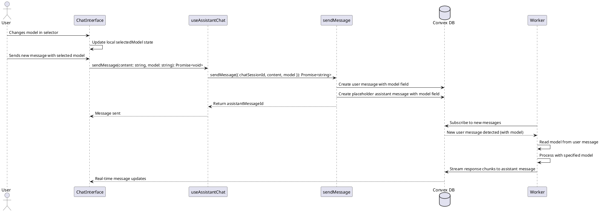

# Dynamic Model Selector Codemap

## Title

Dynamic Model Selection with Per-Message Model Tracking

## Description

Allows users to switch AI models mid-conversation without ending their current chat session. Each message stores the model that was requested by the user, providing a complete audit trail of which model was used for each interaction. This enables model switching at any time while maintaining full history of model choices.

## Sequence Diagram



## Frontend Entry Point / Route

- `apps/webapp/src/app/page.tsx` - Main chat interface page
  - No URL parameters related to model selection
  - Model is stored in session database record

## Frontend Components

- `apps/webapp/src/modules/assistant/components/ChatInterface.tsx` - Main chat interface
  - Manages model selection state
  - Calls model update when user changes selection
- `apps/webapp/src/modules/assistant/components/ChatInputWithModel.tsx` - Chat input with model selector
  - Contains the ModelSelector component
  - **Change**: Remove `hasActiveSession` from disabled condition for ModelSelector
- `apps/webapp/src/modules/assistant/components/ModelSelector.tsx` - Model dropdown selector
  - Remains unchanged (already supports dynamic selection)

## Frontend Service Layer

- `apps/webapp/src/modules/assistant/hooks/useAssistantChat.ts` - Chat session management hook
  - **New Function**:
    ```typescript
    updateModel(model: string): Promise<void>
    ```
  - **Updated Return Type**:
    ```typescript
    export interface AssistantChatReturn {
      session: SessionData | null;
      startSession: (model: string) => Promise<string | undefined>;
      restoreSession: (sessionId: string) => void;
      endSession: () => Promise<void>;
      clearSession: () => void;
      sendMessage: (content: string) => Promise<void>;
      updateModel: (model: string) => Promise<void>; // NEW
      messages: Message[];
      isLoading: boolean;
    }
    ```

## Backend Function Entry Point

- `services/backend/convex/chat.ts` - Chat session management
  - **New Function**:
    ```typescript
    export const updateSessionModel = mutation({
      args: {
        ...SessionIdArg,
        chatSessionId: v.string(),
        model: v.string(),
      },
      handler: async (ctx, args): Promise<void> => {
        // Implementation
      },
    });
    ```

### Contracts

```typescript
// From services/backend/convex/chat.ts

/**
 * Update the AI model for an active chat session.
 * Allows users to switch models mid-conversation.
 * 
 * @param chatSessionId - Session to update
 * @param model - New AI model to use (e.g., "claude-sonnet-4-5", "gpt-4")
 */
export const updateSessionModel = mutation({
  args: {
    ...SessionIdArg,
    chatSessionId: v.string(),
    model: v.string(),
  },
  handler: async (ctx, args): Promise<void> => {
    // Verify user is authenticated
    // Find session by chatSessionId
    // Verify user owns the session
    // Verify session is active
    // Update session.model
    // Update session.lastActivity
  },
});
```

```typescript
// From apps/webapp/src/modules/assistant/hooks/useAssistantChat.ts

export interface AssistantChatReturn {
  session: SessionData | null;
  startSession: (model: string) => Promise<string | undefined>;
  restoreSession: (sessionId: string) => void;
  endSession: () => Promise<void>;
  clearSession: () => void;
  sendMessage: (content: string) => Promise<void>;
  updateModel: (model: string) => Promise<void>; // NEW
  messages: Message[];
  isLoading: boolean;
}

interface SessionData {
  sessionId: string;
  workerId: string;
  model: string; // This reflects the current model
  status: 'active' | 'inactive';
  createdAt: number;
  lastActivity: number;
}
```

## Backend Schema

- `services/backend/convex/schema.ts` - Database schema
  - `chatSessions` table (already exists, no changes needed)
    - `model: v.string()` - Already stores the model, will be updated dynamically

```typescript
// Existing Schema (no changes needed)
chatSessions: defineTable({
  sessionId: v.string(),
  opencodeSessionId: v.optional(v.string()),
  name: v.optional(v.string()),
  workerId: v.string(),
  userId: v.id('users'),
  model: v.string(), // This field will be updated when user changes model
  status: v.union(v.literal('active'), v.literal('inactive')),
  createdAt: v.number(),
  lastActivity: v.number(),
  deletedAt: v.optional(v.number()),
  deletedInOpencode: v.optional(v.boolean()),
  syncedFromOpencode: v.optional(v.boolean()),
})
  .index('by_session_id', ['sessionId'])
  .index('by_opencode_session_id', ['opencodeSessionId'])
  .index('by_worker_id', ['workerId'])
  .index('by_user_id', ['userId'])
  .index('by_status', ['status'])
  .index('by_worker_and_status', ['workerId', 'status'])
  .index('by_deleted', ['deletedInOpencode'])
```

## Implementation Status

✅ **COMPLETED** - Per-message model tracking implemented

### Schema Changes (Completed)

1. **schema.ts**: ✅
   - Added optional `model` field to `chatMessages` table
   - Provides complete audit trail of which model was requested for each message

### Backend Changes (Completed)

1. **chat.ts**: ✅
   - Updated `sendMessage` mutation to accept `model` parameter
   - Stores model in both user and assistant messages
   - Updates session.model for display purposes (last used model)
   - Removed `updateSessionModel` mutation (no longer needed)
   - Updated all message queries to return the `model` field

### Frontend Changes (Completed)

1. **ChatInputWithModel.tsx**: ✅
   - Model selector remains enabled during active sessions (no `hasActiveSession` check)
   - Users can change model at any time

2. **useAssistantChat.ts**: ✅
   - Updated `sendMessage` to accept `model` parameter
   - Removed `updateModel` function (no longer needed)
   - Messages now include `model` field in returned data

3. **types.ts**: ✅
   - Updated `ChatMessage` interface to include optional `model` field
   - Updated `AssistantChatReturn.sendMessage` signature to accept model parameter
   - Removed `updateModel` from interface

4. **ChatInterface.tsx**: ✅
   - Simplified `handleModelChange` to just update local state
   - Updated `handleSendMessage` to pass selected model with each message
   - Model changes take effect immediately on next message

### Worker Changes (Completed)

1. **ConvexClientAdapter.ts**: ✅
   - Updated `MessageCallback` type to include `model` parameter
   - Extracts model from user message and passes it to callback
   - Logs model for each message being processed

2. **ChatSessionManager.ts**: ✅
   - Updated `processMessage` to accept `model` parameter
   - Uses model from message (not from session cache)
   - Updates local session model tracking for consistency
   - Removed Convex query for session model (no longer needed)

3. **WorkerLifecycleManager.ts**: ✅
   - Updated message callback to pass model parameter to ChatSessionManager

### Key Benefits

- ✅ **Complete Audit Trail**: Every message stores which model was used
- ✅ **Seamless Switching**: Change models at any time without ending session
- ✅ **Historical Accuracy**: Can review which model generated each response
- ✅ **No Session Updates**: Model changes don't require database mutations
- ✅ **Simplified Architecture**: Model is part of message data, not session state
- ✅ **Real-time Flexibility**: Each message can use a different model
- ✅ **Performance**: No extra database queries needed to get current model

