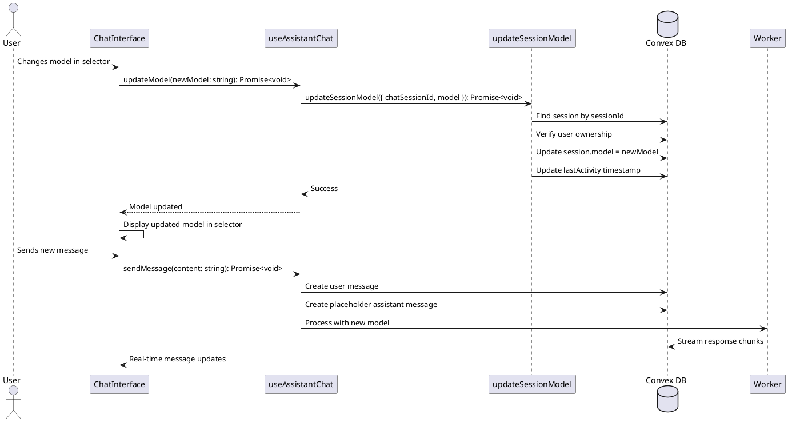

# Dynamic Model Selector Codemap

## Title

Dynamic Model Selection During Active Chat Sessions

## Description

Allows users to switch AI models mid-conversation without ending their current chat session. The model change persists in the session record and the worker seamlessly transitions to using the new model for subsequent messages while preserving the existing conversation context.

## Sequence Diagram



## Frontend Entry Point / Route

- `apps/webapp/src/app/page.tsx` - Main chat interface page
  - No URL parameters related to model selection
  - Model is stored in session database record

## Frontend Components

- `apps/webapp/src/modules/assistant/components/ChatInterface.tsx` - Main chat interface
  - Manages model selection state
  - Calls model update when user changes selection
- `apps/webapp/src/modules/assistant/components/ChatInputWithModel.tsx` - Chat input with model selector
  - Contains the ModelSelector component
  - **Change**: Remove `hasActiveSession` from disabled condition for ModelSelector
- `apps/webapp/src/modules/assistant/components/ModelSelector.tsx` - Model dropdown selector
  - Remains unchanged (already supports dynamic selection)

## Frontend Service Layer

- `apps/webapp/src/modules/assistant/hooks/useAssistantChat.ts` - Chat session management hook
  - **New Function**:
    ```typescript
    updateModel(model: string): Promise<void>
    ```
  - **Updated Return Type**:
    ```typescript
    export interface AssistantChatReturn {
      session: SessionData | null;
      startSession: (model: string) => Promise<string | undefined>;
      restoreSession: (sessionId: string) => void;
      endSession: () => Promise<void>;
      clearSession: () => void;
      sendMessage: (content: string) => Promise<void>;
      updateModel: (model: string) => Promise<void>; // NEW
      messages: Message[];
      isLoading: boolean;
    }
    ```

## Backend Function Entry Point

- `services/backend/convex/chat.ts` - Chat session management
  - **New Function**:
    ```typescript
    export const updateSessionModel = mutation({
      args: {
        ...SessionIdArg,
        chatSessionId: v.string(),
        model: v.string(),
      },
      handler: async (ctx, args): Promise<void> => {
        // Implementation
      },
    });
    ```

### Contracts

```typescript
// From services/backend/convex/chat.ts

/**
 * Update the AI model for an active chat session.
 * Allows users to switch models mid-conversation.
 * 
 * @param chatSessionId - Session to update
 * @param model - New AI model to use (e.g., "claude-sonnet-4-5", "gpt-4")
 */
export const updateSessionModel = mutation({
  args: {
    ...SessionIdArg,
    chatSessionId: v.string(),
    model: v.string(),
  },
  handler: async (ctx, args): Promise<void> => {
    // Verify user is authenticated
    // Find session by chatSessionId
    // Verify user owns the session
    // Verify session is active
    // Update session.model
    // Update session.lastActivity
  },
});
```

```typescript
// From apps/webapp/src/modules/assistant/hooks/useAssistantChat.ts

export interface AssistantChatReturn {
  session: SessionData | null;
  startSession: (model: string) => Promise<string | undefined>;
  restoreSession: (sessionId: string) => void;
  endSession: () => Promise<void>;
  clearSession: () => void;
  sendMessage: (content: string) => Promise<void>;
  updateModel: (model: string) => Promise<void>; // NEW
  messages: Message[];
  isLoading: boolean;
}

interface SessionData {
  sessionId: string;
  workerId: string;
  model: string; // This reflects the current model
  status: 'active' | 'inactive';
  createdAt: number;
  lastActivity: number;
}
```

## Backend Schema

- `services/backend/convex/schema.ts` - Database schema
  - `chatSessions` table (already exists, no changes needed)
    - `model: v.string()` - Already stores the model, will be updated dynamically

```typescript
// Existing Schema (no changes needed)
chatSessions: defineTable({
  sessionId: v.string(),
  opencodeSessionId: v.optional(v.string()),
  name: v.optional(v.string()),
  workerId: v.string(),
  userId: v.id('users'),
  model: v.string(), // This field will be updated when user changes model
  status: v.union(v.literal('active'), v.literal('inactive')),
  createdAt: v.number(),
  lastActivity: v.number(),
  deletedAt: v.optional(v.number()),
  deletedInOpencode: v.optional(v.boolean()),
  syncedFromOpencode: v.optional(v.boolean()),
})
  .index('by_session_id', ['sessionId'])
  .index('by_opencode_session_id', ['opencodeSessionId'])
  .index('by_worker_id', ['workerId'])
  .index('by_user_id', ['userId'])
  .index('by_status', ['status'])
  .index('by_worker_and_status', ['workerId', 'status'])
  .index('by_deleted', ['deletedInOpencode'])
```

## Worker Behavior

The worker service automatically uses the `session.model` field when processing messages:

- `services/worker/src/application/ChatSessionManager.ts` - Already handles model from session
  - No changes needed - worker reads model from session when processing messages
  - OpenCode SDK supports model switching between messages in the same session

## Implementation Status

✅ **COMPLETED** - All changes implemented and tested

### Frontend Changes (Completed)

1. **ChatInputWithModel.tsx**: ✅
   - Removed the `hasActiveSession ||` condition from the ModelSelector's disabled prop
   - Model selector now remains enabled during active sessions

2. **useAssistantChat.ts**: ✅
   - Added `updateModelMutation` using `useSessionMutation(api.chat.updateSessionModel)`
   - Added `updateModel` function that calls the mutation with error handling
   - Exported `updateModel` in the return object

3. **types.ts**: ✅
   - Updated `AssistantChatReturn` interface to include `updateModel` method

4. **ChatInterface.tsx**: ✅
   - Updated `handleModelChange` to call `updateModel(model)` if there's an active session
   - Added error handling with automatic revert to previous model on failure
   - Added `useEffect` to sync selected model with session's model when restored
   - Keeps existing behavior for setting local state when no session exists

### Backend Changes (Completed)

1. **chat.ts**: ✅
   - Added `updateSessionModel` mutation with:
     - User authentication check using `SessionIdArg`
     - Session existence check via database query
     - User ownership verification
     - Session active status check (prevents updating inactive sessions)
     - Model field update in database
     - lastActivity timestamp update
     - Comprehensive console logging for debugging

### Worker Changes (Completed)

1. **ChatSessionManager.ts**: ✅
   - Updated `processMessage` to fetch latest session data from Convex before processing
   - Dynamically uses the current model from database instead of cached value
   - Updates local session cache when model changes
   - Logs model changes for visibility
   - Maintains backward compatibility with existing sessions

### UX Features

- ✅ Model selector remains enabled during active sessions
- ✅ No interruption to ongoing conversations
- ✅ Next message automatically uses the new model
- ✅ Session record maintains accurate model state
- ✅ Error handling with automatic rollback on failure
- ✅ Console logging for debugging and transparency
- ✅ Model sync when restoring sessions

