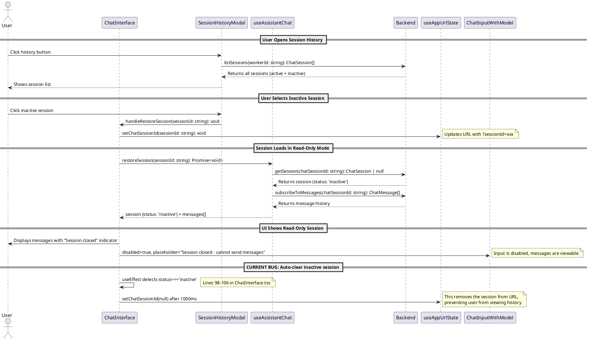

# Inactive Session History Codemap

## Title

View Chat History for Inactive Sessions

## Description

Allows users to view chat message history for inactive/closed sessions in read-only mode. When a session becomes inactive (closed by user, worker offline, etc.), users should still be able to:
1. Click on inactive sessions in the session history modal
2. View the complete message history
3. See a clear indicator that the session is closed
4. Understand they cannot send new messages to inactive sessions

The current implementation incorrectly prevents viewing inactive sessions by:
- Automatically clearing inactive sessions from URL after 1 second
- Disabling clicks on inactive sessions in the session list
- Not allowing restoration of inactive sessions for read-only viewing

## Sequence Diagram



## Frontend Entry Point / Route

- `apps/webapp/src/app/page.tsx` - Main page component (existing)
  - **Search Parameters**: `?sessionId=xxx` - Session to view (active or inactive)

## Frontend Components

- `apps/webapp/src/modules/assistant/components/ChatInterface.tsx` - Main chat interface
  - **ISSUE (lines 98-106)**: Auto-clears inactive sessions from URL after 1 second
  - **EXISTING (lines 475-491)**: Already shows correct UI indicator for inactive sessions
  - **EXISTING (lines 528-544)**: Already disables input for inactive sessions
  
- `apps/webapp/src/modules/assistant/components/SessionHistoryModal.tsx` - Session history modal
  - Renders `SessionList` component with all sessions
  
- `apps/webapp/src/modules/assistant/components/SessionList.tsx` - Session list component
  - **ISSUE (lines 59-68)**: `handleSessionClick` returns early for inactive sessions
  - **ISSUE (lines 134-135)**: Inactive session buttons are disabled with `disabled={true}`
  - **EXISTING (lines 123-152)**: Already separates active/inactive sessions visually

- `apps/webapp/src/modules/assistant/components/ChatMessageList.tsx` - Message list display
  - Already works correctly - no status checks, displays all messages

- `apps/webapp/src/modules/assistant/components/ChatInputWithModel.tsx` - Chat input component
  - Already supports disabled state via `disabled` prop

## Frontend Service Layer

- `apps/webapp/src/modules/assistant/hooks/useAssistantChat.ts` - Chat session management
  - **CORRECT (lines 52-70)**: Already handles inactive sessions correctly for viewing

  ```typescript
  // From apps/webapp/src/modules/assistant/hooks/useAssistantChat.ts
  const session = useMemo<ChatSession | null>(() => {
    if (!sessionData) return null;
    // Return session even if inactive, as long as it's explicitly selected
    // This allows viewing inactive sessions (read-only)
    return {
      sessionId: sessionData.sessionId,
      workerId: sessionData.workerId,
      model: sessionData.model,
      status: sessionData.status,
      createdAt: sessionData.createdAt,
      lastActivity: sessionData.lastActivity,
    };
  }, [sessionData, activeSessionId, allSessions]);
  ```

- `apps/webapp/src/modules/assistant/hooks/useAppUrlState.ts` - URL state management
  - Manages URL query parameters for session state
  - **Functions**:
    ```typescript
    useAppUrlState(): { state: AppUrlState; actions: AppUrlActions }
    setChatSessionId(sessionId: string | null): void
    ```

- `apps/webapp/src/modules/assistant/types.ts` - Frontend type definitions

  ```typescript
  // From apps/webapp/src/modules/assistant/types.ts
  export interface ChatSession {
    sessionId: string;
    workerId: string;
    model: string;
    status: 'active' | 'inactive';
    createdAt: number;
    lastActivity: number;
  }

  export interface ChatMessage {
    id: string;
    sessionId: string;
    role: 'user' | 'assistant' | 'system';
    content: string;
    timestamp: number;
    completed: boolean;
    isStreaming?: boolean;
  }
  ```

## Backend Function Entry Point

- `services/backend/convex/chat.ts` - Chat session and message management
  - **Functions**:
    ```typescript
    // Get a specific session (active or inactive)
    getSession(args: { sessionId: string; chatSessionId: string }): Promise<ChatSession | null>
    
    // List all sessions for a worker (active and inactive)
    listSessions(args: { sessionId: string; workerId: string }): Promise<ChatSession[]>
    
    // Get all messages for a session (no status check)
    subscribeToMessages(args: { sessionId: string; chatSessionId: string }): Promise<ChatMessage[]>
    ```

### Contracts

```typescript
// From services/backend/convex/chat.ts

// Get session query - returns session regardless of status
export const getSession = query({
  args: {
    ...SessionIdArg,
    chatSessionId: v.string(),
  },
  handler: async (ctx, args) => {
    const user = await getAuthUserOptional(ctx, args);
    if (!user) return null;

    const session = await ctx.db
      .query('chatSessions')
      .withIndex('by_session_id', (q) => q.eq('sessionId', args.chatSessionId))
      .first();

    if (!session || session.userId !== user._id) return null;

    // Returns session with status field (active or inactive)
    return {
      sessionId: session.sessionId,
      workerId: session.workerId,
      model: session.model,
      status: session.status, // 'active' | 'inactive'
      createdAt: session.createdAt,
      lastActivity: session.lastActivity,
    };
  },
});

// List sessions query - returns all sessions
export const listSessions = query({
  args: {
    ...SessionIdArg,
    workerId: v.string(),
  },
  handler: async (ctx, args) => {
    // ... authentication and authorization ...
    
    const sessions = await ctx.db
      .query('chatSessions')
      .withIndex('by_worker_id', (q) => q.eq('workerId', args.workerId))
      .filter((q) => q.eq(q.field('userId'), user._id))
      .collect();

    sessions.sort((a, b) => b.lastActivity - a.lastActivity);

    // Returns all sessions including inactive ones
    return sessions.map((session) => ({
      sessionId: session.sessionId,
      workerId: session.workerId,
      model: session.model,
      status: session.status,
      createdAt: session.createdAt,
      lastActivity: session.lastActivity,
    }));
  },
});

// Subscribe to messages query - no status check, works for inactive sessions
export const subscribeToMessages = query({
  args: {
    ...SessionIdArg,
    chatSessionId: v.string(),
  },
  handler: async (ctx, args) => {
    const user = await getAuthUserOptional(ctx, args);
    if (!user) return [];

    const session = await ctx.db
      .query('chatSessions')
      .withIndex('by_session_id', (q) => q.eq('sessionId', args.chatSessionId))
      .first();

    // Verifies ownership but doesn't check status
    if (!session || session.userId !== user._id) return [];

    const messages = await ctx.db
      .query('chatMessages')
      .withIndex('by_session_id', (q) => q.eq('sessionId', args.chatSessionId))
      .collect();

    messages.sort((a, b) => a.timestamp - b.timestamp);

    return messages.map((message) => ({
      id: message.messageId,
      sessionId: message.sessionId,
      role: message.role,
      content: message.content,
      timestamp: message.timestamp,
      completed: message.completed,
    }));
  },
});
```

## Backend Schema

- `services/backend/convex/schema.ts` - Database schema definitions
  - `chatSessions` table:
    - `status: v.union(v.literal('active'), v.literal('inactive'))` - Session state
    - `deletedAt: v.optional(v.number())` - Soft delete timestamp
    - `deletedInOpencode: v.optional(v.boolean())` - Deleted in OpenCode flag
    - Index: `by_session_id`, `by_worker_id`, `by_user_id`, `by_status`
  
  - `chatMessages` table:
    - Messages are persisted regardless of session status
    - No status field - messages are permanent
    - Index: `by_session_id`, `by_message_id`

```typescript
// From services/backend/convex/schema.ts
chatSessions: defineTable({
  sessionId: v.string(),
  opencodeSessionId: v.optional(v.string()),
  name: v.optional(v.string()),
  workerId: v.string(),
  userId: v.id('users'),
  model: v.string(),
  status: v.union(v.literal('active'), v.literal('inactive')),
  createdAt: v.number(),
  lastActivity: v.number(),
  deletedAt: v.optional(v.number()),
  deletedInOpencode: v.optional(v.boolean()),
  syncedFromOpencode: v.optional(v.boolean()),
})
  .index('by_session_id', ['sessionId'])
  .index('by_worker_id', ['workerId'])
  .index('by_user_id', ['userId'])
  .index('by_status', ['status'])

chatMessages: defineTable({
  messageId: v.string(),
  sessionId: v.string(),
  role: v.union(v.literal('user'), v.literal('assistant'), v.literal('system')),
  content: v.string(),
  timestamp: v.number(),
  completed: v.boolean(),
})
  .index('by_session_id', ['sessionId'])
  .index('by_message_id', ['messageId'])
```

## Required Changes

### 1. ChatInterface.tsx - Remove Auto-Clear Logic

**File**: `apps/webapp/src/modules/assistant/components/ChatInterface.tsx`

**Change**: Remove or modify the useEffect that auto-clears inactive sessions (lines 98-106)

**Current behavior**:
```typescript
// Lines 98-106 - PROBLEMATIC
useEffect(() => {
  if (session?.status === 'inactive' && urlChatSessionId) {
    console.log('[ChatInterface] Session inactive, clearing from URL');
    // Clear inactive session from URL after a brief delay to show the state
    setTimeout(() => {
      urlActions.setChatSessionId(null);
    }, 1000);
  }
}, [session?.status, urlChatSessionId, urlActions]);
```

**Desired behavior**: Remove this effect entirely. Inactive sessions should remain in URL for viewing.

**Additionally update**: Lines 139-146 - Remove the check that prevents restoring inactive sessions from URL

```typescript
// Lines 136-150 - NEEDS UPDATE
useEffect(() => {
  if (urlChatSessionId && selectedWorkerId && !session) {
    console.log('[ChatInterface] Restoring session from URL:', urlChatSessionId);
    // REMOVE THIS CHECK - allow restoring inactive sessions for viewing
    const urlSession = sessions?.find((s) => s.sessionId === urlChatSessionId);
    if (urlSession?.status === 'inactive') {
      console.log('[ChatInterface] Skipping restore - session is inactive');
      urlActions.setChatSessionId(null);
      return;
    }
    // ... rest of restoration logic
  }
}, [...]);
```

### 2. SessionList.tsx - Enable Clicking Inactive Sessions

**File**: `apps/webapp/src/modules/assistant/components/SessionList.tsx`

**Change 1**: Update `handleSessionClick` to allow clicking inactive sessions (lines 59-68)

**Current behavior**:
```typescript
const handleSessionClick = useCallback(
  (sessionId: string, sessionStatus: string) => {
    // Don't restore inactive sessions
    if (sessionStatus === 'inactive') {
      return;
    }
    onRestoreSession(sessionId);
  },
  [onRestoreSession]
);
```

**Desired behavior**:
```typescript
const handleSessionClick = useCallback(
  (sessionId: string, sessionStatus: string) => {
    // Allow viewing inactive sessions in read-only mode
    onRestoreSession(sessionId);
  },
  [onRestoreSession]
);
```

**Change 2**: Enable inactive session buttons and add styling for read-only state (lines 131-149)

**Current behavior**:
```typescript
<button
  key={session.sessionId}
  type="button"
  onClick={() => handleSessionClick(session.sessionId, session.status)}
  disabled={true}  // ALWAYS DISABLED
  className="w-full text-left p-3 rounded-lg border border-border opacity-60 cursor-not-allowed"
>
```

**Desired behavior**:
```typescript
<button
  key={session.sessionId}
  type="button"
  onClick={() => handleSessionClick(session.sessionId, session.status)}
  disabled={isLoading}  // Only disabled during loading
  className="w-full text-left p-3 rounded-lg border border-border hover:bg-accent/30 transition-colors opacity-75 cursor-pointer disabled:opacity-50 disabled:cursor-not-allowed"
  title="View session history (read-only)"
>
```

## Implementation Notes

1. **Backend is already correct**: All backend queries (`getSession`, `subscribeToMessages`, `listSessions`) correctly return data for inactive sessions without filtering by status.

2. **Frontend hook is already correct**: `useAssistantChat` already handles inactive sessions correctly, returning the session data with status='inactive' and loading messages.

3. **UI indicators are already correct**: The chat interface already shows appropriate UI for inactive sessions:
   - Gray dot instead of green pulsing dot
   - "Session closed" text
   - Disabled input with appropriate placeholder

4. **Only two components need changes**:
   - `ChatInterface.tsx`: Remove auto-clear logic
   - `SessionList.tsx`: Enable clicking inactive sessions

5. **No new features needed**: This is purely removing restrictions that prevent viewing existing, working functionality.

## User Experience Flow

1. User ends a session or session becomes inactive (worker offline)
2. Session remains visible in session history with "Closed" label
3. User clicks on inactive session
4. Session loads with full message history visible
5. UI clearly shows session is closed (gray indicator, disabled input)
6. User can scroll through history but cannot send new messages
7. User can switch to another session or close this session as normal

