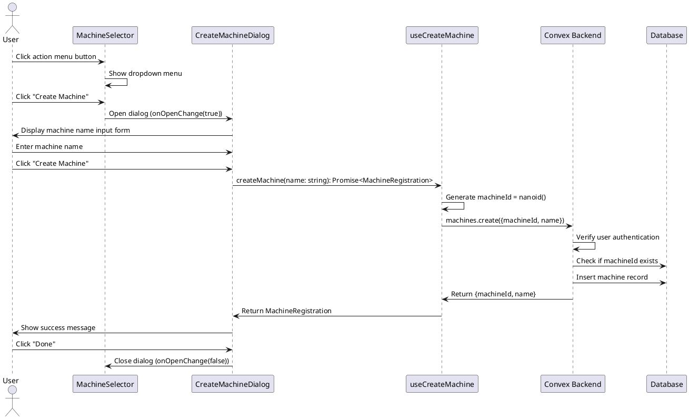

# Machine Creation from App Page Codemap

## Title

Create Machine from App Page Action Menu

## Description

Allows users to create a new machine directly from the /app page by clicking an action menu button. The action menu is restructured into two sections: "Machines" (global actions like creating a machine) and "This Machine" (machine-specific actions like adding workers and accessing settings). This flow enables users to quickly add new machines without navigating to a separate page.

## Sequence Diagram



## Frontend Entry Point / Route

- `apps/webapp/src/app/app/page.tsx` - Main application page that renders ChatInterface
  - No URL parameters or search parameters for this flow

## Frontend Components

- `apps/webapp/src/modules/assistant/components/MachineSelector.tsx` - Machine selector with action menu
  - Contains the dropdown menu with "Machines" and "This Machine" sections
  - Triggers CreateMachineDialog when "Create Machine" is clicked
- `apps/webapp/src/modules/assistant/components/CreateMachineDialog.tsx` - Dialog for creating new machines
  - Form for entering machine name
  - Success state showing next steps
- `apps/webapp/src/modules/assistant/components/ChatInterface.tsx` - Main chat interface that uses MachineSelector

## Frontend Service Layer

- `apps/webapp/src/modules/assistant/hooks/useCreateMachine.ts` - Hook for creating machines
  - **Functions**:
    ```typescript
    useCreateMachine(): CreateMachineReturn
    createMachine(name: string): Promise<MachineRegistration>
    ```

- `apps/webapp/src/modules/assistant/hooks/useMachines.ts` - Hook for fetching machines
  - **Functions**:
    ```typescript
    useMachines(): MachinesData
    ```

- `apps/webapp/src/modules/assistant/types.ts` - Frontend type definitions

  ```typescript
  // From apps/webapp/src/modules/assistant/types.ts
  export interface Machine {
    machineId: string;
    name: string;
    status: 'online' | 'offline';
    lastSeen: number;
    assistantCount: number;
    workerCounts: {
      online: number;
      offline: number;
      pending: number;
    };
  }

  export interface MachineRegistration {
    machineId: string;
    name: string;
  }

  export interface CreateMachineReturn {
    createMachine: (name: string) => Promise<MachineRegistration>;
    isCreating: boolean;
    error: Error | null;
  }

  export interface MachinesData {
    machines: Machine[] | undefined;
    loading: boolean;
    error: Error | null;
  }
  ```

## Backend Function Entry Point

- `services/backend/convex/machines.ts` - Machine management functions
  - **Functions**:
    ```typescript
    create(args: CreateMachineArgs): Promise<CreateMachineReturn>
    list(args: SessionIdArg): Promise<Machine[]>
    ```

### Contracts

```typescript
// From services/backend/convex/machines.ts
import { v } from 'convex/values';
import { SessionIdArg } from 'convex-helpers/server/sessions';

export interface CreateMachineArgs {
  sessionId: string;
  machineId: string;
  name: string;
}

export interface CreateMachineReturn {
  machineId: string;
  name: string;
}

// Create machine mutation
export const create = mutation({
  args: {
    ...SessionIdArg,
    machineId: v.string(),
    name: v.string(),
  },
  handler: async (ctx, args): Promise<CreateMachineReturn> => {
    // Verify user is authenticated
    // Check if machine ID already exists
    // Create machine record
    // Return registration info
  },
});

// List machines query
export const list = query({
  args: {
    ...SessionIdArg,
  },
  handler: async (ctx, args): Promise<Machine[]> => {
    // Verify user is authenticated
    // Get all machines for this user
    // Get worker counts for each machine
    // Return machines with counts
  },
});
```

## Backend Schema

- `services/backend/convex/schema.ts` - Schema definitions
  - `machines` table definition
  - Indexes: `by_machine_id`, `by_user_id`

```typescript
// Schema Definition
machines: defineTable({
  machineId: v.string(), // Client-generated nanoid (not Convex _id)
  name: v.string(), // User-friendly name (e.g., "MacBook Pro", "Desktop PC")
  status: v.union(v.literal('online'), v.literal('offline')), // Connection status
  lastHeartbeat: v.number(), // Timestamp of last heartbeat/activity
  userId: v.id('users'), // Owner of this machine
})
  .index('by_machine_id', ['machineId'])
  .index('by_user_id', ['userId'])
```

## Implementation Notes

### Action Menu Restructuring

The action menu in MachineSelector needs to be restructured into two sections:

1. **Machines Section** (always visible):
   - "+ Create Machine" - Opens CreateMachineDialog

2. **This Machine Section** (only visible when a machine is selected):
   - "Add Worker" - Opens CreateWorkerDialog
   - "Settings" - Links to machine settings page

### UI Components Needed

- `DropdownMenuSeparator` from `@/components/ui/dropdown-menu` - To separate the two sections
- `DropdownMenuLabel` from `@/components/ui/dropdown-menu` - To label each section

### State Management

- The action menu button should always be visible (not just when a machine is selected)
- CreateMachineDialog state is managed locally in MachineSelector
- After successful machine creation, the dialog shows a success message
- The machines list automatically updates via Convex real-time subscription

### User Flow

1. User clicks the action menu button (three vertical dots)
2. Dropdown shows two sections:
   - "Machines" section with "Create Machine" option
   - "This Machine" section (if machine selected) with "Add Worker" and "Settings"
3. User clicks "Create Machine"
4. CreateMachineDialog opens
5. User enters machine name and submits
6. Success message displays with next steps
7. User clicks "Done" to close dialog
8. New machine appears in the machine selector dropdown

