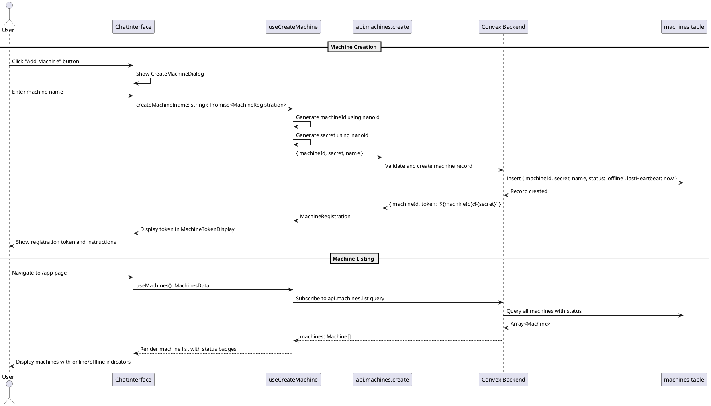

# Machine Registration Codemap

## Title

Machine Registration and Listing Flow

## Description

This flow enables users to create and register machines from the web UI. When a user creates a machine, the system generates a unique machine ID and secret, stores the registration in Convex, and returns a token that can be used by the physical machine to authenticate and connect.

Key features:
- Generate machine ID and secret using nanoid
- Store machine registration in Convex
- Return combined token for machine authentication
- List all registered machines with their status
- Display machine count and online/offline status

## Sequence Diagram



## Frontend Files

### Pages
- `apps/webapp/src/app/app/page.tsx` - Main app page that shows machine list or empty state

### Components
- `apps/webapp/src/modules/assistant/components/ChatInterface.tsx` - Main chat interface with machine selector
- `apps/webapp/src/modules/assistant/components/CreateMachineDialog.tsx` - Dialog for creating new machines
- `apps/webapp/src/modules/assistant/components/MachineTokenDisplay.tsx` - Displays machine token after creation
- `apps/webapp/src/modules/assistant/components/MachineEmptyState.tsx` - Empty state when no machines exist

### Hooks
- `apps/webapp/src/modules/assistant/hooks/useMachines.ts` - Hook for fetching machine list
  ```typescript
  export function useMachines(): MachinesData {
    const machines = useSessionQuery(api.machines.list) ?? undefined;
    const loading = machines === undefined;
    
    return {
      machines,
      loading,
      error: null,
    };
  }
  ```

- `apps/webapp/src/modules/assistant/hooks/useCreateMachine.ts` - Hook for creating machines
  ```typescript
  export function useCreateMachine(): CreateMachineReturn {
    const createMachineMutation = useSessionMutation(api.machines.create);
    const [isCreating, setIsCreating] = useState(false);
    const [error, setError] = useState<Error | null>(null);

    const createMachine = useCallback(async (name: string): Promise<MachineRegistration> => {
      setIsCreating(true);
      setError(null);

      try {
        const machineId = nanoid();
        const secret = nanoid();
        
        const result = await createMachineMutation({
          machineId,
          secret,
          name,
        });

        return {
          machineId: result.machineId,
          token: result.token,
        };
      } catch (err) {
        const error = err instanceof Error ? err : new Error('Failed to create machine');
        setError(error);
        throw error;
      } finally {
        setIsCreating(false);
      }
    }, [createMachineMutation]);

    return {
      createMachine,
      isCreating,
      error,
    };
  }
  ```

### Types
- `apps/webapp/src/modules/assistant/types.ts` - Type definitions
  ```typescript
  export interface Machine {
    machineId: string;
    name: string;
    status: 'online' | 'offline';
    lastSeen: number;
    assistantCount: number;
  }

  export interface MachineRegistration {
    machineId: string;
    token: string; // Format: <machine_id>:<machine_secret>
  }

  export interface MachinesData {
    machines: Machine[] | undefined;
    loading: boolean;
    error: Error | null;
  }

  export interface CreateMachineReturn {
    createMachine: (name: string) => Promise<MachineRegistration>;
    isCreating: boolean;
    error: Error | null;
  }
  ```

## Backend Files

### Schema
- `services/backend/convex/schema.ts` - Convex database schema
  ```typescript
  import { defineSchema, defineTable } from 'convex/server';
  import { v } from 'convex/values';

  export default defineSchema({
    machines: defineTable({
      machineId: v.string(),      // Client-generated nanoid
      secret: v.string(),          // For authentication
      name: v.string(),            // User-friendly name
      status: v.union(v.literal('online'), v.literal('offline')),
      rootDirectory: v.optional(v.string()), // Set during machine registration
      lastHeartbeat: v.number(),   // Timestamp
    })
      .index('by_machine_id', ['machineId']),
    
    // Other tables...
  });
  ```

### Mutations
- `services/backend/convex/machines.ts` - Machine operations
  ```typescript
  import { mutation, query } from './_generated/server';
  import { v } from 'convex/values';
  import { SessionIdArg } from 'convex-helpers/server/sessions';

  /**
   * Create a new machine registration.
   * Called from the web UI when user adds a new machine.
   */
  export const create = mutation({
    args: {
      ...SessionIdArg,
      machineId: v.string(),
      secret: v.string(),
      name: v.string(),
    },
    handler: async (ctx, args) => {
      // Verify user is authenticated
      const userId = await getUserId(ctx, args);
      if (!userId) {
        throw new Error('Unauthorized');
      }

      // Check if machine ID already exists
      const existing = await ctx.db
        .query('machines')
        .withIndex('by_machine_id', (q) => q.eq('machineId', args.machineId))
        .first();

      if (existing) {
        throw new Error('Machine ID already exists');
      }

      // Create machine record
      await ctx.db.insert('machines', {
        machineId: args.machineId,
        secret: args.secret,
        name: args.name,
        status: 'offline',
        lastHeartbeat: Date.now(),
      });

      // Return registration info
      return {
        machineId: args.machineId,
        token: `${args.machineId}:${args.secret}`,
      };
    },
  });

  /**
   * List all machines for the current user.
   */
  export const list = query({
    args: {
      ...SessionIdArg,
    },
    handler: async (ctx, args) => {
      // Verify user is authenticated
      const userId = await getUserId(ctx, args);
      if (!userId) {
        return [];
      }

      // Get all machines
      // TODO: Filter by userId when user association is implemented
      const machines = await ctx.db.query('machines').collect();

      // Map to frontend format
      return machines.map((machine) => ({
        machineId: machine.machineId,
        name: machine.name,
        status: machine.status,
        lastSeen: machine.lastHeartbeat,
        assistantCount: 0, // TODO: Count from workers table
      }));
    },
  });
  ```

### Auth Helpers
- `services/backend/modules/auth/getAuthUser.ts` - Get authenticated user
  ```typescript
  import type { SessionIdArg } from 'convex-helpers/server/sessions';
  import type { QueryCtx, MutationCtx } from '../convex/_generated/server';

  export async function getUserId(
    ctx: QueryCtx | MutationCtx,
    args: typeof SessionIdArg.type,
  ): Promise<string | null> {
    // Implementation to get user ID from session
    // Returns null if not authenticated
  }
  ```

## Contracts

### Frontend → Backend

**Machine Creation Request**
```typescript
{
  machineId: string;      // Generated by frontend using nanoid
  secret: string;         // Generated by frontend using nanoid
  name: string;           // User-provided machine name
}
```

**Machine Creation Response**
```typescript
{
  machineId: string;
  token: string;          // Format: "${machineId}:${secret}"
}
```

**Machine List Response**
```typescript
Array<{
  machineId: string;
  name: string;
  status: 'online' | 'offline';
  lastSeen: number;       // Timestamp
  assistantCount: number;
}>
```

## Implementation Status

- [x] Frontend types defined
- [x] Frontend components created (with mock data)
- [ ] Convex schema defined
- [ ] Backend mutations implemented
- [ ] Frontend hooks connected to real backend
- [ ] End-to-end testing completed

## Notes

- Machine ID and secret are generated client-side using nanoid for security
- Token format is `${machineId}:${secret}` for easy parsing
- Machine status defaults to 'offline' until physical machine connects
- User association will be added in future iteration
- Assistant count is placeholder (0) until workers table is implemented

