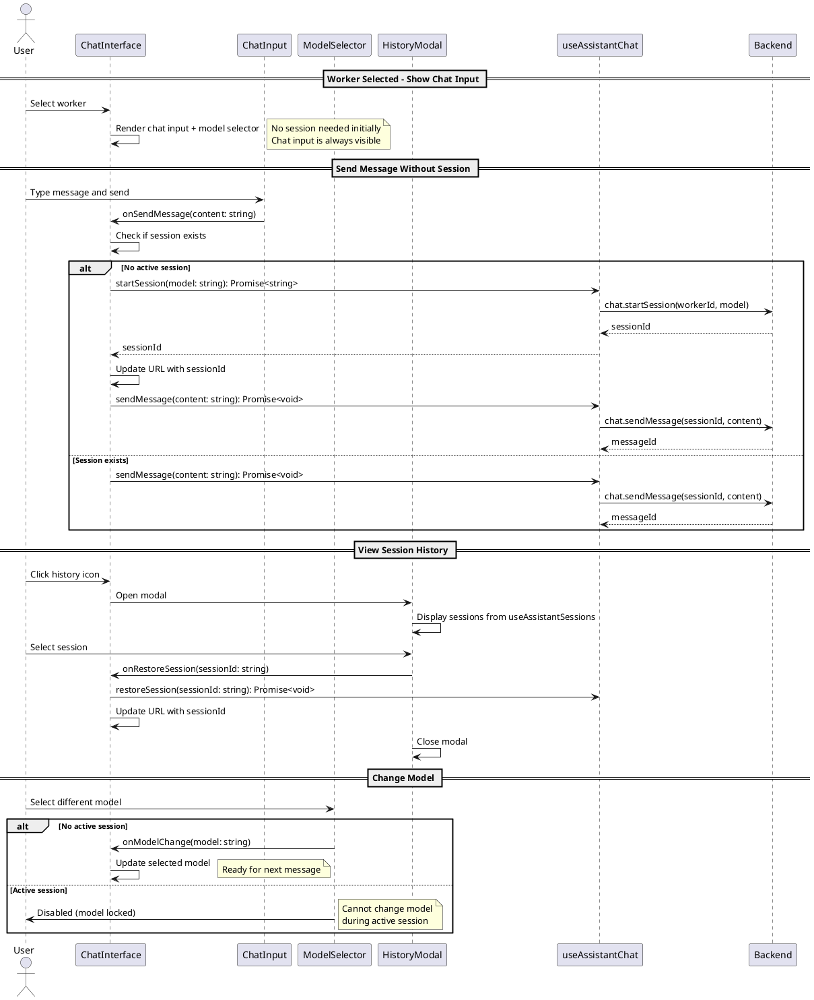

# Refined Chat Interface Codemap

## Title

Refined Chat Interface with Auto-Session Creation and History Modal

## Description

Improves the chat interface UX by:
1. Showing chat input immediately when worker is selected (no session required)
2. Auto-creating a session when user sends first message without active session
3. Displaying model selector inline below chat input with bordered container
4. Adding history icon button to open session history modal for resuming past sessions
5. Disabling model changes during active sessions

## Sequence Diagram



## Frontend Entry Point / Route

- `apps/webapp/src/app/app/page.tsx` - Main app page with chat interface
  - **Search Parameters**: 
    - `machineId` - Selected machine ID
    - `workerId` - Selected worker ID
    - `sessionId` - Active session ID (optional)

## Frontend Components

### Main Components

- `apps/webapp/src/modules/assistant/components/ChatInterface.tsx` - Main orchestrator component
  - Manages worker selection, session state, and message flow
  - Shows chat input immediately when worker is selected
  - Auto-creates session on first message send
  - Coordinates between chat input, model selector, and history modal

- `apps/webapp/src/modules/assistant/components/ChatInputWithModel.tsx` - NEW: Combined input component
  - Wraps `ChatInput` and `ModelSelector` in bordered container
  - Displays model selector inline below text input
  - Handles auto-session creation before sending message
  - Disables model selector when session is active

- `apps/webapp/src/modules/assistant/components/SessionHistoryModal.tsx` - NEW: History modal dialog
  - Shows list of all sessions for selected worker
  - Groups sessions by status (active/idle vs terminated)
  - Allows user to restore/resume a past session
  - Uses shadcn Dialog component

### Existing Components (Modified)

- `apps/webapp/src/modules/assistant/components/ChatInput.tsx` - Message input textarea
  - **Modified**: Remove model selection responsibility
  - **Modified**: Always enabled when worker selected (no session check)
  
- `apps/webapp/src/modules/assistant/components/ModelSelector.tsx` - Model dropdown
  - **Modified**: Accept `disabled` prop to prevent changes during session
  - Displays available models from worker

- `apps/webapp/src/modules/assistant/components/SessionList.tsx` - Session list display
  - **Modified**: Remove from main interface, used only in history modal
  - Shows active and terminated sessions

### UI Components

- `apps/webapp/src/components/ui/dialog.tsx` - Modal dialog (existing)
- `apps/webapp/src/components/ui/button.tsx` - Button component (existing)

## Frontend Service Layer

- `apps/webapp/src/modules/assistant/hooks/useAssistantChat.ts` - Chat session management
  - **Functions**:
    ```typescript
    useAssistantChat(workerId: string | null): AssistantChatReturn
    startSession(model: string): Promise<string>
    restoreSession(sessionId: string): Promise<void>
    endSession(): Promise<void>
    clearSession(): void
    sendMessage(content: string): Promise<void>
    ```

- `apps/webapp/src/modules/assistant/hooks/useAssistantSessions.ts` - Session list management
  - **Functions**:
    ```typescript
    useAssistantSessions(workerId: string | null): SessionsReturn
    ```
  - Returns list of all sessions for worker

- `apps/webapp/src/modules/assistant/hooks/useWorkerModels.ts` - Available models fetching
  - **Functions**:
    ```typescript
    useWorkerModels(workerId: string | null): ModelsReturn
    ```
  - Fetches available AI models from worker

- `apps/webapp/src/modules/assistant/hooks/useAppUrlState.ts` - URL state management
  - **Functions**:
    ```typescript
    useAppUrlState(): { state: AppUrlState; actions: AppUrlStateActions }
    ```

- `apps/webapp/src/modules/assistant/types.ts` - Type definitions

  ```typescript
  // Existing interfaces
  export interface AssistantChatReturn {
    session: ChatSession | null;
    startSession: (model: string) => Promise<string>;
    restoreSession: (sessionId: string) => Promise<void>;
    endSession: () => Promise<void>;
    clearSession: () => void;
    messages: ChatMessage[];
    sendMessage: (content: string) => Promise<void>;
    isLoading: boolean;
    error: Error | null;
  }

  export interface ChatSession {
    sessionId: string;
    workerId: string;
    model: string;
    status: 'active' | 'idle' | 'terminated';
    createdAt: number;
    lastActivity: number;
  }

  export interface ChatMessage {
    id: string;
    sessionId: string;
    role: 'user' | 'assistant' | 'system';
    content: string;
    timestamp: number;
    completed: boolean;
    isStreaming?: boolean;
  }

  // NEW interfaces
  export interface ChatInputWithModelProps {
    onSendMessage: (content: string) => void;
    selectedModel: string | null;
    availableModels: string[];
    onModelChange: (model: string) => void;
    hasActiveSession: boolean;
    disabled?: boolean;
    placeholder?: string;
  }

  export interface SessionHistoryModalProps {
    open: boolean;
    onOpenChange: (open: boolean) => void;
    sessions: ChatSession[];
    onRestoreSession: (sessionId: string) => void;
    isLoading?: boolean;
  }
  ```

## Backend Function Entry Point

- `services/backend/convex/chat.ts` - Chat session and message management (UNCHANGED)
  - **Functions**:
    ```typescript
    startSession(args: { sessionId: string; workerId: string; model: string }): string
    endSession(args: { sessionId: string; chatSessionId: string }): void
    sendMessage(args: { sessionId: string; chatSessionId: string; content: string }): string
    getSession(args: { sessionId: string; chatSessionId: string }): ChatSession | null
    listSessions(args: { sessionId: string; workerId: string }): ChatSession[]
    subscribeToMessages(args: { sessionId: string; chatSessionId: string }): ChatMessage[]
    subscribeToChunks(args: { sessionId: string; chatSessionId: string; messageId: string }): ChatChunk[]
    ```

### Contracts

```typescript
// From services/backend/convex/chat.ts
export interface ChatSessionDoc {
  sessionId: string;
  workerId: string;
  userId: Id<"users">;
  model: string;
  status: 'active' | 'idle' | 'terminated';
  createdAt: number;
  lastActivity: number;
}

export interface ChatMessageDoc {
  messageId: string;
  sessionId: string;
  role: 'user' | 'assistant' | 'system';
  content: string;
  timestamp: number;
  completed: boolean;
}

export interface ChatChunkDoc {
  chunkId: string;
  messageId: string;
  sessionId: string;
  chunk: string;
  sequence: number;
  timestamp: number;
}

// API Functions (existing)
export const startSession = mutation({
  args: {
    ...SessionIdArg,
    workerId: v.string(),
    model: v.string(),
  },
  handler: async (ctx, args): Promise<string> => {
    // Creates session and returns sessionId
  },
});

export const sendMessage = mutation({
  args: {
    ...SessionIdArg,
    chatSessionId: v.string(),
    content: v.string(),
  },
  handler: async (ctx, args): Promise<string> => {
    // Creates user message and assistant placeholder
    // Returns assistantMessageId
  },
});

export const listSessions = query({
  args: {
    ...SessionIdArg,
    workerId: v.string(),
  },
  handler: async (ctx, args): Promise<ChatSessionDoc[]> => {
    // Returns all sessions for worker
  },
});
```

## Backend Schema

- `services/backend/convex/schema.ts` - Database schema (UNCHANGED)
  - `chatSessions` table definition
    - Indexes: `by_session_id`, `by_worker_id`, `by_user_id`, `by_status`, `by_worker_and_status`
  - `chatMessages` table definition
    - Indexes: `by_message_id`, `by_session_id`
  - `chatChunks` table definition
    - Indexes: `by_chunk_id`, `by_message_id`, `by_session_id`

```typescript
// Schema Definition (existing)
chatSessions: defineTable({
  sessionId: v.string(),
  workerId: v.string(),
  userId: v.id('users'),
  model: v.string(),
  status: v.union(v.literal('active'), v.literal('idle'), v.literal('terminated')),
  createdAt: v.number(),
  lastActivity: v.number(),
})
.index("by_session_id", ["sessionId"])
.index("by_worker_id", ["workerId"])
.index("by_user_id", ["userId"])
.index("by_status", ["status"])
.index("by_worker_and_status", ["workerId", "status"]),

chatMessages: defineTable({
  messageId: v.string(),
  sessionId: v.string(),
  role: v.union(v.literal('user'), v.literal('assistant'), v.literal('system')),
  content: v.string(),
  timestamp: v.number(),
  completed: v.boolean(),
})
.index("by_message_id", ["messageId"])
.index("by_session_id", ["sessionId"]),

chatChunks: defineTable({
  chunkId: v.string(),
  messageId: v.string(),
  sessionId: v.string(),
  chunk: v.string(),
  sequence: v.number(),
  timestamp: v.number(),
})
.index("by_chunk_id", ["chunkId"])
.index("by_message_id", ["messageId"])
.index("by_session_id", ["sessionId"])
```

## Implementation Notes

### Key Changes

1. **Immediate Chat Availability**
   - Chat input renders as soon as worker is selected
   - No need to explicitly start a session first
   - Model selector defaults to first available model

2. **Auto-Session Creation**
   - When user sends message without active session:
     1. `handleSendMessage` checks `if (!session)`
     2. Calls `startSession(selectedModel)` first
     3. Waits for sessionId
     4. Updates URL with new sessionId
     5. Then calls `sendMessage(content)`

3. **Model Selector Integration**
   - Moved from separate modal to inline below chat input
   - Wrapped in bordered container with chat input and send button
   - Disabled when session is active (cannot change model mid-session)
   - Auto-selects first model when worker is selected

4. **Session History Modal**
   - History icon button (Clock icon from lucide-react) in header
   - Opens modal with list of all sessions from `useAssistantSessions`
   - Reuses `SessionList` component inside modal
   - Clicking session closes modal and restores that session

5. **UI Layout**
   - Bordered container contains:
     - Text input (top)
     - Model selector (bottom left)
     - Send button (bottom right)
   - Similar visual grouping to screenshot reference
   - Clean, compact layout with proper spacing

### Current State vs Required

**Existing (Working)**
- Session management backend APIs
- Message sending and streaming
- Session list fetching
- Model list fetching
- URL state management

**NEW (To Implement)**
- `ChatInputWithModel` component combining input + model selector
- `SessionHistoryModal` component for history dialog
- Auto-session creation logic in `ChatInterface`
- Model selector disable logic based on session state
- History icon button in header
- Bordered container styling

**MODIFIED (To Update)**
- `ChatInterface` - Add auto-session logic, history button, refactor layout
- `ChatInput` - Remove session checks, simplify props
- `ModelSelector` - Add disabled state for active sessions

### Model Switching

**Current Behavior**: To be confirmed - check if model can be changed mid-session

**Implementation**:
- If model switching IS supported: Enable model selector always
- If model switching NOT supported: Disable model selector when `session !== null && session.status === 'active'`
- **Codemap assumes**: Model switching NOT supported (safer default)

