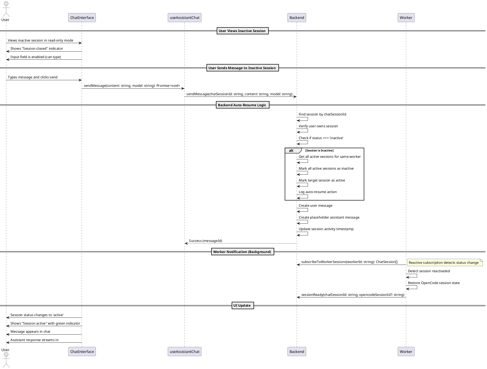

# Auto-Resume Session Codemap

## Title

Automatic Session Resumption on Message Send

## Description

Allows users to send messages to inactive chat sessions, which automatically resumes them. When a user sends a message to an inactive session:
1. The backend automatically marks the session as active
2. All other active sessions for the same worker are automatically marked as inactive (single active session per worker constraint)
3. The message is processed normally
4. The worker detects the status change and restores the OpenCode session state
5. The user can continue the conversation seamlessly

This provides a seamless UX where users don't need to explicitly "resume" a session - they can just start typing and the system handles the reactivation automatically.

## Sequence Diagram



## Frontend Entry Point / Route

- `apps/webapp/src/app/page.tsx` - Main page component (existing)
  - **Search Parameters**: `?sessionId=xxx` - Session being viewed (can be inactive or active)

## Frontend Components

- `apps/webapp/src/modules/assistant/components/ChatInterface.tsx` - Main chat interface
  - **CHANGED**: Input is now enabled for inactive sessions (no `disabled` or placeholder check)
  - **REMOVED**: Resume button and warning dialog (no longer needed)
  - **EXISTING**: Shows session status indicator (gray dot for inactive, green for active)
  
- `apps/webapp/src/modules/assistant/components/ChatMessageList.tsx` - Message list display
  - **NO CHANGES**: Already displays all messages regardless of session status

- `apps/webapp/src/modules/assistant/components/ChatInputWithModel.tsx` - Chat input component
  - **NO CHANGES**: Standard input component, works the same

## Frontend Service Layer

- `apps/webapp/src/modules/assistant/hooks/useAssistantChat.ts` - Chat session management
  - **UPDATED**: `sendMessage` function documentation to note auto-resume behavior
  - **REMOVED**: `resumeSession` function (no longer needed)

  ```typescript
  // From apps/webapp/src/modules/assistant/hooks/useAssistantChat.ts
  
  /**
   * Sends a message to the active session with the specified model.
   * The response will be streamed via subscriptions.
   * Each message stores the model for audit trail purposes.
   * 
   * If the session is inactive, the backend will automatically resume it
   * and close other active sessions for the same worker.
   */
  const sendMessage = useCallback(
    async (content: string, model: string) => {
      if (!activeSessionId) throw new Error('No active session');

      setIsLoading(true);
      setError(null);

      try {
        console.log('[useAssistantChat] Sending message with model:', model);
        // Send message with model - backend will create user message and assistant placeholder
        // If session is inactive, backend will auto-resume it
        await sendMessageMutation({ chatSessionId: activeSessionId, content, model });
        // Worker will receive notification and start processing
        // Chunks will arrive via subscribeToChunks subscription
      } catch (err) {
        const error = err instanceof Error ? err : new Error(String(err));
        setError(error);
        throw error;
      } finally {
        setIsLoading(false);
      }
    },
    [activeSessionId, sendMessageMutation]
  );
  ```

- `apps/webapp/src/modules/assistant/types.ts` - Frontend type definitions

  ```typescript
  // From apps/webapp/src/modules/assistant/types.ts
  
  export interface AssistantChatReturn {
    session: ChatSession | null;
    messages: ChatMessage[];
    isLoading: boolean;
    error: Error | null;
    startSession: () => Promise<string>;
    restoreSession: (sessionId: string) => Promise<void>;
    // resumeSession removed - auto-resume happens in sendMessage
    endSession: () => Promise<void>;
    clearSession: () => void;
    sendMessage: (content: string, model: string) => Promise<void>;
  }
  
  export interface ChatSession {
    sessionId: string;
    workerId: string;
    model: string;
    status: 'active' | 'inactive';
    createdAt: number;
    lastActivity: number;
  }
  ```

## Backend Function Entry Point

- `services/backend/convex/chat.ts` - Chat session management
  - **UPDATED**: `sendMessage` mutation with auto-resume logic
  - **REMOVED**: `resumeSession` mutation (logic moved into sendMessage)

### Contracts

```typescript
// From services/backend/convex/chat.ts

/**
 * Send a message in a chat session.
 * Creates user message and placeholder assistant message for streaming.
 * Each message stores the model that should be used for processing.
 *
 * AUTO-RESUME: If the session is inactive, it will be automatically reactivated
 * and all other active sessions for the same worker will be closed.
 *
 * @param sessionId - Session to send message in
 * @param content - Message content
 * @param model - AI model to use for this message
 * @returns messageId for the assistant response
 */
export const sendMessage = mutation({
  args: {
    ...SessionIdArg,
    chatSessionId: v.string(),
    content: v.string(),
    model: v.string(),
  },
  handler: async (ctx, args) => {
    // Verify user is authenticated
    const user = await getAuthUserOptional(ctx, args);
    if (!user) {
      throw new Error('Unauthorized: Must be logged in to send a message');
    }

    // Find session
    const session = await ctx.db
      .query('chatSessions')
      .withIndex('by_session_id', (q) => q.eq('sessionId', args.chatSessionId))
      .first();

    if (!session) {
      throw new Error('Session not found');
    }

    // Verify user owns the session
    if (session.userId !== user._id) {
      throw new Error('Unauthorized: You do not own this session');
    }

    const timestamp = Date.now();

    // Auto-resume: If session is inactive, reactivate it and close other active sessions
    if (session.status === 'inactive') {
      console.log('[sendMessage] Auto-resuming inactive session:', args.chatSessionId);

      // Get all active sessions for the same worker
      const activeSessions = await ctx.db
        .query('chatSessions')
        .withIndex('by_worker_and_status', (q) =>
          q.eq('workerId', session.workerId).eq('status', 'active')
        )
        .collect();

      // Mark all other active sessions as inactive
      for (const activeSession of activeSessions) {
        await ctx.db.patch(activeSession._id, {
          status: 'inactive',
          lastActivity: timestamp,
        });
      }

      // Mark this session as active
      await ctx.db.patch(session._id, {
        status: 'active',
        lastActivity: timestamp,
      });

      console.log('[sendMessage] Resumed session, closed', activeSessions.length, 'other sessions');
    }

    // Create user message
    const userMessageId = nanoid();
    await ctx.db.insert('chatMessages', {
      messageId: userMessageId,
      sessionId: args.chatSessionId,
      role: 'user',
      content: args.content,
      timestamp,
      completed: true,
      model: args.model,
    });

    // Create placeholder assistant message for streaming
    const assistantMessageId = nanoid();
    await ctx.db.insert('chatMessages', {
      messageId: assistantMessageId,
      sessionId: args.chatSessionId,
      role: 'assistant',
      content: '',
      timestamp: timestamp + 1,
      completed: false,
      model: args.model,
    });

    // Update session activity
    await ctx.db.patch(session._id, {
      lastActivity: timestamp,
      model: args.model,
    });

    return assistantMessageId;
  },
});

// Other queries remain unchanged
export const getSession = query({ /* ... */ });
export const subscribeToMessages = query({ /* ... */ });
export const subscribeToWorkerSessions = query({ /* ... */ });
```

## Backend Schema

- `services/backend/convex/schema.ts` - Database schema definitions
  - **NO CHANGES NEEDED** - existing schema supports this feature

```typescript
// From services/backend/convex/schema.ts
// No changes needed - existing schema is sufficient

chatSessions: defineTable({
  sessionId: v.string(),
  opencodeSessionId: v.optional(v.string()),
  name: v.optional(v.string()),
  workerId: v.string(),
  userId: v.id('users'),
  model: v.string(),
  status: v.union(v.literal('active'), v.literal('inactive')),
  createdAt: v.number(),
  lastActivity: v.number(),
  deletedAt: v.optional(v.number()),
  deletedInOpencode: v.optional(v.boolean()),
  syncedFromOpencode: v.optional(v.boolean()),
})
  .index('by_session_id', ['sessionId'])
  .index('by_worker_id', ['workerId'])
  .index('by_user_id', ['userId'])
  .index('by_status', ['status'])
  .index('by_worker_and_status', ['workerId', 'status']) // Used to find active sessions
```

## Worker Integration (Background Processing)

- `services/worker/src/application/ChatSessionManager.ts` - Worker session management
  - **NO CHANGES NEEDED** - existing subscription already handles this
  - **EXISTING**: `subscribeToWorkerSessions` detects when session becomes active
  - **EXISTING**: Worker will restore OpenCode session state automatically

```typescript
// From services/worker/src/application/ChatSessionManager.ts
// No changes needed - existing code handles session reactivation

// The worker subscribes to session changes via:
// this.convexClient.subscribeToWorkerSessions((sessions) => {...})
// 
// When a session is auto-resumed:
// 1. Worker detects status changed from 'inactive' to 'active'
// 2. Worker calls startSession(chatSessionId) to restore OpenCode state
// 3. Worker marks session as ready via sessionReady mutation
// 
// This is already implemented in the existing worker architecture.
```

## Implementation Summary

### Changes Made

1. **Backend (`services/backend/convex/chat.ts`)**:
   - Added auto-resume logic to `sendMessage` mutation
   - Removed standalone `resumeSession` mutation (no longer needed)
   - Auto-resume checks if session is inactive and reactivates it before processing message
   - Closes all other active sessions for the same worker

2. **Frontend Hook (`apps/webapp/src/modules/assistant/hooks/useAssistantChat.ts`)**:
   - Removed `resumeSession` function
   - Updated `sendMessage` documentation to note auto-resume behavior
   - No logic changes - backend handles everything

3. **Frontend UI (`apps/webapp/src/modules/assistant/components/ChatInterface.tsx`)**:
   - Removed "Resume Session" button
   - Removed warning AlertDialog
   - Enabled input for inactive sessions (removed `disabled` check)
   - Removed unused AlertDialog import

4. **Types (`apps/webapp/src/modules/assistant/types.ts`)**:
   - Removed `resumeSession` from `AssistantChatReturn` interface

### User Experience

1. User views an inactive session (sees chat history)
2. UI shows "Session closed" indicator with gray dot
3. **Input field is enabled** - user can type freely
4. User types a message and sends it
5. **Backend automatically:**
   - Reactivates the session
   - Closes other active sessions
   - Processes the message normally
6. UI updates to show "Session active" with green indicator
7. User receives response and can continue chatting

### Key Benefits

- **Seamless UX**: No explicit "resume" action needed
- **Fewer clicks**: Just start typing and send
- **No warnings**: System handles session management automatically
- **Transparent**: Status indicator shows what's happening
- **Safe**: Still enforces single active session per worker

## Future Enhancements

### Multi-Session Support (Future)

Currently, the system enforces a single active session per worker. In the future, we may want to support multiple active sessions:

**Changes Required**:
- Remove the "close all other sessions" logic from `sendMessage` mutation auto-resume
- Update worker to handle multiple active OpenCode sessions simultaneously
- Add session switching UI without closing sessions

**Files to Modify**:
- `services/backend/convex/chat.ts:sendMessage` - Remove deactivation loop from auto-resume
- `services/worker/src/application/ChatSessionManager.ts` - Support multiple active sessions

### Session Activity Timeout (Optional)

Auto-close sessions that have been inactive for a certain period:

**Changes Required**:
1. Add background job to check for inactive sessions
2. Auto-mark sessions as inactive after timeout (e.g., 24 hours)
3. Add UI indicator showing "session will close in X hours"

**Files to Modify**:
- Add new Convex cron job for cleanup
- Update UI to show timeout warning

## Dependencies

- **Backend**: Convex mutation system
- **Frontend**: 
  - `convex-helpers/react/sessions` for authenticated mutations
  - Existing session management hooks

## Testing Strategy

- **Manual Testing**:
  1. Create an active session
  2. End the session (mark as inactive)
  3. View the inactive session (can see messages)
  4. Type a message and send it
  5. Verify session becomes active automatically
  6. Verify other active sessions are closed
  7. Verify worker restores session
  8. Verify message is processed normally

- **Edge Cases**:
  - Send message when no other active sessions exist
  - Send message when already active (should be no-op for resume logic)
  - Send message with invalid session ID
  - Send message to session owned by different user (should fail)

## Security Considerations

- **Authorization**: Verify user owns session before auto-resuming
- **Validation**: Validate session exists before auto-resuming
- **Audit**: Log auto-resume actions for debugging
- **Rate Limiting**: Existing rate limits apply to sendMessage
