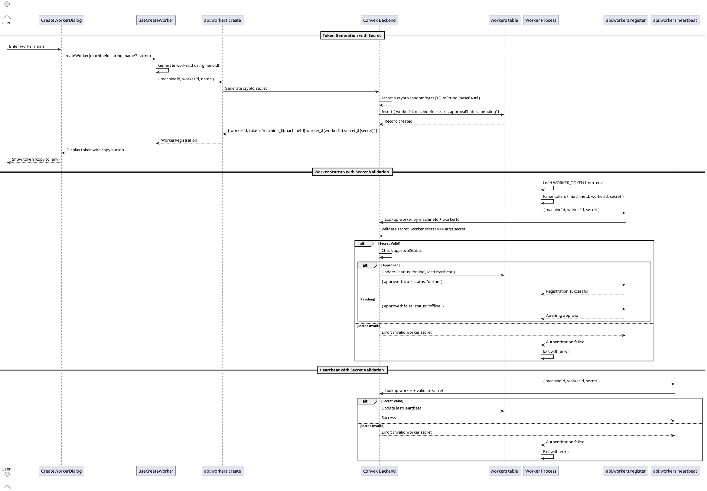

# Secure Worker Token Authentication with Cryptographic Secrets

## Title

Secure Worker Token Authentication with Cryptographic Secret Validation

## Description

This flow enhances the worker token system by adding a cryptographically secure secret component. The current implementation uses tokens in format `machine_<machine_id>:worker_<worker_id>`, which only contains identifiers without any authentication secret. This leaves worker endpoints unprotected since anyone with knowledge of the machine and worker IDs can call worker-specific mutations.

The enhanced system generates tokens in format: `machine_<machine_id>:worker_<worker_id>:secret_<cryptographic_secret>`

Key security improvements:
- **Cryptographic Secret**: 32-byte random secret generated using Node.js `crypto.randomBytes()`
- **Secret Storage**: Secrets stored in Convex database (plain text for retrieval convenience)
- **Token Validation**: All worker mutations validate the secret before execution
- **Token Retrieval**: Users can retrieve their worker tokens anytime from the UI
- **Backward Compatible**: Maintains existing approval workflow and operational status tracking

## Sequence Diagram



## Frontend Files

### Hooks

**`apps/webapp/src/modules/assistant/hooks/useCreateWorker.ts`**
- `useCreateWorker(): { createWorker, isLoading }`
  - `createWorker(machineId: string, name?: string): Promise<WorkerRegistration>`
  - Calls `api.workers.create` mutation
  - Returns worker registration with token containing secret
  - **No changes required** - backend returns new token format

### Components

**`apps/webapp/src/modules/assistant/components/CreateWorkerDialog.tsx`**
- Displays worker token with copy functionality
- Shows instructions for adding token to worker `.env`
- **No changes required** - displays token as-is

### Types

**`apps/webapp/src/modules/assistant/types.ts`**
```typescript
export interface WorkerRegistration {
  workerId: string;
  token: string; // Format: machine_<id>:worker_<id>:secret_<secret>
}
```
- **No changes required** - token format is opaque to frontend

## Backend Files

### Schema

**`services/backend/convex/schema.ts`**
```typescript
workers: defineTable({
  workerId: v.string(),
  machineId: v.string(),
  name: v.optional(v.string()),
  secret: v.string(), // NEW: Cryptographic secret for authentication (stored plain for retrieval)
  approvalStatus: v.union(
    v.literal('pending'),
    v.literal('approved'),
    v.literal('revoked')
  ),
  status: v.union(v.literal('offline'), v.literal('online')),
  createdAt: v.number(),
  approvedAt: v.optional(v.number()),
  approvedBy: v.optional(v.id('users')),
  lastHeartbeat: v.optional(v.number()),
  connectRequestedAt: v.optional(v.number()),
  connectedAt: v.optional(v.number()),
})
  .index('by_worker_id', ['workerId'])
  .index('by_machine_id', ['machineId'])
  .index('by_machine_and_worker', ['machineId', 'workerId'])
  .index('by_approval_status', ['approvalStatus'])
  .index('by_status', ['status'])
  .index('by_machine_and_approval_status', ['machineId', 'approvalStatus'])
```

### Mutations and Queries

**`services/backend/convex/workers.ts`**

```typescript
/**
 * Create a new worker token with cryptographic secret.
 */
export const create = mutation({
  args: {
    ...SessionIdArg,
    machineId: v.string(),
    workerId: v.string(),
    name: v.optional(v.string()),
  },
  handler: async (ctx, args): Promise<WorkerRegistration> => {
    // 1. Verify user authentication and machine ownership
    // 2. Generate cryptographic secret: crypto.randomBytes(32).toString('base64url')
    // 3. Insert worker record with secret
    // 4. Return token: `machine_${machineId}:worker_${workerId}:secret_${secret}`
  }
});

/**
 * Register worker with secret validation.
 */
export const register = mutation({
  args: {
    machineId: v.string(),
    workerId: v.string(),
    secret: v.string(), // NEW: Required secret for authentication
  },
  handler: async (ctx, args): Promise<WorkerRegistrationResponse> => {
    // 1. Lookup worker by machineId + workerId
    // 2. Validate secret: worker.secret === args.secret
    // 3. If invalid, throw authentication error
    // 4. If valid, check approval status and update accordingly
  }
});

/**
 * Worker heartbeat with secret validation.
 */
export const heartbeat = mutation({
  args: {
    machineId: v.string(),
    workerId: v.string(),
    secret: v.string(), // NEW: Required secret for authentication
  },
  handler: async (ctx, args): Promise<void> => {
    // 1. Lookup worker
    // 2. Validate secret
    // 3. Update lastHeartbeat if valid
  }
});

/**
 * Mark worker as connected with secret validation.
 */
export const markConnected = mutation({
  args: {
    workerId: v.string(),
    machineId: v.string(),
    secret: v.string(), // NEW: Required secret for authentication
  },
  handler: async (ctx, args): Promise<{ success: boolean }> => {
    // 1. Lookup worker
    // 2. Validate secret
    // 3. Update connectedAt timestamp if valid
  }
});
```

### Utility Functions

**`services/backend/convex/lib/workerCrypto.ts`** (NEW FILE)
```typescript
/**
 * Generate a cryptographically secure random secret.
 * Uses Node.js crypto.randomBytes for secure random generation.
 *
 * The secret is stored directly in the database (not hashed) so users can
 * retrieve their worker tokens later if needed.
 *
 * @param bytes - Number of random bytes to generate (default: 32)
 * @returns Base64url-encoded secret string
 */
export function generateWorkerSecret(bytes: number = 32): string {
  return crypto.randomBytes(bytes).toString('base64url');
}
```

**`services/backend/convex/workers.ts`** - Internal Actions & Token Retrieval
```typescript
/**
 * Internal action to generate a cryptographic secret.
 */
export const generateSecret = internalAction({
  args: {},
  handler: async () => {
    const { generateWorkerSecret } = await import('./lib/workerCrypto');
    return generateWorkerSecret(32);
  },
});

/**
 * Get worker token for an existing worker.
 * Allows users to retrieve their worker token if they lost it.
 */
export const getToken = query({
  args: {
    ...SessionIdArg,
    workerId: v.string(),
  },
  handler: async (ctx, args) => {
    // 1. Verify user authentication
    // 2. Find worker and verify ownership
    // 3. Return token: `machine_${machineId}:worker_${workerId}:secret_${secret}`
  },
});
```

## Worker Service Files

### Configuration

**`services/worker/src/config/env.ts`**
```typescript
const envSchema = z.object({
  /**
   * Worker authentication token with secret.
   * Format: machine_<machine_id>:worker_<worker_id>:secret_<secret>
   */
  WORKER_TOKEN: z
    .string()
    .min(1, 'WORKER_TOKEN is required')
    .regex(
      /^machine_[a-zA-Z0-9_-]+:worker_[a-zA-Z0-9_-]+:secret_[a-zA-Z0-9_-]+$/,
      'WORKER_TOKEN must be in format: machine_<id>:worker_<id>:secret_<secret>'
    ),
  
  CONVEX_URL: z
    .string()
    .min(1, 'CONVEX_URL is required')
    .url('CONVEX_URL must be a valid URL')
    .startsWith('https://', 'CONVEX_URL must use HTTPS'),
});

export interface WorkerConfig {
  machineId: string;
  workerId: string;
  secret: string; // NEW: Extracted secret
  convexUrl: string;
  workerToken: string;
}

/**
 * Parse worker configuration from validated environment.
 * Extracts machine ID, worker ID, and secret from token.
 */
export function parseWorkerConfig(env: Env): WorkerConfig {
  // Token format: machine_<machine_id>:worker_<worker_id>:secret_<secret>
  const [machinePart, workerPart, secretPart] = env.WORKER_TOKEN.split(':');
  
  const machineId = machinePart.replace('machine_', '');
  const workerId = workerPart.replace('worker_', '');
  const secret = secretPart.replace('secret_', '');
  
  return {
    machineId,
    workerId,
    secret,
    convexUrl: env.CONVEX_URL,
    workerToken: env.WORKER_TOKEN,
  };
}
```

### Infrastructure

**`services/worker/src/infrastructure/convex/ConvexClientAdapter.ts`**
```typescript
export class ConvexClientAdapter {
  private config: WorkerConfig;
  
  /**
   * Register worker with secret validation.
   */
  async registerWorker(): Promise<WorkerRegistrationResponse> {
    return await this.httpClient.mutation(api.workers.register, {
      machineId: this.config.machineId,
      workerId: this.config.workerId,
      secret: this.config.secret, // NEW: Include secret
    });
  }
  
  /**
   * Send heartbeat with secret validation.
   */
  async sendHeartbeat(): Promise<void> {
    await this.httpClient.mutation(api.workers.heartbeat, {
      machineId: this.config.machineId,
      workerId: this.config.workerId,
      secret: this.config.secret, // NEW: Include secret
    });
  }
  
  /**
   * Mark worker as connected with secret validation.
   */
  async markConnected(): Promise<void> {
    await this.httpClient.mutation(api.workers.markConnected, {
      workerId: this.config.workerId,
      machineId: this.config.machineId,
      secret: this.config.secret, // NEW: Include secret
    });
  }
}
```

### Documentation

**`services/worker/CONFIG-SYSTEM.md`**
- Update token format documentation
- Update examples to show new format
- Add security notes about secret handling

**`services/worker/env.example`**
```bash
# Worker authentication token (get from web UI)
# Format: machine_<machine_id>:worker_<worker_id>:secret_<cryptographic_secret>
WORKER_TOKEN=machine_abc123:worker_xyz789:secret_abcdef1234567890

# Convex backend URL
CONVEX_URL=https://your-deployment.convex.cloud
```

## Contracts

### Frontend to Backend

**Worker Creation**
```typescript
// Request
{
  machineId: string;
  workerId: string;
  name?: string;
}

// Response
interface WorkerRegistration {
  workerId: string;
  token: string; // Format: machine_<id>:worker_<id>:secret_<secret>
}
```

### Worker to Backend

**Worker Registration**
```typescript
// Request
{
  machineId: string;
  workerId: string;
  secret: string; // NEW: Cryptographic secret for authentication
}

// Response
interface WorkerRegistrationResponse {
  approvalStatus: 'pending' | 'approved' | 'revoked';
  status: 'offline' | 'online';
  approved: boolean;
  workerId: string;
  name?: string;
}
```

**Worker Heartbeat**
```typescript
// Request
{
  machineId: string;
  workerId: string;
  secret: string; // NEW: Required for authentication
}

// Response: void (throws error if secret invalid)
```

**Mark Connected**
```typescript
// Request
{
  workerId: string;
  machineId: string;
  secret: string; // NEW: Required for authentication
}

// Response
{
  success: boolean;
}
```

## Security Considerations

### Secret Generation
- **MUST** use `crypto.randomBytes(32)` for cryptographically secure random generation
- **MUST** encode as base64url for URL-safe transmission
- **MUST** generate unique secret per worker
- **NEVER** reuse secrets across workers

### Secret Storage
- Secrets are stored in plain text in the database for retrieval convenience
- Users can retrieve their worker tokens anytime from the UI
- Database access is protected by Convex's built-in authentication and authorization
- Only machine owners can retrieve tokens for their workers

### Secret Validation
- **MUST** validate secret on every worker mutation
- Simple string comparison (`worker.secret === args.secret`)
- **MUST** fail closed (reject if validation fails)
- Authentication failures are logged in worker process

### Secret Transmission
- **MUST** only transmit secret over HTTPS
- **MUST** include secret in worker token for initial setup
- Tokens can be retrieved from UI if lost

### Token Retrieval
- Users can retrieve worker tokens through the UI
- Only the machine owner can retrieve tokens for their workers
- Useful when worker `.env` file is lost or needs to be recreated

### Backward Compatibility
- **BREAKING CHANGE**: Old tokens without secrets will no longer work
- Existing workers must be re-registered with new tokens
- Migration requires generating new tokens from UI

## Migration Strategy

### Implementation Approach
This is a **breaking change** that requires all workers to be re-registered:

1. **Deploy Backend Changes**
   - Add `secret` field to workers table schema
   - Update all worker mutations to require and validate secret
   - Deploy `workers.getToken` query for token retrieval

2. **Deploy Worker Service Changes**
   - Update token parsing to extract secret
   - Update all Convex mutations to include secret parameter

3. **User Migration Steps**
   - Existing workers will fail authentication (old tokens don't have secrets)
   - Users must:
     1. Go to web UI
     2. Click "Add Worker" to generate new token with secret
     3. Update worker `.env` file with new token
     4. Restart worker

4. **Token Retrieval**
   - If users lose their `.env` file, they can retrieve the token from the UI
   - Click on worker in settings to view/copy token

## Testing Strategy

### Unit Tests
- Secret generation produces unique values
- Secret generation uses cryptographically secure random
- Token parsing handles new format correctly
- Token parsing extracts all three components (machineId, workerId, secret)

### Integration Tests
- Worker registration with valid secret succeeds
- Worker registration with invalid secret fails
- Heartbeat with valid secret succeeds
- Heartbeat with invalid secret fails
- Token creation includes secret in correct format
- Token retrieval works for machine owners
- Token retrieval fails for non-owners

### Security Tests
- Invalid secrets are rejected consistently
- Authentication failures are logged
- Only machine owners can retrieve tokens
- Secrets are properly validated on all worker mutations

## Future Enhancements

### Secret Rotation
- Implement periodic secret rotation
- Support multiple active secrets during rotation
- Automatic secret expiration

### Rate Limiting
- Limit authentication attempts per worker
- Implement exponential backoff for failed attempts
- Block workers after repeated failures

### Audit Logging
- Log all authentication attempts
- Track secret generation and rotation
- Monitor for suspicious patterns

### Secret Revocation
- Immediate secret revocation on compromise
- Revoke all secrets for a machine
- Revoke individual worker secrets

