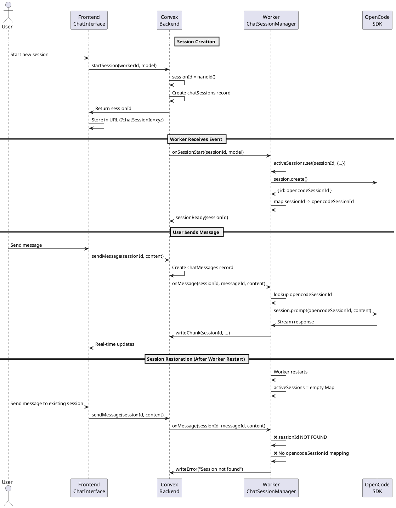

# Session Restoration Research: Issue Analysis

## Overview

This document analyzes the session restoration implementation to address confusion about session data storage, session ID sources of truth, and session ID allocation.

## Research Questions & Answers

### 1. What kind of session data do we store in Convex?

Convex stores **TWO DISTINCT TYPES** of sessions:

#### A. Authentication Sessions (`sessions` table)

```typescript
// From services/backend/convex/schema.ts:160-175
sessions: defineTable({
  sessionId: v.string(), // Provided by client (frontend)
  userId: v.id("users"), // Links to user account
  createdAt: v.number(),
  authMethod: v.optional(
    v.union(
      v.literal("google"),
      v.literal("login_code"),
      v.literal("recovery_code"),
      v.literal("anonymous"),
      v.literal("username_password")
    )
  ),
  expiresAt: v.optional(v.number()), // DEPRECATED
  expiresAtLabel: v.optional(v.string()), // DEPRECATED
}).index("by_sessionId", ["sessionId"]);
```

**Purpose**: User authentication state management
**Generated By**: Frontend client (webapp)
**Used For**: Identifying authenticated users across HTTP requests

#### B. Chat Sessions (`chatSessions` table)

```typescript
// From services/backend/convex/schema.ts:301-314
chatSessions: defineTable({
  sessionId: v.string(), // Primary key (nanoid generated by BACKEND)
  workerId: v.string(), // Worker handling this session
  userId: v.id("users"), // User who owns this session
  model: v.string(), // AI model being used
  status: v.union(
    v.literal("active"),
    v.literal("idle"),
    v.literal("terminated")
  ),
  createdAt: v.number(),
  lastActivity: v.number(),
})
  .index("by_session_id", ["sessionId"])
  .index("by_worker_id", ["workerId"])
  .index("by_user_id", ["userId"])
  .index("by_status", ["status"])
  .index("by_worker_and_status", ["workerId", "status"]);
```

**Purpose**: Chat conversation state management
**Generated By**: Backend (Convex) when session is started
**Associated Data**:

- `chatMessages` table - stores message content and metadata
- `chatChunks` table - stores streaming response chunks

### 2. Which session ID is the source of truth - Convex or OpenCode?

**CRITICAL FINDING**: There is a **SESSION ID MISMATCH** issue in the current implementation!

#### Current Implementation Has TWO Session IDs

**Convex Chat Session ID** (Primary)

- Generated by: **Backend** (Convex) in `chat.ts:startSession()`
- Location: `services/backend/convex/chat.ts:58`
- Code: `const sessionId = nanoid();`
- Purpose: Identifies chat session in Convex database
- Used For: All database operations, frontend routing, URL state

**OpenCode Session ID** (Secondary)

- Generated by: **OpenCode SDK** in worker process
- Location: `services/worker/src/infrastructure/opencode/OpencodeClientAdapter.ts:182`
- Code: `await sdkClient.session.create({ ... })`
- Returns: `{ id: string, projectID: string, directory: string, parentID: string }`
- Purpose: Identifies session in OpenCode's internal state
- Used For: Sending prompts to OpenCode AI model

#### The Problem

The two session IDs are **NOT synchronized**:

```typescript
// services/worker/src/application/ChatSessionManager.ts:79-108
async startSession(sessionId: string, model: string): Promise<void> {
  // sessionId is from Convex (backend-generated)
  console.log(`🚀 Starting session ${sessionId} with model ${model}`);

  // Store Convex session ID in memory
  this.activeSessions.set(sessionId, {
    sessionId,  // Convex session ID
    model,
    startedAt: Date.now(),
    isInitializing: true,
  });

  // Create OpenCode session (generates NEW ID internally)
  const opencodeSession = await this.opencodeAdapter.createSession(
    this.opencodeClient!,
    model
  );
  console.log(`📝 Opencode session created: ${opencodeSession.id}`);

  // Map Convex ID -> OpenCode ID
  const session = this.activeSessions.get(sessionId);
  if (session) {
    session.opencodeSessionId = opencodeSession.id;  // Store mapping
    session.isInitializing = false;
  }
}
```

**Current Mapping**:

```
Convex Session ID (nanoid) ----maps-to----> OpenCode Session ID (SDK-generated)
         |                                              |
    Source of truth                            Used for AI prompts
    for database                               and responses
```

### 3. Where are session IDs allocated?

#### Design Document States (spec/design.md:263-267)

```
| Entity       | ID Source    | Generated By      | Notes                                |
|--------------|--------------|-------------------|--------------------------------------|
| Machine      | machine_id   | Frontend (webapp) | Used in worker token                 |
| Worker       | worker_id    | Frontend (webapp) | Part of worker token                 |
| Chat Session | session_id   | Opencode          | Source of truth for session identity |
```

**⚠️ DISCREPANCY DETECTED**: The design doc says "Chat Session ID generated by OpenCode" but the actual implementation generates it in **Convex backend**!

#### Actual Implementation

**Authentication Session ID**

- **Allocated By**: Frontend (webapp client)
- **Location**: Client-side session management (convex-helpers)
- **Purpose**: User authentication

**Chat Session ID**

- **Allocated By**: Backend (Convex)
- **Location**: `services/backend/convex/chat.ts:58`
- **Code**: `const sessionId = nanoid();`
- **When**: Called when frontend invokes `startSession` mutation

**OpenCode Session ID**

- **Allocated By**: OpenCode SDK
- **Location**: Worker process during session initialization
- **Code**: `await sdkClient.session.create({ ... })`
- **When**: Worker receives session start event from Convex

## Session Restoration Flow Analysis

### Current Implementation



### The Problem: Lost Session Mapping

When the worker process restarts:

1. **Convex retains** all chat session data (sessionId, messages, status)
2. **Worker loses** the in-memory mapping: `sessionId -> opencodeSessionId`
3. **OpenCode may retain** sessions (depends on OpenCode server lifecycle)
4. **No recovery mechanism** to rebuild the mapping

## Solution Architecture Needed

### Option A: Store OpenCode Session ID in Convex

Modify `chatSessions` table to include OpenCode session ID:

```typescript
chatSessions: defineTable({
  sessionId: v.string(),           // Convex ID (primary)
  opencodeSessionId: v.optional(v.string()),  // OpenCode ID (NEW)
  workerId: v.string(),
  userId: v.id('users'),
  model: v.string(),
  status: v.union(...),
  createdAt: v.number(),
  lastActivity: v.number(),
})
```

**Pros**:

- Persistent mapping survives worker restarts
- Can restore sessions by querying OpenCode with stored ID
- Maintains Convex as single source of truth

**Cons**:

- Adds coupling between Convex schema and OpenCode internals
- Need to handle case where OpenCode session expired but Convex record exists

### Option B: Use OpenCode Session ID as Primary ID

Change implementation to use OpenCode's session ID throughout:

```typescript
// In backend
export const startSession = mutation({
  handler: async (ctx, args) => {
    // Don't generate sessionId here
    // Wait for worker to provide OpenCode session ID
    const pendingSessionId = nanoid(); // Temporary ID

    await ctx.db.insert("chatSessions", {
      sessionId: pendingSessionId,
      status: "initializing",
      // ...
    });

    return pendingSessionId;
  },
});

// Worker calls back with OpenCode session ID
export const registerOpencodeSession = internalMutation({
  args: {
    pendingSessionId: v.string(),
    opencodeSessionId: v.string(),
  },
  handler: async (ctx, args) => {
    // Update record with real OpenCode session ID
    // ...
  },
});
```

**Pros**:

- Aligns with design document intent
- Single source of truth (OpenCode)
- Can restore by listing OpenCode sessions

**Cons**:

- More complex initialization flow
- Requires callback mechanism
- Frontend must wait for "session ready" event

### Option C: Hybrid Approach with Session Restoration API

Keep current dual-ID approach but add restoration capability:

```typescript
// In ChatSessionManager
async restoreActiveSessions(): Promise<void> {
  // Query Convex for active sessions belonging to this worker
  const activeSessions = await this.convexClient.getActiveSessions();

  // Query OpenCode for existing sessions
  const opencodeSessions = await this.opencodeAdapter.listSessions(this.opencodeClient!);

  // Try to match by timestamp/metadata or create new OpenCode sessions
  for (const convexSession of activeSessions) {
    // Strategy 1: Check if OpenCode session still exists
    const matchingOCSession = opencodeSessions.find(s =>
      Math.abs(s.createdAt - convexSession.createdAt) < 5000
    );

    if (matchingOCSession) {
      // Restore mapping
      this.activeSessions.set(convexSession.sessionId, {
        sessionId: convexSession.sessionId,
        opencodeSessionId: matchingOCSession.id,
        model: convexSession.model,
        startedAt: convexSession.createdAt,
      });
    } else {
      // Strategy 2: Create new OpenCode session for existing Convex session
      const newOCSession = await this.opencodeAdapter.createSession(
        this.opencodeClient!,
        convexSession.model
      );
      this.activeSessions.set(convexSession.sessionId, {
        sessionId: convexSession.sessionId,
        opencodeSessionId: newOCSession.id,
        model: convexSession.model,
        startedAt: convexSession.createdAt,
      });
    }
  }
}
```

**Pros**:

- Minimal schema changes
- Graceful recovery from worker restarts
- Can handle both preserved and lost OpenCode sessions

**Cons**:

- Complex matching logic
- May not preserve conversation history in OpenCode
- Need to handle race conditions during restoration

## Recommendations

### Immediate Fix (Option A)

1. Add `opencodeSessionId` field to `chatSessions` table
2. Store mapping when worker creates OpenCode session
3. Implement session restoration on worker startup
4. Update design document to reflect actual implementation

### Long-term Consideration

Re-evaluate whether OpenCode session persistence is needed:

- If OpenCode sessions are meant to be ephemeral (5-minute timeout), Option A is sufficient
- If we want conversation history in OpenCode itself, consider Option B
- Document the architectural decision clearly

## Files Involved

### Backend

- `services/backend/convex/schema.ts` - Add opencodeSessionId field
- `services/backend/convex/chat.ts` - Store opencodeSessionId when session is ready

### Worker

- `services/worker/src/application/ChatSessionManager.ts` - Implement restoration
- `services/worker/src/infrastructure/convex/ConvexClientAdapter.ts` - Add restoration queries
- `services/worker/src/infrastructure/opencode/OpencodeClientAdapter.ts` - Session listing

### Documentation

- `spec/design.md` - Update ID allocation table
- `codemaps/session-restoration.codemap.md` - This document

## Next Steps

1. **Clarify Design Intent**: Decide which option aligns with product vision
2. **Update Schema**: Add opencodeSessionId to chatSessions table
3. **Implement Restoration**: Add restoration logic to ChatSessionManager
4. **Add Tests**: Test worker restart scenarios
5. **Update Documentation**: Align design docs with implementation
