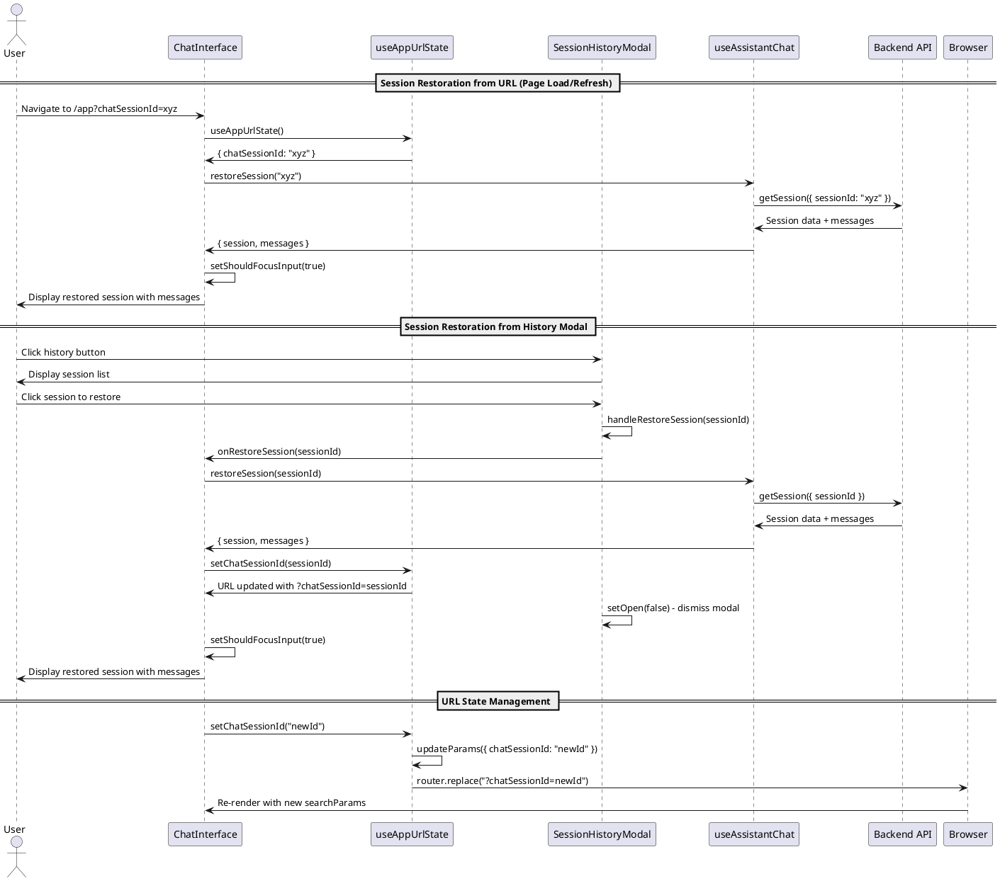

# Chat Session Restoration Codemap

## Title

Chat Session Restoration and URL State Management

## Description

Enables users to restore previous chat sessions via URL state management, with automatic restoration on page load/refresh, session history modal for browsing past sessions, and proper URL parameter naming to avoid conflicts with auth sessions.

## Sequence Diagram



## Frontend Entry Point / Route

- `apps/webapp/src/app/app/page.tsx` - Main chat interface page
  - **Search Parameters**: 
    - `machineId` - Selected machine ID
    - `workerId` - Selected worker ID  
    - `chatSessionId` - Active chat session ID (renamed from sessionId to avoid auth session confusion)

## Frontend Components

- `apps/webapp/src/modules/assistant/components/ChatInterface.tsx` - Main chat interface orchestrator
- `apps/webapp/src/modules/assistant/components/SessionHistoryModal.tsx` - Modal for browsing and restoring sessions
- `apps/webapp/src/modules/assistant/components/SessionList.tsx` - List of available sessions
- `apps/webapp/src/modules/assistant/components/ChatMessageList.tsx` - Displays restored messages
- `apps/webapp/src/modules/assistant/components/ChatInputWithModel.tsx` - Input component with focus control

## Frontend Service Layer

- `apps/webapp/src/modules/assistant/hooks/useAppUrlState.ts` - URL state management hook
  - **Functions**:
    ```typescript
    useAppUrlState(): {
      state: AppUrlState;
      actions: AppUrlStateActions;
    }
    ```

- `apps/webapp/src/modules/assistant/hooks/useAssistantChat.ts` - Chat session management hook
  - **Functions**:
    ```typescript
    useAssistantChat(workerId: string | null): AssistantChatReturn
    ```

- `apps/webapp/src/modules/assistant/hooks/useAssistantSessions.ts` - Sessions list hook
  - **Functions**:
    ```typescript
    useAssistantSessions(workerId: string | null): {
      sessions: ChatSession[] | undefined;
      loading: boolean;
    }
    ```

- `apps/webapp/src/modules/assistant/types.ts` - Frontend type definitions

  ```typescript
  // From apps/webapp/src/modules/assistant/types.ts
  export interface ChatSession {
    sessionId: string;
    workerId: string;
    model: string;
    status: 'active' | 'terminated';
    createdAt: number;
    terminatedAt?: number;
    messageCount: number;
  }

  export interface ChatMessage {
    id: string;
    role: 'user' | 'assistant' | 'system';
    content: string;
    timestamp: number;
    isStreaming?: boolean;
  }

  export interface AssistantChatReturn {
    session: ChatSession | null;
    messages: ChatMessage[];
    isLoading: boolean;
    startSession: (model: string) => Promise<string | null>;
    restoreSession: (sessionId: string) => Promise<void>;
    endSession: () => Promise<void>;
    clearSession: () => void;
    sendMessage: (content: string) => Promise<void>;
  }

  // From apps/webapp/src/modules/assistant/hooks/useAppUrlState.ts
  export interface AppUrlState {
    /** Selected machine ID */
    machineId: string | null;
    /** Selected worker ID */
    workerId: string | null;
    /** Active chat session ID (renamed from sessionId to avoid auth session confusion) */
    chatSessionId: string | null;
  }

  export interface AppUrlStateActions {
    /** Set the selected machine ID and clear worker/session */
    setMachineId: (machineId: string | null) => void;
    /** Set the selected worker ID and clear session */
    setWorkerId: (workerId: string | null) => void;
    /** Set the active chat session ID */
    setChatSessionId: (chatSessionId: string | null) => void;
    /** Clear all selections */
    clearAll: () => void;
  }
  ```

## Backend Function Entry Point

- `services/backend/convex/chat.ts` - Chat session management backend
  - **Functions**:
    ```typescript
    getSession(args: { sessionId: string }): Promise<ChatSession | null>
    getSessions(args: { workerId: string }): Promise<ChatSession[]>
    getMessages(args: { chatSessionId: string }): Promise<ChatMessage[]>
    startSession(args: { workerId: string; model: string }): Promise<string>
    endSession(args: { chatSessionId: string }): Promise<void>
    sendMessage(args: { chatSessionId: string; content: string }): Promise<void>
    ```

### Contracts

```typescript
// From services/backend/convex/chat.ts
import { SessionIdArg } from "convex-helpers/server/sessions";
import { v } from "convex/values";

// Query to get session details
export const getSession = query({
  args: {
    ...SessionIdArg,
    sessionId: v.string(),
  },
  handler: async (ctx, args): Promise<ChatSession | null> => {
    // Implementation fetches session from database
  },
});

// Query to list worker's sessions
export const getSessions = query({
  args: {
    ...SessionIdArg,
    workerId: v.string(),
  },
  handler: async (ctx, args): Promise<ChatSession[]> => {
    // Implementation fetches all sessions for worker
  },
});

// Query to get session messages
export const getMessages = query({
  args: {
    ...SessionIdArg,
    chatSessionId: v.string(),
  },
  handler: async (ctx, args): Promise<ChatMessage[]> => {
    // Implementation fetches messages for session
  },
});

// Mutation to start new session
export const startSession = mutation({
  args: {
    ...SessionIdArg,
    workerId: v.string(),
    model: v.string(),
  },
  handler: async (ctx, args): Promise<string> => {
    // Implementation creates session and returns ID
  },
});

// Mutation to end session
export const endSession = mutation({
  args: {
    ...SessionIdArg,
    chatSessionId: v.string(),
  },
  handler: async (ctx, args): Promise<void> => {
    // Implementation marks session as terminated
  },
});

// Mutation to send message
export const sendMessage = mutation({
  args: {
    ...SessionIdArg,
    chatSessionId: v.string(),
    content: v.string(),
  },
  handler: async (ctx, args): Promise<void> => {
    // Implementation adds message and triggers worker processing
  },
});
```

## Backend Schema

- `services/backend/convex/schema.ts` - Schema definitions
  - `chatSessions` table definition
  - `chatMessages` table definition
  - Relevant indexes

```typescript
// Schema Definition
interface IChatSessionDoc {
  workerId: string;
  model: string;
  status: 'active' | 'terminated';
  createdAt: number;
  terminatedAt?: number;
}

interface IChatMessageDoc {
  chatSessionId: Id<"chatSessions">;
  role: 'user' | 'assistant' | 'system';
  content: string;
  timestamp: number;
}

chatSessions: defineTable({
  workerId: v.string(),
  model: v.string(),
  status: v.union(v.literal('active'), v.literal('terminated')),
  createdAt: v.number(),
  terminatedAt: v.optional(v.number()),
})
.index("by_worker", ["workerId"])
.index("by_worker_status", ["workerId", "status"]);

chatMessages: defineTable({
  chatSessionId: v.id("chatSessions"),
  role: v.union(v.literal('user'), v.literal('assistant'), v.literal('system')),
  content: v.string(),
  timestamp: v.number(),
})
.index("by_session", ["chatSessionId"])
.index("by_session_timestamp", ["chatSessionId", "timestamp"]);
```

## Key Implementation Details

### URL Parameter Naming

The URL parameter was renamed from `sessionId` to `chatSessionId` to avoid confusion with authentication session management:

- **Old**: `?sessionId=xyz` (could be confused with auth sessions)
- **New**: `?chatSessionId=xyz` (clearly indicates chat-specific session)

This is implemented in `useAppUrlState.ts` with corresponding updates throughout the codebase.

### Automatic Session Restoration

Session restoration happens automatically on mount/page refresh via `useEffect` in `ChatInterface.tsx`:

```typescript
// Restore session from URL on mount or when URL session changes
useEffect(() => {
  if (urlChatSessionId && selectedWorkerId && !session) {
    console.log('[ChatInterface] Restoring session from URL:', urlChatSessionId);
    // Check if this session is terminated before restoring
    const urlSession = sessions?.find((s) => s.sessionId === urlChatSessionId);
    if (urlSession?.status === 'terminated') {
      console.log('[ChatInterface] Skipping restore - session is terminated');
      // Clear terminated session from URL
      urlActions.setChatSessionId(null);
      return;
    }
    restoreSession(urlChatSessionId).catch((error) => {
      console.error('[ChatInterface] Failed to restore session from URL:', error);
      // Clear invalid session from URL
      urlActions.setChatSessionId(null);
    });
  }
}, [urlChatSessionId, selectedWorkerId, session, sessions, restoreSession, urlActions]);
```

### Modal Dismissal

The `SessionHistoryModal` is converted to a controlled component that automatically dismisses after session selection:

```typescript
export function SessionHistoryModal({ sessions, onRestoreSession, isLoading }: SessionHistoryModalProps) {
  const [open, setOpen] = useState(false);

  const handleRestoreSession = (sessionId: string) => {
    onRestoreSession(sessionId);
    // Close modal after restoring session
    setOpen(false);
  };

  return (
    <Dialog open={open} onOpenChange={setOpen}>
      {/* Dialog content */}
    </Dialog>
  );
}
```

### Focus Management

After session restoration, the input is focused using state-based triggering:

```typescript
const handleRestoreSession = useCallback(
  async (sessionId: string) => {
    try {
      await restoreSession(sessionId);
      urlActions.setChatSessionId(sessionId);
      // Trigger focus after the component re-renders with the new session
      setShouldFocusInput(true);
    } catch (error) {
      console.error('Failed to restore session:', error);
    }
  },
  [restoreSession, urlActions]
);
```

See `docs/focus-management-pattern.md` for detailed explanation of the focus management approach.

