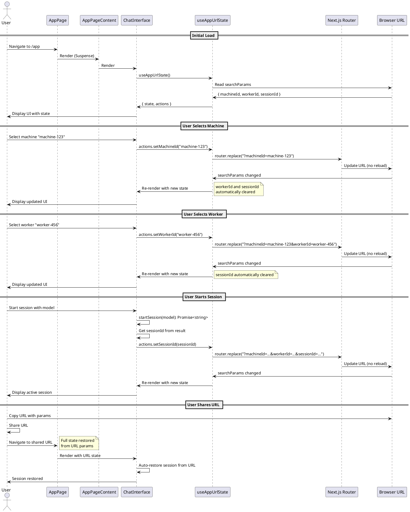

# URL State Management for App Selection

## Description

This codemap documents the URL state management pattern used in the `/app` page for persisting machine, worker, and session selections via query parameters. The implementation follows unidirectional dataflow principles to avoid render loops and ensures the URL is the single source of truth.

## Key Principles

1. **URL as Single Source of Truth**: All selection state is derived directly from URL params
2. **No useEffect for State Sync**: Avoids common render loop pitfalls
3. **Unidirectional Flow**: Actions update URL → URL change triggers re-render → State derived from URL
4. **Suspense Boundary**: Proper handling of `useSearchParams` with Suspense

## Sequence Diagram



## Frontend Files

### Pages

#### `/app/app/page.tsx`
Main application page that wraps content in Suspense boundary.

**Key Functions:**
- `AppPage()`: Wrapper component with Suspense
- `AppPageContent()`: Inner component with actual logic

**URL Parameters Read:**
- `machineId` - Selected machine ID
- `workerId` - Selected worker ID
- `sessionId` - Active session ID

### Components

#### `/apps/webapp/src/modules/assistant/components/ChatInterface.tsx`
Main chat interface that uses URL state for persistence.

**Key Functions:**
- `ChatInterface()`: Main component
- `handleMachineChange(machineId: string): void` - Updates URL with machine selection
- `handleWorkerChange(workerId: string): void` - Updates URL with worker selection
- `handleStartSession(): Promise<void>` - Starts session and updates URL
- `handleRestoreSession(sessionId: string): Promise<void>` - Restores session and updates URL
- `handleEndSession(): Promise<void>` - Ends session and clears URL

**State Management:**
```typescript
// URL state (single source of truth)
const { state: urlState, actions: urlActions } = useAppUrlState();
const { machineId, workerId, sessionId } = urlState;

// Local UI state (not persisted)
const [selectedModel, setSelectedModel] = useState<string | null>(null);
const [showNewSession, setShowNewSession] = useState(false);
```

**Side Effects (useEffect):**
1. Worker connection request (network call)
2. Session restoration from URL (on mount/URL change)
3. Auto-select first model (UI convenience)
4. Debug logging

### Hooks

#### `/apps/webapp/src/modules/assistant/hooks/useAppUrlState.ts`
Custom hook for managing URL state in a unidirectional way.

**Exports:**
```typescript
interface AppUrlState {
  machineId: string | null;
  workerId: string | null;
  sessionId: string | null;
}

interface AppUrlStateActions {
  setMachineId: (machineId: string | null) => void;
  setWorkerId: (workerId: string | null) => void;
  setSessionId: (sessionId: string | null) => void;
  clearAll: () => void;
}

function useAppUrlState(): {
  state: AppUrlState;
  actions: AppUrlStateActions;
}
```

**Key Functions:**
- `useAppUrlState()`: Returns current URL state and actions
- `updateParams(updates: Partial<Record<string, string | null>>)`: Internal helper to update URL

**Implementation Details:**
- Uses `useSearchParams()` to read URL params
- Uses `router.replace()` to update URL without navigation
- State is derived via `useMemo` directly from searchParams
- Actions are memoized callbacks that update URL
- Hierarchical clearing: machine change clears worker+session, worker change clears session

## Backend Files

No backend changes required. This is purely a frontend state management improvement.

## Contracts

### URL Query Parameters

```typescript
// URL format: /app?machineId=xxx&workerId=yyy&sessionId=zzz

interface AppUrlParams {
  /** Selected machine ID (optional) */
  machineId?: string;
  
  /** Selected worker ID (optional, requires machineId) */
  workerId?: string;
  
  /** Active session ID (optional, requires workerId) */
  sessionId?: string;
}
```

### Hook Interface

```typescript
/**
 * URL state for the app page.
 */
interface AppUrlState {
  /** Selected machine ID */
  machineId: string | null;
  
  /** Selected worker ID */
  workerId: string | null;
  
  /** Active session ID */
  sessionId: string | null;
}

/**
 * Actions for updating URL state.
 * All actions follow unidirectional dataflow.
 */
interface AppUrlStateActions {
  /** 
   * Set the selected machine ID and clear worker/session.
   * Updates URL: ?machineId=xxx
   */
  setMachineId: (machineId: string | null) => void;
  
  /** 
   * Set the selected worker ID and clear session.
   * Updates URL: ?machineId=xxx&workerId=yyy
   */
  setWorkerId: (workerId: string | null) => void;
  
  /** 
   * Set the active session ID.
   * Updates URL: ?machineId=xxx&workerId=yyy&sessionId=zzz
   */
  setSessionId: (sessionId: string | null) => void;
  
  /** 
   * Clear all selections.
   * Updates URL: /app (no params)
   */
  clearAll: () => void;
}

/**
 * Hook return type.
 */
interface UseAppUrlStateReturn {
  /** Current URL state (derived from searchParams) */
  state: AppUrlState;
  
  /** Actions to update URL state */
  actions: AppUrlStateActions;
}
```

## Implementation Notes

### Why This Pattern Avoids Render Loops

**Common Anti-Pattern (causes loops):**
```typescript
// ❌ BAD: useEffect syncing state
const [urlMachineId, setUrlMachineId] = useState(searchParams.get('machineId'));
const [localMachineId, setLocalMachineId] = useState(null);

useEffect(() => {
  setLocalMachineId(urlMachineId); // Can cause loops
}, [urlMachineId]);

useEffect(() => {
  setUrlMachineId(localMachineId); // Can cause loops
}, [localMachineId]);
```

**Our Pattern (no loops):**
```typescript
// ✅ GOOD: Direct derivation, no sync
const { state } = useAppUrlState();
const { machineId } = state; // Derived directly from URL

// Actions update URL, which triggers natural re-render
actions.setMachineId('machine-123');
```

### Hierarchical State Clearing

When a parent selection changes, child selections are automatically cleared:

1. **Machine changes** → Clear worker AND session
2. **Worker changes** → Clear session only
3. **Session ends** → Clear session only

This is implemented in the action handlers:

```typescript
setMachineId: (machineId) => {
  updateParams({
    machineId,
    workerId: null,    // Clear child
    sessionId: null,   // Clear grandchild
  });
}

setWorkerId: (workerId) => {
  updateParams({
    workerId,
    sessionId: null,   // Clear child
  });
}
```

### Session Restoration Flow

When a user navigates to a URL with a sessionId:

1. Page renders with URL params
2. `useAppUrlState` derives state from URL
3. ChatInterface receives `urlSessionId` from state
4. useEffect detects `urlSessionId && !session`
5. Calls `restoreSession(urlSessionId)`
6. Session data loads via Convex queries
7. UI updates to show active session

### Suspense Boundary

`useSearchParams()` requires a Suspense boundary in Next.js App Router:

```typescript
export default function AppPage() {
  return (
    <Suspense fallback={<LoadingSkeleton />}>
      <AppPageContent />
    </Suspense>
  );
}
```

This prevents hydration errors and provides proper loading states.

## Testing Strategy

### Manual Testing Checklist

1. ✅ Select machine → URL updates with `?machineId=xxx`
2. ✅ Select worker → URL updates with `?workerId=yyy`, keeps machineId
3. ✅ Start session → URL updates with `?sessionId=zzz`, keeps machine+worker
4. ✅ End session → URL removes sessionId, keeps machine+worker
5. ✅ Change machine → URL clears worker and session
6. ✅ Change worker → URL clears session, keeps machine
7. ✅ Copy URL and paste in new tab → State fully restored
8. ✅ Browser back/forward → State follows URL history
9. ✅ No console errors about render loops
10. ✅ No infinite re-render warnings

### Render Loop Prevention

**Key checks:**
- No `useEffect` that sets state based on props/state
- No circular dependencies in useEffect deps
- State derived directly from URL, not synced
- Actions only update URL, not local state

## Benefits

1. **Shareable URLs**: Users can share exact state via URL
2. **Browser History**: Back/forward buttons work naturally
3. **No Render Loops**: Unidirectional flow prevents common pitfalls
4. **Persistence**: State survives page refresh
5. **Bookmarkable**: Users can bookmark specific states
6. **Testable**: URL params are easy to test
7. **Debuggable**: State visible in URL bar

## Future Enhancements

- Add URL param validation/sanitization
- Add URL state for model selection
- Add URL state for message filters
- Add analytics tracking for URL state changes
- Add deep linking to specific messages

