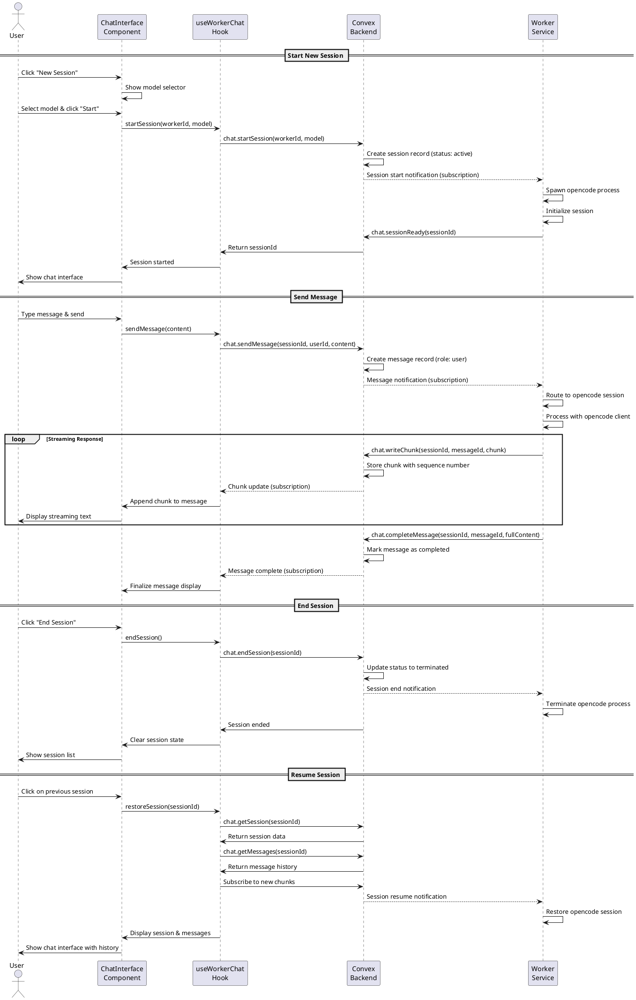

# Worker Chat Sessions Codemap

## Title

Worker Chat Session Management with Real-time Messaging

## Description

Implements end-to-end chat session functionality where users can start new sessions, send messages, receive streaming responses from workers, and resume previous sessions. This feature connects the frontend chat UI with the worker service through the Convex backend, enabling real-time bidirectional communication.

**Key Features:**
- Start new chat sessions with model selection
- Send messages and receive streaming responses
- End current session and start a new one
- Resume previous sessions from session list
- Real-time message synchronization via Convex subscriptions

**Related Design Documentation:**
- [System Design - Flow 3: Chat Session](../spec/design.md#flow-3-worker-registration-and-usage)
- [Design Decisions - Session Lifecycle & Timeouts](../spec/design.md#session-lifecycle--timeouts)
- [Design Decisions - Dual Channel Response](../spec/design.md#dual-channel-response)

## Sequence Diagram



## Frontend Files

### Chat Hooks (Updated)

- `apps/webapp/src/modules/assistant/hooks/useAssistantChat.ts` - Real chat session management ✅ (Update from mock)
  - **Functions**:
    ```typescript
    useAssistantChat(workerId: string | null): AssistantChatReturn
    ```
  - **Implementation**: Replace mock data with real Convex queries/mutations

- `apps/webapp/src/modules/assistant/hooks/useAssistantSessions.ts` - Real session list ✅ (Update from mock)
  - **Functions**:
    ```typescript
    useAssistantSessions(workerId: string | null): { sessions: ChatSession[], loading: boolean }
    ```
  - **Implementation**: Replace mock data with real Convex query

### Chat Components (Existing)

- `apps/webapp/src/modules/assistant/components/ChatInterface.tsx` - Already integrated ✅
- `apps/webapp/src/modules/assistant/components/ChatMessageList.tsx` - Already supports streaming ✅
- `apps/webapp/src/modules/assistant/components/ChatInput.tsx` - Already functional ✅
- `apps/webapp/src/modules/assistant/components/SessionList.tsx` - Already functional ✅
- `apps/webapp/src/modules/assistant/components/ModelSelector.tsx` - Already functional ✅

### Type Definitions (Updated)

- `apps/webapp/src/modules/assistant/types.ts` - Update chat types ✅
  - Add missing fields for backend compatibility
  - Ensure types match backend schema

## Backend Files

### Chat Session Management

- `services/backend/convex/chat.ts` - Chat session and message handling 🆕
  - **Mutations**:
    ```typescript
    startSession(args: SessionIdArg & { workerId: string; model: string }): Promise<string>
    endSession(args: SessionIdArg & { sessionId: string }): Promise<void>
    sendMessage(args: SessionIdArg & { sessionId: string; content: string }): Promise<string>
    writeChunk(args: { sessionId: string; messageId: string; chunk: string; sequence: number }): Promise<void>
    completeMessage(args: { sessionId: string; messageId: string; content: string }): Promise<void>
    sessionReady(args: { sessionId: string }): Promise<void>
    ```
  - **Queries**:
    ```typescript
    getSession(args: SessionIdArg & { sessionId: string }): Promise<ChatSession | null>
    listSessions(args: SessionIdArg & { workerId: string }): Promise<ChatSession[]>
    getMessages(args: SessionIdArg & { sessionId: string }): Promise<ChatMessage[]>
    subscribeToMessages(args: SessionIdArg & { sessionId: string }): Promise<ChatMessage[]>
    subscribeToChunks(args: SessionIdArg & { sessionId: string; messageId: string }): Promise<ChatChunk[]>
    ```

### Schema Updates

- `services/backend/convex/schema.ts` - Add chat tables 🆕
  - `chatSessions` table
  - `chatMessages` table
  - `chatChunks` table

## Worker Service Files

### Chat Session Handler

- `services/worker/src/application/ChatSessionManager.ts` - Manage opencode sessions 🆕
  - **Functions**:
    ```typescript
    startSession(sessionId: string, model: string): Promise<void>
    endSession(sessionId: string): Promise<void>
    sendMessage(sessionId: string, messageId: string, content: string): Promise<void>
    restoreSession(sessionId: string): Promise<void>
    ```

### Message Processor

- `services/worker/src/application/MessageProcessor.ts` - Process messages with opencode 🆕
  - **Functions**:
    ```typescript
    processMessage(sessionId: string, messageId: string, content: string): Promise<void>
    streamResponse(sessionId: string, messageId: string, stream: AsyncIterable<string>): Promise<void>
    ```

### Convex Integration (Updated)

- `services/worker/src/infrastructure/convex/ConvexClientAdapter.ts` - Add chat methods ✅
  - Add subscription to session start events
  - Add subscription to message events
  - Add methods to write chunks and complete messages

### Worker Server (Updated)

- `services/worker/src/presentation/MachineServer.ts` - Integrate chat manager ✅
  - Initialize ChatSessionManager
  - Set up subscriptions for chat events
  - Handle session lifecycle

## Contracts

```typescript
// Frontend Types (apps/webapp/src/modules/assistant/types.ts)

export interface ChatSession {
  sessionId: string; // From opencode or backend-generated
  workerId: string;
  model: string;
  status: 'active' | 'idle' | 'terminated';
  createdAt: number;
  lastActivity: number;
}

export interface ChatMessage {
  id: string; // messageId
  sessionId: string;
  role: 'user' | 'assistant' | 'system';
  content: string;
  timestamp: number;
  completed: boolean;
  isStreaming?: boolean; // Frontend-only flag
}

export interface ChatChunk {
  chunkId: string;
  messageId: string;
  sessionId: string;
  chunk: string;
  sequence: number;
  timestamp: number;
}

// Backend Schema (services/backend/convex/schema.ts)

chatSessions: defineTable({
  sessionId: v.string(), // Primary key (nanoid or from opencode)
  workerId: v.string(),
  userId: v.id('users'),
  model: v.string(),
  status: v.union(
    v.literal('active'),
    v.literal('idle'),
    v.literal('terminated')
  ),
  createdAt: v.number(),
  lastActivity: v.number(),
})
  .index('by_session_id', ['sessionId'])
  .index('by_worker_id', ['workerId'])
  .index('by_user_id', ['userId'])
  .index('by_status', ['status']),

chatMessages: defineTable({
  messageId: v.string(), // Primary key (nanoid)
  sessionId: v.string(),
  role: v.union(v.literal('user'), v.literal('assistant'), v.literal('system')),
  content: v.string(),
  timestamp: v.number(),
  completed: v.boolean(), // False while streaming, true when done
})
  .index('by_message_id', ['messageId'])
  .index('by_session_id', ['sessionId'])
  .index('by_session_and_timestamp', ['sessionId', 'timestamp']),

chatChunks: defineTable({
  chunkId: v.string(), // Primary key (nanoid)
  messageId: v.string(),
  sessionId: v.string(),
  chunk: v.string(),
  sequence: v.number(),
  timestamp: v.number(),
})
  .index('by_chunk_id', ['chunkId'])
  .index('by_message_id', ['messageId'])
  .index('by_session_and_sequence', ['sessionId', 'sequence']),

// Backend API (services/backend/convex/chat.ts)

export const startSession = mutation({
  args: {
    ...SessionIdArg,
    workerId: v.string(),
    model: v.string(),
  },
  handler: async (ctx, args): Promise<string> => {
    // Verify user owns the worker
    // Create session record
    // Return sessionId
  },
});

export const sendMessage = mutation({
  args: {
    ...SessionIdArg,
    sessionId: v.string(),
    content: v.string(),
  },
  handler: async (ctx, args): Promise<string> => {
    // Verify user owns the session
    // Create user message record
    // Create assistant message placeholder (completed: false)
    // Return messageId for assistant response
  },
});

export const writeChunk = mutation({
  args: {
    sessionId: v.string(),
    messageId: v.string(),
    chunk: v.string(),
    sequence: v.number(),
  },
  handler: async (ctx, args): Promise<void> => {
    // Store chunk with sequence number
    // Update session lastActivity
  },
});

export const completeMessage = mutation({
  args: {
    sessionId: v.string(),
    messageId: v.string(),
    content: v.string(),
  },
  handler: async (ctx, args): Promise<void> => {
    // Update message with full content
    // Mark message as completed
    // Update session lastActivity
  },
});

export const listSessions = query({
  args: {
    ...SessionIdArg,
    workerId: v.string(),
  },
  handler: async (ctx, args): Promise<ChatSession[]> => {
    // Verify user owns the worker
    // Return sessions for worker
  },
});

export const getMessages = query({
  args: {
    ...SessionIdArg,
    sessionId: v.string(),
  },
  handler: async (ctx, args): Promise<ChatMessage[]> => {
    // Verify user owns the session
    // Return messages ordered by timestamp
  },
});

export const subscribeToMessages = query({
  args: {
    ...SessionIdArg,
    sessionId: v.string(),
  },
  handler: async (ctx, args): Promise<ChatMessage[]> => {
    // Real-time subscription to messages
    // Used for live updates
  },
});

export const subscribeToChunks = query({
  args: {
    ...SessionIdArg,
    sessionId: v.string(),
    messageId: v.string(),
  },
  handler: async (ctx, args): Promise<ChatChunk[]> => {
    // Real-time subscription to chunks
    // Used for streaming display
  },
});
```

## Implementation Order

### Phase 1: Backend Foundation 🆕

1. **Schema**: Add chat tables to `schema.ts`
2. **Chat API**: Implement `chat.ts` with all mutations and queries
3. **Testing**: Verify CRUD operations work

### Phase 2: Frontend Integration 🔄

1. **Update Types**: Ensure frontend types match backend
2. **Update useAssistantChat**: Replace mock with real Convex calls
3. **Update useAssistantSessions**: Replace mock with real Convex query
4. **Testing**: Verify UI can start sessions and send messages

### Phase 3: Worker Service Integration ✅

1. **Backend Worker Queries**: Added subscribeToWorkerSessions and subscribeToWorkerMessages ✅
2. **ConvexClientAdapter**: Implemented real-time chat subscriptions ✅
3. **ChatSessionManager**: Integrated real opencode SDK for message processing ✅
4. **MachineServer**: Integrated chat manager with event callbacks ✅
5. **Port Management**: Random port selection with availability checking ✅
6. **Race Condition Fixes**: Separate initialization flags for subscriptions ✅
7. **Error Handling**: All errors write to chat and mark messages complete ✅

### Phase 4: Streaming & Polish ✅

1. **Chunk Streaming**: Real-time chunk display working ✅
2. **Session Resume**: Session restoration working ✅
3. **Error Handling**: Proper error states and messages in chat ✅
4. **Loading States**: Loading indicators working ✅
5. **Message Deduplication**: Only new messages processed after startup ✅

## Implementation Notes

### Session ID Generation

- Backend generates sessionId using nanoid
- Alternative: Worker can generate and send to backend
- Decision: Backend generates for consistency

### Message Flow

1. User sends message → `sendMessage` mutation
2. Backend creates user message + assistant message placeholder
3. Worker receives notification via subscription
4. Worker processes with opencode
5. Worker streams chunks via `writeChunk`
6. Worker completes via `completeMessage`
7. Frontend displays via subscriptions

### Streaming Strategy

- Frontend subscribes to `subscribeToChunks(sessionId, messageId)`
- Each chunk has sequence number for ordering
- Chunks append to message display in real-time
- When `completeMessage` called, message marked as completed

### Session States

- **active**: Currently in use, can send messages
- **idle**: No activity for 5 minutes, can be resumed
- **terminated**: Explicitly ended, cannot be resumed

### Error Handling

- Worker offline: Show error, disable message input
- Session not found: Redirect to session list
- Message send failure: Retry mechanism
- Chunk write failure: Log but continue (full message is backup)

## Testing Checklist

### Frontend Tests

- [ ] Start new session with model selection
- [ ] Send message and see it appear
- [ ] Receive streaming response chunks
- [ ] End session and return to session list
- [ ] Resume previous session
- [ ] Handle worker offline state
- [ ] Handle session not found

### Backend Tests

- [ ] Create session for valid worker
- [ ] Reject session for invalid worker
- [ ] Store messages correctly
- [ ] Store chunks in order
- [ ] Complete message updates content
- [ ] List sessions for worker
- [ ] Get messages for session
- [ ] Subscriptions deliver updates

### Worker Tests

- [ ] Receive session start notification
- [ ] Spawn opencode process
- [ ] Receive message notification
- [ ] Process message with opencode
- [ ] Stream chunks to backend
- [ ] Complete message to backend
- [ ] Handle session end
- [ ] Restore previous session

### End-to-End Tests

- [ ] Full flow: start → send → receive → end
- [ ] Resume flow: start → send → end → resume
- [ ] Multiple sessions on same worker
- [ ] Session isolation (messages don't cross)
- [ ] Worker restart recovery

## Notes

- This codemap focuses on chat session implementation only
- Worker service opencode integration is in scope
- UI components are already built and functional
- Real-time updates via Convex subscriptions
- Streaming is critical for good UX
- Session persistence enables resume functionality

## Current Implementation Status (100% Complete)

**All phases complete and production-ready:**

✅ Backend infrastructure with chat tables and APIs  
✅ Frontend integration with real-time subscriptions  
✅ Worker service with opencode SDK integration  
✅ Real AI responses streaming to UI  
✅ Error handling with chat feedback  
✅ Port management to prevent conflicts  
✅ Race condition fixes for reliable startup  
✅ Message deduplication to prevent reprocessing  

**Known Limitations:**
- Model selection is hardcoded in frontend (TODO: fetch from opencode)
- Opencode SDK returns complete messages, not true streaming chunks
- Session timeout/cleanup not yet implemented

