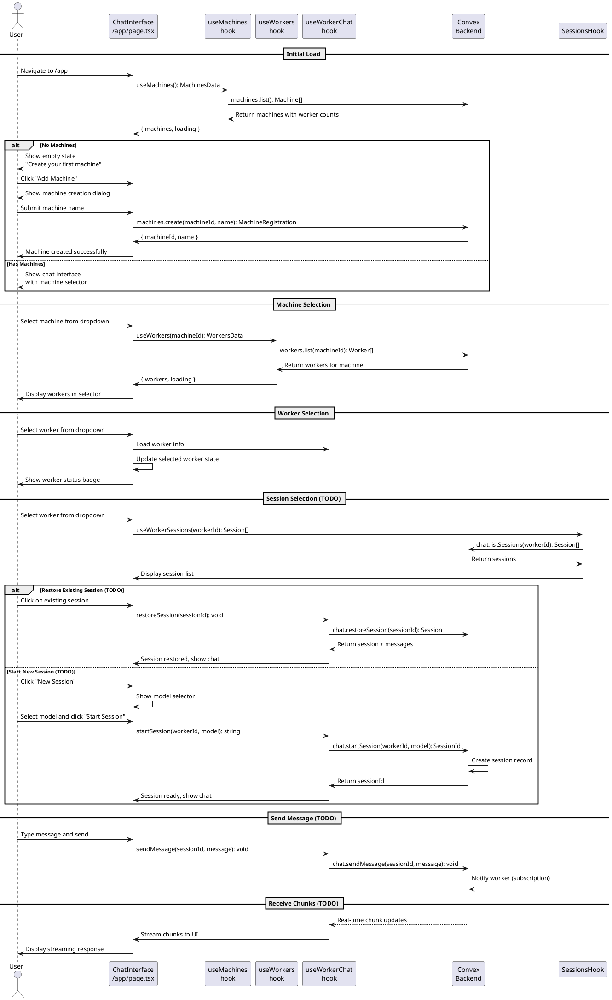

# Worker Chat UI Codemap

## Title

Worker Chat Interface with Machine and Worker Selection

## Description

Provides a chat interface at `/app` where authenticated users can select a machine and worker to interact with. The UI displays an empty state when no machines are registered, prompting users to create their first machine. When machines and workers exist, users can select them and start chat sessions with model selection.

**Key Concepts:**

- **Machines**: Physical/virtual computers registered by users
- **Workers**: Individual authenticated processes running on machines that handle chat sessions
- **Chat Sessions**: Conversations with AI models managed by workers

**Related Design Documentation:**

- [System Design - Flow 3: Worker Registration and Usage](../spec/design.md#flow-3-worker-registration-and-usage)
- [Design Decisions - Worker Identity & Concurrency](../spec/design.md#worker-identity--concurrency)
- [Design Decisions - Worker Token Authentication](../spec/design.md#authentication--security)
- [Design Decisions - ID Allocation Strategy](../spec/design.md#id-allocation-strategy)

## Sequence Diagram



## Frontend Entry Point / Route

- `apps/webapp/src/app/app/page.tsx` - Main chat interface page (authenticated) ✅
  - **No URL Parameters**
  - **No Search Parameters**
- `apps/webapp/src/app/app/layout.tsx` - Already exists (authenticated layout)

## Frontend Components

### Core Chat Components

- `apps/webapp/src/modules/assistant/components/ChatInterface.tsx` - Main chat container with worker selection and session management ✅
- `apps/webapp/src/modules/assistant/components/MachineSelector.tsx` - Dropdown to select machine with worker counts ✅
- `apps/webapp/src/modules/assistant/components/AssistantSelector.tsx` - Dropdown to select worker (reused component) ✅
- `apps/webapp/src/modules/assistant/components/ModelSelector.tsx` - Dropdown to select AI model ✅
- `apps/webapp/src/modules/assistant/components/SessionList.tsx` - List of sessions for worker, allows restoration ✅
- `apps/webapp/src/modules/assistant/components/ChatMessageList.tsx` - Message history display with streaming support ✅
- `apps/webapp/src/modules/assistant/components/ChatInput.tsx` - Message input field with send button ✅
- `apps/webapp/src/modules/assistant/components/ChatMessage.tsx` - Individual message bubble (user/assistant) ✅

### Machine Management Components

- `apps/webapp/src/modules/assistant/components/MachineEmptyState.tsx` - Empty state when no machines exist ✅
- `apps/webapp/src/modules/assistant/components/CreateMachineDialog.tsx` - Modal for creating new machine ✅
- `apps/webapp/src/modules/assistant/components/CreateWorkerDialog.tsx` - Modal for creating worker token ✅

### Worker Management Components

- `apps/webapp/src/modules/assistant/components/WorkersList.tsx` - Display workers grouped by status ✅
- `apps/webapp/src/modules/assistant/components/PendingWorkersList.tsx` - Display pending authorization requests ✅

### Supporting Components

- Existing: `apps/webapp/src/components/ui/select.tsx` - ShadCN select for dropdowns
- Existing: `apps/webapp/src/components/ui/dialog.tsx` - ShadCN dialog for modals
- Existing: `apps/webapp/src/components/ui/button.tsx` - ShadCN button
- Existing: `apps/webapp/src/components/ui/input.tsx` - ShadCN input
- Existing: `apps/webapp/src/components/ui/scroll-area.tsx` - ShadCN scroll area for messages
- Existing: `apps/webapp/src/components/ui/skeleton.tsx` - Loading states
- Existing: `apps/webapp/src/components/ui/badge.tsx` - Status badges
- Existing: `apps/webapp/src/components/ui/card.tsx` - Card containers

## Frontend Service Layer

### Machine Management Hooks

- `apps/webapp/src/modules/assistant/hooks/useMachines.ts` - Fetch and manage machines ✅

  - **Functions**:
    ```typescript
    useMachines(): MachinesData
    ```

- `apps/webapp/src/modules/assistant/hooks/useCreateMachine.ts` - Create new machine ✅

  - **Functions**:
    ```typescript
    useCreateMachine(): CreateMachineReturn
    ```

- `apps/webapp/src/modules/assistant/hooks/useDeleteMachine.ts` - Delete machine ✅
  - **Functions**:
    ```typescript
    useDeleteMachine(): DeleteMachineReturn
    ```

### Worker Management Hooks

- `apps/webapp/src/modules/assistant/hooks/useWorkers.ts` - Fetch workers for a machine ✅

  - **Functions**:
    ```typescript
    useWorkers(machineId: string): WorkersData
    ```

- `apps/webapp/src/modules/assistant/hooks/usePendingWorkers.ts` - Fetch pending workers ✅

  - **Functions**:
    ```typescript
    usePendingWorkers(machineId: string): PendingWorkersData
    ```

- `apps/webapp/src/modules/assistant/hooks/useCreateWorker.ts` - Generate worker token ✅

  - **Functions**:
    ```typescript
    useCreateWorker(): CreateWorkerReturn
    ```

- `apps/webapp/src/modules/assistant/hooks/useApproveWorker.ts` - Approve pending worker ✅

  - **Functions**:
    ```typescript
    useApproveWorker(): ApproveWorkerReturn
    ```

- `apps/webapp/src/modules/assistant/hooks/useRejectWorker.ts` - Reject pending worker ✅

  - **Functions**:
    ```typescript
    useRejectWorker(): RejectWorkerReturn
    ```

- `apps/webapp/src/modules/assistant/hooks/useRemoveWorker.ts` - Remove worker ✅
  - **Functions**:
    ```typescript
    useRemoveWorker(): RemoveWorkerReturn
    ```

### Chat Management Hooks (TODO)

- `apps/webapp/src/modules/assistant/hooks/useAssistantSessions.ts` - Fetch sessions for a worker ⚠️ (Mock data)

  - **Functions**:
    ```typescript
    useAssistantSessions(workerId: string | null): { sessions: ChatSession[], loading: boolean }
    ```

- `apps/webapp/src/modules/assistant/hooks/useAssistantChat.ts` - Manage chat session(s) ⚠️ (Mock data)
  - **Functions**:
    ```typescript
    useAssistantChat(workerId: string | null): AssistantChatReturn
    ```

### Frontend Type Definitions

- `apps/webapp/src/modules/assistant/types.ts` - All assistant module types ✅

  ```typescript
  // Machine types
  export interface Machine {
    machineId: string;
    name: string;
    status: "online" | "offline";
    lastSeen: number;
    assistantCount: number; // Total worker count
    workerCounts: {
      online: number;
      offline: number;
      pending: number;
    };
  }

  export interface MachineRegistration {
    machineId: string;
    name: string;
  }

  export interface MachinesData {
    machines: Machine[] | undefined;
    loading: boolean;
    error: Error | null;
  }

  export interface CreateMachineReturn {
    createMachine: (name: string) => Promise<MachineRegistration>;
    isCreating: boolean;
    error: Error | null;
  }

  // Worker types
  export interface Worker {
    workerId: string;
    machineId: string;
    name?: string;
    status: "pending_authorization" | "ready" | "online" | "offline";
    createdAt: number;
    approvedAt?: number;
    lastHeartbeat?: number;
  }

  export interface PendingWorker {
    workerId: string;
    machineId: string;
    name?: string;
    status: "pending_authorization";
    createdAt: number;
  }

  export interface WorkerRegistration {
    workerId: string;
    token: string; // Format: machine_<machine_id>:worker_<worker_id>
  }

  export interface WorkersData {
    workers: Worker[] | undefined;
    loading: boolean;
    error: Error | null;
  }

  export interface PendingWorkersData {
    workers: PendingWorker[] | undefined;
    loading: boolean;
    error: Error | null;
  }

  export interface CreateWorkerReturn {
    createWorker: (
      machineId: string,
      name?: string
    ) => Promise<WorkerRegistration>;
    isCreating: boolean;
    error: Error | null;
  }

  export interface ApproveWorkerReturn {
    approveWorker: (workerId: string) => Promise<void>;
    isApproving: boolean;
    error: Error | null;
  }

  export interface RejectWorkerReturn {
    rejectWorker: (workerId: string) => Promise<void>;
    isRejecting: boolean;
    error: Error | null;
  }

  export interface RemoveWorkerReturn {
    removeWorker: (workerId: string) => Promise<void>;
    isRemoving: boolean;
    error: Error | null;
  }

  // Chat types (TODO - not yet implemented in backend)
  export interface ChatMessage {
    id: string;
    role: "user" | "assistant" | "system";
    content: string;
    timestamp: number;
    isStreaming?: boolean;
  }

  export interface ChatSession {
    sessionId: string;
    workerId: string;
    model: string;
    status: "active" | "idle" | "terminated";
    createdAt: number;
  }

  export interface AssistantChatReturn {
    // Session management
    session: ChatSession | null;
    startSession: (model: string) => Promise<string>;
    restoreSession: (sessionId: string) => Promise<void>;
    endSession: () => Promise<void>;

    // Messaging
    messages: ChatMessage[];
    sendMessage: (content: string) => Promise<void>;

    // State
    isLoading: boolean;
    error: Error | null;
  }
  ```

## Backend Function Entry Point

### Machine Management

- `services/backend/convex/machines.ts` - Machine registration and management ✅
- **Functions**:
  ```typescript
  list(args: SessionIdArg): Promise<Machine[]>
  create(args: SessionIdArg & { machineId: string; name: string }): Promise<MachineRegistration>
  updateMachineStatus(args: { machineId: string }): Promise<void> // Internal mutation
  deleteMachine(args: SessionIdArg & { machineId: string }): Promise<void>
  ```

### Worker Management

- `services/backend/convex/workers.ts` - Worker registration and management ✅
- **Functions**:
  ```typescript
  create(args: SessionIdArg & { machineId: string; workerId: string; name?: string }): Promise<WorkerRegistration>
  register(args: { machineId: string; workerId: string }): Promise<RegistrationStatus>
  approve(args: SessionIdArg & { workerId: string }): Promise<{ success: boolean }>
  reject(args: SessionIdArg & { workerId: string }): Promise<{ success: boolean }>
  list(args: SessionIdArg & { machineId: string }): Promise<Worker[]>
  listPending(args: SessionIdArg & { machineId: string }): Promise<PendingWorker[]>
  heartbeat(args: { machineId: string; workerId: string }): Promise<void>
  setOffline(args: { machineId: string; workerId: string }): Promise<void>
  remove(args: SessionIdArg & { workerId: string }): Promise<{ success: boolean }>
  ```

### Chat Management (TODO)

- **[TODO]** `services/backend/convex/chat.ts` - Chat session and message handling
- **Functions**:
  ```typescript
  startSession(args: SessionIdArg & { workerId: string; model: string }): Promise<string>
  endSession(args: SessionIdArg & { chatSessionId: string }): Promise<void>
  sendMessage(args: SessionIdArg & { chatSessionId: string; content: string }): Promise<void>
  getMessages(args: SessionIdArg & { chatSessionId: string }): Promise<ChatMessage[]>
  writeChunk(args: { chatSessionId: string; messageId: string; chunk: string }): Promise<void>
  writeMessage(args: { chatSessionId: string; messageId: string; content: string }): Promise<void>
  subscribeToChunks(args: SessionIdArg & { chatSessionId: string }): Promise<ChatChunk[]>
  ```

## Contracts

```typescript
// From services/backend/convex/machines.ts ✅

export interface Machine {
  machineId: string; // Primary key (nanoid)
  userId: string; // Owner
  name: string;
  status: "online" | "offline";
  lastHeartbeat: number;
}

export interface MachineRegistration {
  machineId: string;
  name: string;
}

// From services/backend/convex/workers.ts ✅

export interface Worker {
  workerId: string; // Primary key (nanoid)
  machineId: string;
  name?: string;
  status: "pending_authorization" | "ready" | "online" | "offline";
  createdAt: number;
  approvedAt?: number;
  approvedBy?: string; // User ID who approved
  lastHeartbeat?: number;
}

export interface WorkerRegistration {
  workerId: string;
  token: string; // Format: machine_<machine_id>:worker_<worker_id>
}

export interface RegistrationStatus {
  status: "pending_authorization" | "ready";
  approved: boolean;
  workerId: string;
  name?: string;
}

// From services/backend/convex/chat.ts [TODO]

export interface ChatSession {
  chatSessionId: string; // Primary key (from opencode)
  workerId: string;
  userId: string;
  model: string;
  status: "active" | "idle" | "terminated";
  lastActivity: number;
  createdAt: number;
}

export interface ChatMessage {
  messageId: string; // Primary key (nanoid)
  chatSessionId: string;
  role: "user" | "assistant" | "system";
  content: string;
  timestamp: number;
  completed: boolean;
}

export interface ChatChunk {
  chunkId: string; // Primary key (nanoid)
  messageId: string;
  chatSessionId: string;
  chunk: string;
  sequence: number;
  timestamp: number;
}
```

## Backend Schema

- `services/backend/convex/schema.ts` - Database schema ✅

```typescript
// Schema Definitions ✅

// machines table
machines: defineTable({
  machineId: v.string(), // nanoid (primary key for business logic)
  userId: v.id('users'), // Owner
  name: v.string(),
  status: v.union(v.literal('online'), v.literal('offline')),
  lastHeartbeat: v.number(),
})
  .index('by_machine_id', ['machineId'])
  .index('by_user_id', ['userId']),

// workers table
workers: defineTable({
  workerId: v.string(), // nanoid (primary key)
  machineId: v.string(),
  name: v.optional(v.string()),
  status: v.union(
    v.literal('pending_authorization'),
    v.literal('ready'),
    v.literal('online'),
    v.literal('offline')
  ),
  createdAt: v.number(),
  approvedAt: v.optional(v.number()),
  approvedBy: v.optional(v.id('users')),
  lastHeartbeat: v.optional(v.number()),
})
  .index('by_worker_id', ['workerId'])
  .index('by_machine_id', ['machineId'])
  .index('by_machine_and_worker', ['machineId', 'workerId'])
  .index('by_status', ['status'])
  .index('by_machine_and_status', ['machineId', 'status']),

// chatSessions table [TODO]
chatSessions: defineTable({
  chatSessionId: v.string(), // From opencode (primary key)
  workerId: v.string(),
  userId: v.string(),
  model: v.string(),
  status: v.union(
    v.literal('active'),
    v.literal('idle'),
    v.literal('terminated')
  ),
  lastActivity: v.number(),
  createdAt: v.number(),
})
  .index('by_chatSessionId', ['chatSessionId'])
  .index('by_workerId', ['workerId'])
  .index('by_userId', ['userId'])
  .index('by_status', ['status']),

// chatMessages table [TODO]
chatMessages: defineTable({
  messageId: v.string(), // nanoid (primary key)
  chatSessionId: v.string(),
  role: v.union(v.literal('user'), v.literal('assistant'), v.literal('system')),
  content: v.string(),
  timestamp: v.number(),
  completed: v.boolean(),
})
  .index('by_messageId', ['messageId'])
  .index('by_chatSessionId', ['chatSessionId'])
  .index('by_timestamp', ['timestamp']),

// chatChunks table (for streaming) [TODO]
chatChunks: defineTable({
  chunkId: v.string(), // nanoid (primary key)
  messageId: v.string(),
  chatSessionId: v.string(),
  chunk: v.string(),
  sequence: v.number(),
  timestamp: v.number(),
})
  .index('by_chunkId', ['chunkId'])
  .index('by_messageId', ['messageId'])
  .index('by_chatSessionId_and_sequence', ['chatSessionId', 'sequence']),
```

## Implementation Notes

### Empty State Flow ✅

1. User navigates to `/app`
2. `useMachines()` loads machines
3. If `machines.length === 0`, show `MachineEmptyState`
4. User clicks "Add Machine"
5. `CreateMachineDialog` opens
6. User enters machine name
7. `createMachine(name)` creates machine record
8. Machine appears in list
9. User can now add workers via action menu

### Worker Selection Flow ✅

1. Load all machines on mount
2. User selects machine from dropdown
3. `useWorkers(machineId)` loads workers for that machine
4. Workers displayed in selector with status badges
5. User selects worker
6. Worker status and info displayed

### Worker Authorization Flow ✅

1. User clicks "Add Worker" from machine action menu
2. `CreateWorkerDialog` opens
3. System generates worker token: `machine_<id>:worker_<id>`
4. User copies token and starts worker process
5. Worker registers with backend (status: pending_authorization)
6. User sees pending worker in machine settings
7. User clicks "Approve"
8. Worker transitions to ready/online status
9. Worker appears in chat interface selector

### Session Selection Flow (TODO)

1. When worker selected, `useAssistantSessions(workerId)` loads sessions
2. Display session list with:
   - Active/idle sessions at top (with green indicator)
   - Terminated sessions below
   - "New Session" button
3. User can:
   - Click existing session → `restoreSession(sessionId)` → load messages → show chat
   - Click "New Session" → select model → `startSession(model)` → show chat

### Chat Session Flow (TODO)

1. Session must be active (restored or newly started) before messaging
2. Backend creates/restores session record with status "active"
3. Frontend receives `sessionId` and messages
4. Messages use `sendMessage(content)` (sessionId from active session)
5. Frontend subscribes to `subscribeToChunks(sessionId)`
6. Chunks stream in real-time and append to message display
7. When message complete, `writeMessage` called with full content

### Model Synchronization Flow (TODO)

1. Worker machine queries opencode on startup
2. Worker calls `workers.updateModels(workerId, models[])`
3. Backend stores models in workers table
4. Frontend fetches models when worker selected
5. Models displayed in dropdown for user selection

## Implementation Status

### Phase 1: Machine & Worker Management (Completed ✅)

1. ✅ **Backend Schema** - machines and workers tables
2. ✅ **Backend Machines** - CRUD operations
3. ✅ **Backend Workers** - Registration, approval, management
4. ✅ **Frontend Types** - All machine and worker types
5. ✅ **Frontend Hooks** - All machine and worker hooks
6. ✅ **Machine Components** - Empty state, creation, selector
7. ✅ **Worker Components** - Creation, approval, listing
8. ✅ **ChatInterface** - Machine and worker selection
9. ✅ **Worker Token Auth** - Complete authorization flow

### Phase 2: Chat Integration (Next)

1. **Backend Schema** - Chat tables (sessions, messages, chunks)
2. **Backend Chat** - Session and message handling
3. **Replace Mock Chat Hooks** - Connect to real Convex queries/mutations
4. **Worker Service** - Chat session management
5. **Integration** - End-to-end chat flow testing

## Notes

- Machine and worker management is fully implemented and functional
- Chat functionality uses mock data and needs backend implementation
- Worker service (actual machine process) handles chat sessions
- Model data will come from worker service via backend
- Authentication uses `SessionIdArg` pattern throughout
- Dark mode support implemented for all components
- Real-time updates via Convex subscriptions
- Worker token format: `machine_<machine_id>:worker_<worker_id>`
