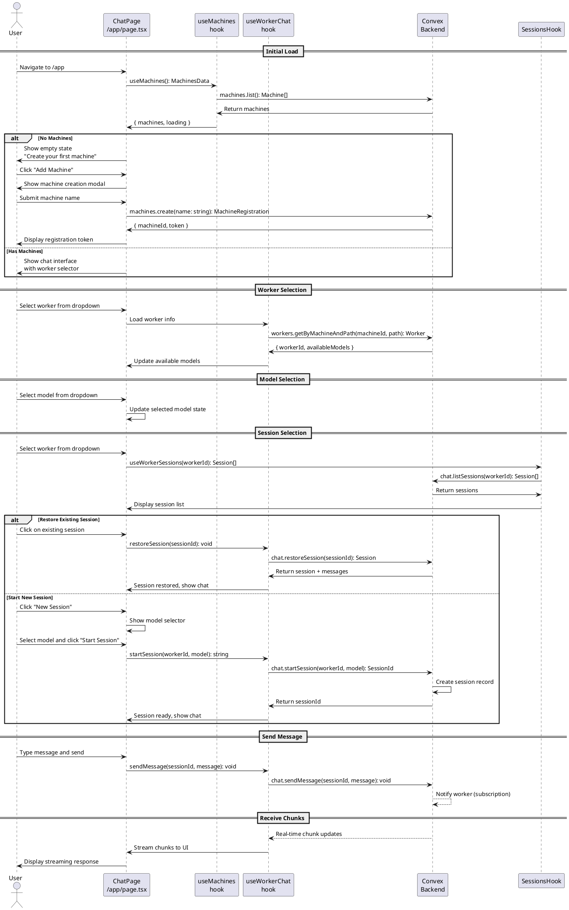

# Worker Chat UI Codemap

## Title

Worker Chat Interface with Machine and Model Selection

## Description

Provides a chat interface at `/app` where authenticated users can select a worker (identified as `<machine name>:<worker directory>`) and AI model to interact with. The UI displays an empty state when no machines are registered, prompting users to create their first machine. When machines and workers exist, users can select them and start chat sessions with model selection.

**Related Design Documentation:**

- [System Design - Flow 3: Worker Registration and Usage](../spec/design.md#flow-3-worker-registration-and-usage)
- [Design Decisions - Worker Identity & Concurrency](../spec/design.md#worker-identity--concurrency)
- [Design Decisions - ID Allocation Strategy](../spec/design.md#id-allocation-strategy)
- [Project Structure - Worker Chat UI Implementation](../codemaps/projectmap.md#implementation-status)

## Sequence Diagram



## Frontend Entry Point / Route

- `apps/webapp/src/app/app/page.tsx` - Main chat interface page (authenticated) ✅
  - **No URL Parameters**
  - **No Search Parameters**
- `apps/webapp/src/app/app/layout.tsx` - Already exists (authenticated layout)

## Frontend Components

### Core Chat Components

- `apps/webapp/src/modules/worker/components/ChatInterface.tsx` - Main chat container with worker selection and session management ✅
- `apps/webapp/src/modules/worker/components/WorkerSelector.tsx` - Dropdown to select worker (`<machine>:<directory>`) ✅
- `apps/webapp/src/modules/worker/components/ModelSelector.tsx` - Dropdown to select AI model ✅
- `apps/webapp/src/modules/worker/components/SessionList.tsx` - List of sessions for worker, allows restoration ✅
- `apps/webapp/src/modules/worker/components/ChatMessageList.tsx` - Message history display with streaming support ✅
- `apps/webapp/src/modules/worker/components/ChatInput.tsx` - Message input field with send button ✅
- `apps/webapp/src/modules/worker/components/ChatMessage.tsx` - Individual message bubble (user/assistant) ✅

### Machine Management Components

- `apps/webapp/src/modules/machine/components/MachineEmptyState.tsx` - Empty state when no machines exist ✅
- `apps/webapp/src/modules/machine/components/CreateMachineDialog.tsx` - Modal for creating new machine ✅
- `apps/webapp/src/modules/machine/components/MachineTokenDisplay.tsx` - Display registration token after creation ✅

### Supporting Components

- Existing: `apps/webapp/src/components/ui/select.tsx` - ShadCN select for dropdowns
- Existing: `apps/webapp/src/components/ui/dialog.tsx` - ShadCN dialog for modals
- Existing: `apps/webapp/src/components/ui/button.tsx` - ShadCN button
- Existing: `apps/webapp/src/components/ui/input.tsx` - ShadCN input
- Existing: `apps/webapp/src/components/ui/scroll-area.tsx` - ShadCN scroll area for messages
- Existing: `apps/webapp/src/components/ui/skeleton.tsx` - Loading states

## Frontend Service Layer

### Machine Management Hooks

- `apps/webapp/src/modules/machine/hooks/useMachines.ts` - Fetch and manage machines ✅

  - **Functions**:
    ```typescript
    useMachines(): MachinesData
    ```

- `apps/webapp/src/modules/machine/hooks/useCreateMachine.ts` - Create new machine ✅
  - **Functions**:
    ```typescript
    useCreateMachine(): CreateMachineReturn
    ```

### Worker Management Hooks

- `apps/webapp/src/modules/worker/hooks/useWorkers.ts` - Fetch workers for machines ✅

  - **Functions**:
    ```typescript
    useWorkers(machineId?: string): WorkersData
    ```

- `apps/webapp/src/modules/worker/hooks/useWorkerSessions.ts` - Fetch sessions for a worker ✅

  - **Functions**:
    ```typescript
    useWorkerSessions(workerId: string | null): { sessions: ChatSession[], loading: boolean }
    ```

- `apps/webapp/src/modules/worker/hooks/useWorkerChat.ts` - Manage chat session(s) ✅
  - **Functions**:
    ```typescript
    useWorkerChat(workerId: string | null): WorkerChatReturn
    ```

### Frontend Type Definitions

- `apps/webapp/src/modules/machine/types.ts` - Machine-related types ✅

  ```typescript
  export interface Machine {
    machineId: string;
    name: string;
    status: "online" | "offline";
    lastSeen: number;
    workerCount: number;
  }

  export interface MachineRegistration {
    machineId: string;
    token: string; // Format: <machine_id>:<machine_secret>
  }

  export interface MachinesData {
    machines: Machine[] | undefined;
    loading: boolean;
    error: Error | null;
  }

  export interface CreateMachineReturn {
    createMachine: (name: string) => Promise<MachineRegistration>;
    isCreating: boolean;
    error: Error | null;
  }
  ```

- `apps/webapp/src/modules/worker/types.ts` - Worker-related types ✅

  ```typescript
  export interface Worker {
    workerId: string;
    machineId: string;
    machineName: string;
    workingDirectory: string;
    displayName: string; // Format: <machine_name>:<working_directory>
    status: "online" | "offline";
    activeSessionCount: number;
    availableModels: string[];
  }

  export interface WorkersData {
    workers: Worker[] | undefined;
    loading: boolean;
    error: Error | null;
  }

  export interface ChatMessage {
    id: string;
    role: "user" | "assistant" | "system";
    content: string;
    timestamp: number;
    isStreaming?: boolean;
  }

  export interface ChatSession {
    sessionId: string;
    workerId: string;
    model: string;
    status: "active" | "idle" | "terminated";
    createdAt: number;
  }
  ```

export interface WorkerChatReturn {
// Session management
session: ChatSession | null;
startSession: (model: string) => Promise<string>;
restoreSession: (sessionId: string) => Promise<void>;
endSession: () => Promise<void>;

// Messaging
messages: ChatMessage[];
sendMessage: (content: string) => Promise<void>;

// State
isLoading: boolean;
error: Error | null;
}

````

## Backend Function Entry Point

### Machine Management

- **[TODO]** `services/backend/convex/machines.ts` - Machine registration and management
- **Functions**:
  ```typescript
  list(args: SessionIdArg): Promise<Machine[]>
  create(args: SessionIdArg & { name: string }): Promise<MachineRegistration>
  updateStatus(args: { machineId: string; status: MachineStatus }): Promise<void>
  getById(args: SessionIdArg & { machineId: string }): Promise<Machine | null>
  ```

### Worker Management

- **[TODO]** `services/backend/convex/workers.ts` - Worker registration and queries
- **Functions**:
  ```typescript
  list(args: SessionIdArg & { machineId?: string }): Promise<Worker[]>
  getByMachineAndPath(args: SessionIdArg & { machineId: string; path: string }): Promise<Worker | null>
  register(args: { machineId: string; workerId: string; workingDirectory: string }): Promise<void>
  updateModels(args: { workerId: string; models: string[] }): Promise<void>
  ```

### Chat Management

- **[TODO]** `services/backend/convex/chat.ts` - Chat session and message handling
- **Functions**:
  ```typescript
  startSession(args: SessionIdArg & { workerId: string; model: string }): Promise<string>
  endSession(args: SessionIdArg & { chatSessionId: string }): Promise<void>
  sendMessage(args: SessionIdArg & { chatSessionId: string; content: string }): Promise<void>
  getMessages(args: SessionIdArg & { chatSessionId: string }): Promise<ChatMessage[]>
  writeChunk(args: { chatSessionId: string; messageId: string; chunk: string }): Promise<void>
  writeMessage(args: { chatSessionId: string; messageId: string; content: string }): Promise<void>
  subscribeToChunks(args: SessionIdArg & { chatSessionId: string }): Promise<ChatChunk[]>
  ```

### Contracts

```typescript
// From services/backend/convex/machines.ts [TODO]

export interface Machine {
machineId: string; // Primary key (nanoid)
userId: string; // Owner
name: string;
status: "online" | "offline";
lastSeen: number;
createdAt: number;
}

export interface MachineRegistration {
machineId: string;
token: string; // Format: <machine_id>:<machine_secret>
}

export interface MachineStatus {
online: boolean;
lastSeen: number;
workerCount: number;
}

// From services/backend/convex/workers.ts [TODO]

export interface Worker {
workerId: string; // Primary key (nanoid)
machineId: string;
workingDirectory: string;
availableModels: string[];
status: "online" | "offline";
activeSessionCount: number;
lastActivity: number;
createdAt: number;
}

// From services/backend/convex/chat.ts [TODO]

export interface ChatSession {
chatSessionId: string; // Primary key (from opencode)
workerId: string;
userId: string;
model: string;
status: "active" | "idle" | "terminated";
lastActivity: number;
createdAt: number;
}

export interface ChatMessage {
messageId: string; // Primary key (nanoid)
chatSessionId: string;
role: "user" | "assistant" | "system";
content: string;
timestamp: number;
completed: boolean;
}

export interface ChatChunk {
chunkId: string; // Primary key (nanoid)
messageId: string;
chatSessionId: string;
chunk: string;
sequence: number;
timestamp: number;
}

// API Functions [TODO]

export const list = query({
args: {
  ...SessionIdArg,
},
handler: async (ctx, args): Promise<Machine[]> => {
  // Get user's machines
},
});

export const create = mutation({
args: {
  ...SessionIdArg,
  name: v.string(),
},
handler: async (ctx, args): Promise<MachineRegistration> => {
  // Generate machine_id and secret using nanoid
  // Store machine record
  // Return registration token
},
});

export const startSession = mutation({
args: {
  ...SessionIdArg,
  workerId: v.string(),
  model: v.string(),
},
handler: async (ctx, args): Promise<string> => {
  // Create chat session
  // Return chatSessionId
},
});

export const sendMessage = mutation({
args: {
  ...SessionIdArg,
  chatSessionId: v.string(),
  content: v.string(),
},
handler: async (ctx, args): Promise<void> => {
  // Create message record
  // Worker will receive via subscription
},
});

export const subscribeToChunks = query({
args: {
  ...SessionIdArg,
  chatSessionId: v.string(),
},
handler: async (ctx, args): Promise<ChatChunk[]> => {
  // Real-time subscription to chunks
},
});
````

## Backend Schema

- **[TODO]** `services/backend/convex/schema.ts` - Add new tables
  - `machines` table definition
  - `workers` table definition
  - `chatSessions` table definition
  - `chatMessages` table definition
  - `chatChunks` table definition

```typescript
// Schema Additions [TODO]

// machines table
machines: defineTable({
  machineId: v.string(), // nanoid (primary key for business logic)
  machineSecret: v.string(), // Hashed secret for authentication
  userId: v.string(), // Owner
  name: v.string(),
  status: v.union(v.literal("online"), v.literal("offline")),
  lastSeen: v.number(),
  createdAt: v.number(),
})
  .index("by_machineId", ["machineId"])
  .index("by_userId", ["userId"])
  .index("by_status", ["status"]),

// workers table
workers: defineTable({
  workerId: v.string(), // nanoid (primary key)
  machineId: v.string(),
  workingDirectory: v.string(),
  availableModels: v.array(v.string()),
  status: v.union(v.literal("online"), v.literal("offline")),
  activeSessionCount: v.number(),
  lastActivity: v.number(),
  createdAt: v.number(),
})
  .index("by_workerId", ["workerId"])
  .index("by_machineId", ["machineId"])
  .index("by_machine_and_directory", ["machineId", "workingDirectory"]),

// chatSessions table
chatSessions: defineTable({
  chatSessionId: v.string(), // From opencode (primary key)
  workerId: v.string(),
  userId: v.string(),
  model: v.string(),
  status: v.union(
    v.literal("active"),
    v.literal("idle"),
    v.literal("terminated")
  ),
  lastActivity: v.number(),
  createdAt: v.number(),
})
  .index("by_chatSessionId", ["chatSessionId"])
  .index("by_workerId", ["workerId"])
  .index("by_userId", ["userId"])
  .index("by_status", ["status"]),

// chatMessages table
chatMessages: defineTable({
  messageId: v.string(), // nanoid (primary key)
  chatSessionId: v.string(),
  role: v.union(v.literal("user"), v.literal("assistant"), v.literal("system")),
  content: v.string(),
  timestamp: v.number(),
  completed: v.boolean(),
})
  .index("by_messageId", ["messageId"])
  .index("by_chatSessionId", ["chatSessionId"])
  .index("by_timestamp", ["timestamp"]),

// chatChunks table (for streaming)
chatChunks: defineTable({
  chunkId: v.string(), // nanoid (primary key)
  messageId: v.string(),
  chatSessionId: v.string(),
  chunk: v.string(),
  sequence: v.number(),
  timestamp: v.number(),
})
  .index("by_chunkId", ["chunkId"])
  .index("by_messageId", ["messageId"])
  .index("by_chatSessionId_and_sequence", ["chatSessionId", "sequence"]),
```

## Backend Modules

### Machine Domain Logic

- **[TODO]** `services/backend/modules/machine/types.ts` - Machine types and interfaces

  ```typescript
  export interface IMachineAuth {
    machineId: string;
    machineSecret: string;
  }

  export interface IMachineToken {
    token: string; // Format: <machine_id>:<machine_secret>
  }
  ```

- **[TODO]** `services/backend/modules/machine/machineAuth.ts` - Machine authentication logic

  ```typescript
  parseToken(token: string): IMachineAuth
  validateToken(ctx: Context, token: string): Promise<boolean>
  hashSecret(secret: string): string
  ```

- **[TODO]** `services/backend/modules/machine/machineRegistry.ts` - Machine registration business logic
  ```typescript
  generateMachineToken(): IMachineToken
  registerMachine(userId: string, name: string): Promise<MachineRegistration>
  ```

### Worker Domain Logic

- **[TODO]** `services/backend/modules/worker/types.ts` - Worker types and interfaces

  ```typescript
  export interface IWorkerRegistration {
    workerId: string;
    machineId: string;
    workingDirectory: string;
  }
  ```

- **[TODO]** `services/backend/modules/worker/workerRegistry.ts` - Worker registration logic
  ```typescript
  registerWorker(registration: IWorkerRegistration): Promise<void>
  updateAvailableModels(workerId: string, models: string[]): Promise<void>
  ```

### Chat Domain Logic

- **[TODO]** `services/backend/modules/chat/types.ts` - Chat types and interfaces

  ```typescript
  export interface ISessionConfig {
    workerId: string;
    userId: string;
    model: string;
  }
  ```

- **[TODO]** `services/backend/modules/chat/sessionManager.ts` - Session lifecycle management
  ```typescript
  createSession(config: ISessionConfig): Promise<string>
  terminateIdleSessions(): Promise<void>
  ```

## Utility Functions

### Frontend Utilities

- **[TODO]** `apps/webapp/src/modules/worker/utils/workerFormatter.ts` - Format worker display names
  ```typescript
  formatWorkerDisplayName(machineName: string, workingDirectory: string): string
  // Returns: "<machine_name>:<working_directory>"
  ```

### Backend Utilities

- **[TODO]** `services/backend/modules/shared/idGenerator.ts` - ID generation wrapper
  ```typescript
  generateMachineId(): string
  generateWorkerId(): string
  generateMessageId(): string
  generateChunkId(): string
  // All use nanoid
  ```

## Implementation Notes

### Empty State Flow

1. User navigates to `/app`
2. `useMachines()` loads machines
3. If `machines.length === 0`, show `MachineEmptyState`
4. User clicks "Add Machine"
5. `CreateMachineDialog` opens
6. User enters machine name
7. `createMachine(name)` generates token
8. `MachineTokenDisplay` shows token for user to copy
9. User saves token for machine setup

### Worker Selection Flow

1. Load all machines and workers on mount
2. Group workers by machine
3. Format display as `<machine_name>:<directory>`
4. When worker selected, show session list (not chat)

### Session Selection Flow

1. When worker selected, `useWorkerSessions(workerId)` loads sessions
2. Display session list with:
   - Active/idle sessions at top (with green indicator)
   - Terminated sessions below
   - "New Session" button
3. User can:
   - Click existing session → `restoreSession(sessionId)` → load messages → show chat
   - Click "New Session" → select model → `startSession(model)` → show chat

### Chat Session Flow

1. Session must be active (restored or newly started) before messaging
2. Backend creates/restores session record with status "active"
3. Frontend receives `sessionId` and messages
4. Messages use `sendMessage(content)` (sessionId from active session)
5. Frontend subscribes to `subscribeToChunks(sessionId)`
6. Chunks stream in real-time and append to message display
7. When message complete, `writeMessage` called with full content

### Model Synchronization Flow

1. Worker machine queries opencode on startup
2. Worker calls `workers.updateModels(workerId, models[])`
3. Backend stores models in workers table
4. Frontend fetches models when worker selected
5. Models displayed in dropdown for user selection

## Implementation Order

### Phase 1: Frontend UI (Completed ✅)

1. ✅ **Frontend Types** - Type definitions for machines, workers, sessions
2. ✅ **Frontend Hooks** - Mock hooks for data fetching
3. ✅ **Machine Components** - Empty state, creation dialog, token display
4. ✅ **Worker Components** - Selectors, session list, chat interface
5. ✅ **Chat Components** - Message display, input, streaming simulation

### Phase 2: Backend Integration (Next)

1. **Backend Schema** - Define all tables first
2. **Backend Utilities** - ID generation helpers
3. **Backend Machines** - Machine CRUD operations
4. **Backend Workers** - Worker registration and queries
5. **Backend Chat** - Session and message handling
6. **Replace Mock Hooks** - Connect frontend to real Convex queries/mutations
7. **Integration** - Connect all pieces and test flow

## Notes

- This codemap covers **UI implementation only**
- Worker service (actual machine process) is **out of scope** for this phase
- Model data will be stubbed initially until worker service implements model discovery
- Authentication already exists via `SessionIdArg` pattern
- Dark mode support required for all components (follow existing patterns)
- Real-time updates via Convex subscriptions (already established pattern in codebase)
