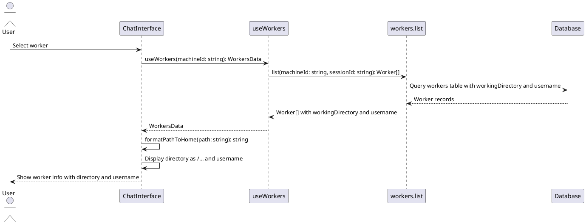

# Worker Directory Display Codemap

## Title

Worker Directory and Username Display

## Description

Displays the working directory and username for each worker in the /app page. The working directory path is formatted relative to the user's home directory (using ~/...), and the username is extracted and displayed as a separate field.

## Sequence Diagram



## Frontend Entry Point / Route

- `apps/webapp/src/app/app/page.tsx` - Main application page
  - Displays ChatInterface when workers exist
  - No URL parameters specific to this feature

## Frontend Components

- `apps/webapp/src/modules/assistant/components/ChatInterface.tsx` - Main chat interface
  - Displays selected worker information including directory and username
- `apps/webapp/src/modules/assistant/components/WorkersList.tsx` - Worker list in settings
  - Shows worker details including directory and username
- `apps/webapp/src/modules/assistant/components/PendingWorkersList.tsx` - Pending workers list
  - Shows pending worker details including directory and username

## Frontend Service Layer

- `apps/webapp/src/modules/assistant/hooks/useWorkers.ts` - Worker data hook
  - **Functions**:
    ```typescript
    useWorkers(machineId: string): WorkersData
    ```

- `apps/webapp/src/modules/assistant/types.ts` - Frontend type definitions

  ```typescript
  export interface Worker {
    workerId: string;
    machineId: string;
    name?: string;
    approvalStatus: 'pending' | 'approved' | 'revoked';
    status: 'offline' | 'online';
    createdAt: number;
    approvedAt?: number;
    lastHeartbeat?: number;
    workingDirectory?: string; // NEW: Working directory path
    username?: string; // NEW: System username
  }

  export interface WorkersData {
    workers: Worker[] | undefined;
    loading: boolean;
    error: Error | null;
  }
  ```

- `apps/webapp/src/modules/assistant/utils/pathFormatter.ts` - NEW: Path formatting utilities
  - **Functions**:
    ```typescript
    formatPathToHome(path: string, username?: string): string
    extractUsername(path: string): string | null
    ```

## Backend Function Entry Point

- `services/backend/convex/workers.ts` - Worker management functions
  - **Functions**:
    ```typescript
    register(args: RegisterArgs): RegisterReturn
    list(args: ListArgs): Worker[]
    ```

### Contracts

```typescript
// Worker registration arguments (updated)
export interface RegisterArgs {
  machineId: string;
  workerId: string;
  secret: string;
  workingDirectory: string; // NEW: Working directory from worker config
  username: string; // NEW: System username from worker environment
}

// Worker registration return type
export interface RegisterReturn {
  approvalStatus: 'pending' | 'approved';
  status: 'offline' | 'online';
  approved: boolean;
  workerId: string;
  name?: string;
}

// Worker list arguments
export interface ListArgs {
  ...SessionIdArg;
  machineId: string;
}

// Worker document (from database)
export interface WorkerDoc {
  _id: Id<"workers">;
  workerId: string;
  machineId: string;
  name?: string;
  secret: string;
  approvalStatus: 'pending' | 'approved' | 'revoked';
  status: 'offline' | 'online';
  createdAt: number;
  approvedAt?: number;
  approvedBy?: Id<"users">;
  lastHeartbeat?: number;
  connectRequestedAt?: number;
  connectedAt?: number;
  workingDirectory?: string; // NEW: Working directory path
  username?: string; // NEW: System username
}

// API Functions
export const register = mutation({
  args: {
    machineId: v.string(),
    workerId: v.string(),
    secret: v.string(),
    workingDirectory: v.string(), // NEW
    username: v.string(), // NEW
  },
  handler: async (ctx, args): Promise<RegisterReturn> => {
    // Implementation updates worker record with workingDirectory and username
  },
});

export const list = query({
  args: {
    ...SessionIdArg,
    machineId: v.string(),
  },
  handler: async (ctx, args): Promise<Worker[]> => {
    // Returns workers with workingDirectory and username fields
  },
});
```

## Backend Schema

- `services/backend/convex/schema.ts` - Schema definitions
  - `workers` table definition (updated)

```typescript
// Workers table schema (updated)
workers: defineTable({
  workerId: v.string(),
  machineId: v.string(),
  name: v.optional(v.string()),
  secret: v.string(),
  approvalStatus: v.union(v.literal('pending'), v.literal('approved'), v.literal('revoked')),
  status: v.union(v.literal('offline'), v.literal('online')),
  createdAt: v.number(),
  approvedAt: v.optional(v.number()),
  approvedBy: v.optional(v.id('users')),
  lastHeartbeat: v.optional(v.number()),
  connectRequestedAt: v.optional(v.number()),
  connectedAt: v.optional(v.number()),
  workingDirectory: v.optional(v.string()), // NEW: Working directory path
  username: v.optional(v.string()), // NEW: System username
})
  .index('by_worker_id', ['workerId'])
  .index('by_machine_id', ['machineId'])
  .index('by_machine_and_worker', ['machineId', 'workerId'])
  .index('by_approval_status', ['approvalStatus'])
  .index('by_status', ['status'])
  .index('by_machine_and_approval_status', ['machineId', 'approvalStatus']);
```

## Worker Service Updates

- `services/worker/src/infrastructure/convex/ConvexClientAdapter.ts` - Convex client
  - Update `register()` method to send workingDirectory and username

```typescript
// Updated register method
async register(): Promise<RegisterReturn> {
  const result = await this.httpClient.mutation(api.workers.register, {
    machineId: this.config.machineId,
    workerId: this.config.workerId,
    secret: this.config.secret,
    workingDirectory: this.config.workingDirectory, // NEW
    username: os.userInfo().username, // NEW: Get system username
  });
  
  // ... rest of implementation
}
```

## Utility Functions

- `apps/webapp/src/modules/assistant/utils/pathFormatter.ts` - NEW: Path formatting utilities

```typescript
/**
 * Formats a file path to be relative to the user's home directory.
 * Replaces the home directory prefix with ~
 * 
 * @param path - Absolute file path
 * @param username - Optional username to use for home directory detection
 * @returns Formatted path with ~ prefix if applicable
 * 
 * @example
 * formatPathToHome('/Users/john/Documents/project', 'john')
 * // Returns: '~/Documents/project'
 * 
 * formatPathToHome('/home/jane/workspace', 'jane')
 * // Returns: '~/workspace'
 * 
 * formatPathToHome('/opt/projects/app')
 * // Returns: '/opt/projects/app' (no home directory detected)
 */
export function formatPathToHome(path: string, username?: string): string {
  if (!path) return path;
  
  // Common home directory patterns
  const patterns = [
    `/Users/${username}/`,  // macOS
    `/home/${username}/`,   // Linux
    `C:\\Users\\${username}\\`, // Windows
  ];
  
  // Try to replace with username if provided
  if (username) {
    for (const pattern of patterns) {
      if (path.startsWith(pattern)) {
        return path.replace(pattern, '~/');
      }
    }
  }
  
  // Fallback: try common patterns without username
  if (path.startsWith('/Users/')) {
    return path.replace(/^\/Users\/[^/]+\//, '~/');
  }
  if (path.startsWith('/home/')) {
    return path.replace(/^\/home\/[^/]+\//, '~/');
  }
  if (path.match(/^C:\\Users\\[^\\]+\\/)) {
    return path.replace(/^C:\\Users\\[^\\]+\\/, '~/');
  }
  
  return path;
}

/**
 * Extracts the username from a file path.
 * 
 * @param path - Absolute file path
 * @returns Username if found, null otherwise
 * 
 * @example
 * extractUsername('/Users/john/Documents/project')
 * // Returns: 'john'
 * 
 * extractUsername('/home/jane/workspace')
 * // Returns: 'jane'
 * 
 * extractUsername('/opt/projects/app')
 * // Returns: null
 */
export function extractUsername(path: string): string | null {
  if (!path) return null;
  
  // macOS pattern
  const macMatch = path.match(/^\/Users\/([^/]+)\//);
  if (macMatch) return macMatch[1];
  
  // Linux pattern
  const linuxMatch = path.match(/^\/home\/([^/]+)\//);
  if (linuxMatch) return linuxMatch[1];
  
  // Windows pattern
  const windowsMatch = path.match(/^C:\\Users\\([^\\]+)\\/);
  if (windowsMatch) return windowsMatch[1];
  
  return null;
}
```

## Implementation Steps

1. **Backend Schema Update**
   - Add `workingDirectory` and `username` fields to workers table schema
   - Deploy schema migration

2. **Backend Function Update**
   - Update `workers.register` mutation to accept and store workingDirectory and username
   - Update `workers.list` query to return these fields

3. **Worker Service Update**
   - Update ConvexClientAdapter.register() to send workingDirectory from config
   - Get system username using `os.userInfo().username` and send it

4. **Frontend Types Update**
   - Add workingDirectory and username to Worker interface

5. **Frontend Utilities**
   - Create pathFormatter.ts with formatPathToHome() and extractUsername()

6. **Frontend UI Update**
   - Update ChatInterface to display formatted directory and username
   - Update WorkersList to display formatted directory and username
   - Update PendingWorkersList to display formatted directory and username

