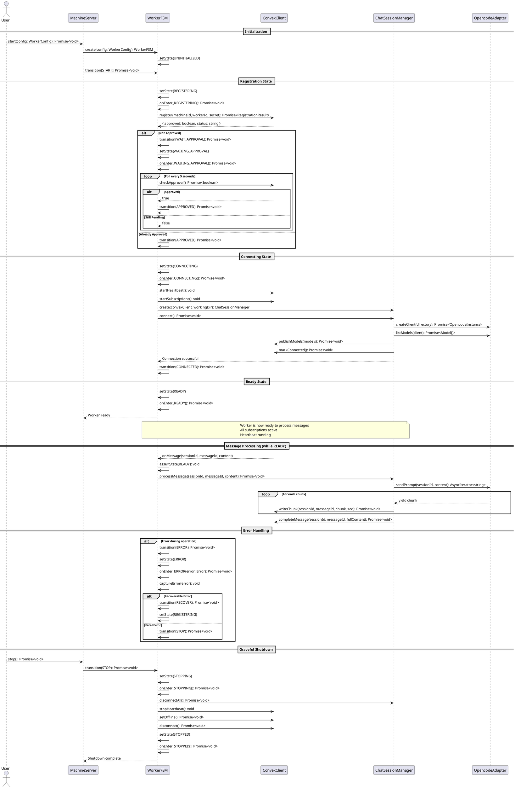

# Worker Finite State Machine Lifecycle Codemap

## Title

Worker Lifecycle Management with Finite State Machine

## Description

This codemap documents the refactoring of the worker runtime to use a Finite State Machine (FSM) to manage its lifecycle. The FSM will provide clear, predictable state transitions and make the worker's behavior more maintainable and testable.

The worker currently has implicit states scattered across `MachineServer`, `ConvexClientAdapter`, and `ChatSessionManager`. This refactor consolidates all lifecycle management into an explicit FSM that:

- Defines clear states: `UNINITIALIZED`, `REGISTERING`, `WAITING_APPROVAL`, `CONNECTING`, `READY`, `STOPPING`, `STOPPED`, `ERROR`
- Enforces valid state transitions with guards
- Centralizes lifecycle logic for better maintainability
- Provides hooks for state entry/exit actions
- Enables better error handling and recovery
- Improves testability through explicit state verification

## Sequence Diagram



## State Machine Definition

### States

```typescript
export enum WorkerState {
  UNINITIALIZED = 'UNINITIALIZED',
  REGISTERING = 'REGISTERING',
  WAITING_APPROVAL = 'WAITING_APPROVAL',
  CONNECTING = 'CONNECTING',
  READY = 'READY',
  STOPPING = 'STOPPING',
  STOPPED = 'STOPPED',
  ERROR = 'ERROR',
}
```

### Events (Transitions)

```typescript
export enum WorkerEvent {
  START = 'START',
  REGISTERED = 'REGISTERED',
  WAIT_APPROVAL = 'WAIT_APPROVAL',
  APPROVED = 'APPROVED',
  CONNECTED = 'CONNECTED',
  STOP = 'STOP',
  ERROR = 'ERROR',
  RECOVER = 'RECOVER',
}
```

### Valid Transitions

```typescript
// State transition map
const transitions: Record<WorkerState, Partial<Record<WorkerEvent, WorkerState>>> = {
  [WorkerState.UNINITIALIZED]: {
    [WorkerEvent.START]: WorkerState.REGISTERING,
  },
  [WorkerState.REGISTERING]: {
    [WorkerEvent.REGISTERED]: WorkerState.CONNECTING,
    [WorkerEvent.WAIT_APPROVAL]: WorkerState.WAITING_APPROVAL,
    [WorkerEvent.ERROR]: WorkerState.ERROR,
  },
  [WorkerState.WAITING_APPROVAL]: {
    [WorkerEvent.APPROVED]: WorkerState.CONNECTING,
    [WorkerEvent.ERROR]: WorkerState.ERROR,
    [WorkerEvent.STOP]: WorkerState.STOPPING,
  },
  [WorkerState.CONNECTING]: {
    [WorkerEvent.CONNECTED]: WorkerState.READY,
    [WorkerEvent.ERROR]: WorkerState.ERROR,
  },
  [WorkerState.READY]: {
    [WorkerEvent.STOP]: WorkerState.STOPPING,
    [WorkerEvent.ERROR]: WorkerState.ERROR,
  },
  [WorkerState.ERROR]: {
    [WorkerEvent.RECOVER]: WorkerState.REGISTERING,
    [WorkerEvent.STOP]: WorkerState.STOPPING,
  },
  [WorkerState.STOPPING]: {
    // Terminal transition
  },
  [WorkerState.STOPPED]: {
    // Terminal state
  },
};
```

## Domain Layer

### State Machine Entity

- `services/worker/src/domain/entities/WorkerStateMachine.ts` - Core FSM entity
  ```typescript
  export interface IWorkerStateMachine {
    readonly currentState: WorkerState;
    readonly previousState: WorkerState | null;
    readonly error: Error | null;
    
    /**
     * Attempt to transition to a new state via an event.
     * @throws Error if transition is invalid
     */
    transition(event: WorkerEvent): void;
    
    /**
     * Check if a transition is valid from current state.
     */
    canTransition(event: WorkerEvent): boolean;
    
    /**
     * Check if currently in a specific state.
     */
    is(state: WorkerState): boolean;
    
    /**
     * Check if in one of multiple states.
     */
    isOneOf(...states: WorkerState[]): boolean;
    
    /**
     * Assert current state matches expected state.
     * @throws Error if state doesn't match
     */
    assertState(expected: WorkerState): void;
    
    /**
     * Get state history for debugging.
     */
    getHistory(): StateTransition[];
    
    /**
     * Capture error information.
     */
    setError(error: Error): void;
    
    /**
     * Clear error information.
     */
    clearError(): void;
  }
  
  export interface StateTransition {
    from: WorkerState;
    to: WorkerState;
    event: WorkerEvent;
    timestamp: number;
    error?: Error;
  }
  
  export class WorkerStateMachine implements IWorkerStateMachine {
    private _currentState: WorkerState;
    private _previousState: WorkerState | null;
    private _error: Error | null;
    private _history: StateTransition[];
    private readonly _maxHistorySize: number;
    
    private constructor(
      initialState: WorkerState = WorkerState.UNINITIALIZED,
      maxHistorySize: number = 50
    ) {
      this._currentState = initialState;
      this._previousState = null;
      this._error = null;
      this._history = [];
      this._maxHistorySize = maxHistorySize;
    }
    
    static create(): WorkerStateMachine;
    
    get currentState(): WorkerState;
    get previousState(): WorkerState | null;
    get error(): Error | null;
    
    transition(event: WorkerEvent): void;
    canTransition(event: WorkerEvent): boolean;
    is(state: WorkerState): boolean;
    isOneOf(...states: WorkerState[]): boolean;
    assertState(expected: WorkerState): void;
    getHistory(): StateTransition[];
    setError(error: Error): void;
    clearError(): void;
  }
  ```

### State Machine Configuration

- `services/worker/src/domain/valueObjects/StateMachineConfig.ts` - FSM configuration
  ```typescript
  export interface StateTransitionMap {
    [state: string]: {
      [event: string]: WorkerState;
    };
  }
  
  export interface StateActionHooks {
    onEnter?: (context: StateContext) => Promise<void>;
    onExit?: (context: StateContext) => Promise<void>;
  }
  
  export interface StateContext {
    state: WorkerState;
    previousState: WorkerState | null;
    event: WorkerEvent;
    error?: Error;
    metadata?: Record<string, unknown>;
  }
  
  export class StateMachineConfig {
    readonly transitions: StateTransitionMap;
    readonly stateHooks: Map<WorkerState, StateActionHooks>;
    
    static createDefault(): StateMachineConfig;
    
    getNextState(currentState: WorkerState, event: WorkerEvent): WorkerState | null;
    getStateHooks(state: WorkerState): StateActionHooks | undefined;
    registerHook(state: WorkerState, hooks: StateActionHooks): void;
  }
  ```

## Application Layer

### Worker Lifecycle Manager

- `services/worker/src/application/WorkerLifecycleManager.ts` - Orchestrates FSM with infrastructure
  ```typescript
  export interface IWorkerLifecycleManager {
    /**
     * Start the worker lifecycle.
     */
    start(config: WorkerConfig): Promise<void>;
    
    /**
     * Stop the worker gracefully.
     */
    stop(): Promise<void>;
    
    /**
     * Get current state.
     */
    getState(): WorkerState;
    
    /**
     * Check if worker is ready.
     */
    isReady(): boolean;
    
    /**
     * Get state machine for inspection.
     */
    getStateMachine(): IWorkerStateMachine;
  }
  
  export class WorkerLifecycleManager implements IWorkerLifecycleManager {
    private fsm: WorkerStateMachine;
    private convexClient: ConvexClientAdapter | null;
    private chatManager: ChatSessionManager | null;
    private config: WorkerConfig | null;
    private approvalPoller: NodeJS.Timeout | null;
    
    constructor() {
      this.fsm = WorkerStateMachine.create();
      this.convexClient = null;
      this.chatManager = null;
      this.config = null;
      this.approvalPoller = null;
      
      // Register state hooks
      this.registerStateHooks();
    }
    
    async start(config: WorkerConfig): Promise<void>;
    async stop(): Promise<void>;
    getState(): WorkerState;
    isReady(): boolean;
    getStateMachine(): IWorkerStateMachine;
    
    // Private state handlers
    private registerStateHooks(): void;
    private async onEnterRegistering(): Promise<void>;
    private async onEnterWaitingApproval(): Promise<void>;
    private async onEnterConnecting(): Promise<void>;
    private async onEnterReady(): Promise<void>;
    private async onEnterError(error: Error): Promise<void>;
    private async onEnterStopping(): Promise<void>;
    private async onEnterStopped(): Promise<void>;
    
    // Helper methods
    private startApprovalPolling(): void;
    private stopApprovalPolling(): void;
  }
  ```

### State Action Handlers

- `services/worker/src/application/stateHandlers/RegistrationHandler.ts` - Registration state logic
  ```typescript
  export interface IRegistrationHandler {
    handle(
      convexClient: ConvexClientAdapter,
      config: WorkerConfig
    ): Promise<RegistrationResult>;
  }
  
  export interface RegistrationResult {
    approved: boolean;
    workerId: string;
    name?: string;
  }
  
  export class RegistrationHandler implements IRegistrationHandler {
    async handle(
      convexClient: ConvexClientAdapter,
      config: WorkerConfig
    ): Promise<RegistrationResult>;
  }
  ```

- `services/worker/src/application/stateHandlers/ConnectionHandler.ts` - Connection state logic
  ```typescript
  export interface IConnectionHandler {
    handle(
      convexClient: ConvexClientAdapter,
      chatManager: ChatSessionManager
    ): Promise<void>;
  }
  
  export class ConnectionHandler implements IConnectionHandler {
    async handle(
      convexClient: ConvexClientAdapter,
      chatManager: ChatSessionManager
    ): Promise<void>;
  }
  ```

- `services/worker/src/application/stateHandlers/ShutdownHandler.ts` - Shutdown state logic
  ```typescript
  export interface IShutdownHandler {
    handle(
      convexClient: ConvexClientAdapter | null,
      chatManager: ChatSessionManager | null
    ): Promise<void>;
  }
  
  export class ShutdownHandler implements IShutdownHandler {
    async handle(
      convexClient: ConvexClientAdapter | null,
      chatManager: ChatSessionManager | null
    ): Promise<void>;
  }
  ```

- `services/worker/src/application/stateHandlers/ErrorHandler.ts` - Error state logic
  ```typescript
  export interface IErrorHandler {
    handle(error: Error, state: WorkerState): Promise<ErrorHandlingStrategy>;
  }
  
  export enum ErrorHandlingStrategy {
    RECOVER = 'RECOVER',
    STOP = 'STOP',
    IGNORE = 'IGNORE',
  }
  
  export class ErrorHandler implements IErrorHandler {
    async handle(error: Error, state: WorkerState): Promise<ErrorHandlingStrategy>;
    
    private isRecoverable(error: Error): boolean;
    private logError(error: Error, state: WorkerState): void;
  }
  ```

## Presentation Layer Updates

### MachineServer Refactor

- `services/worker/src/presentation/MachineServer.ts` - Updated to use lifecycle manager
  ```typescript
  export class MachineServer {
    private lifecycleManager: WorkerLifecycleManager;
    
    constructor() {
      this.lifecycleManager = new WorkerLifecycleManager();
    }
    
    /**
     * Start the worker with FSM-managed lifecycle.
     */
    async start(config: WorkerConfig): Promise<void> {
      try {
        await this.lifecycleManager.start(config);
        console.log('✅ Worker started successfully');
      } catch (error) {
        console.error('❌ Failed to start worker:', error);
        throw error;
      }
    }
    
    /**
     * Stop the worker gracefully.
     */
    async stop(): Promise<void> {
      try {
        await this.lifecycleManager.stop();
        console.log('✅ Worker stopped successfully');
      } catch (error) {
        console.error('❌ Error during shutdown:', error);
        throw error;
      }
    }
    
    /**
     * Get current worker state.
     */
    getState(): WorkerState {
      return this.lifecycleManager.getState();
    }
    
    /**
     * Check if worker is ready to process messages.
     */
    isReady(): boolean {
      return this.lifecycleManager.isReady();
    }
    
    /**
     * Get status information.
     */
    getStatus(): MachineStatus {
      const state = this.lifecycleManager.getState();
      const fsm = this.lifecycleManager.getStateMachine();
      
      return {
        state,
        isReady: this.lifecycleManager.isReady(),
        error: fsm.error?.message,
        history: fsm.getHistory().slice(-10), // Last 10 transitions
      };
    }
  }
  
  export interface MachineStatus {
    state: WorkerState;
    isReady: boolean;
    error?: string;
    history: StateTransition[];
  }
  ```

## Infrastructure Layer Updates

### Convex Client Adapter Updates

- `services/worker/src/infrastructure/convex/ConvexClientAdapter.ts` - Simplified, FSM-aware
  
  **Changes:**
  - Remove internal state management (now handled by FSM)
  - Expose methods for FSM to call at appropriate times
  - Remove callback-based architecture in favor of direct method calls
  - Keep heartbeat and subscription management

  ```typescript
  export class ConvexClientAdapter {
    private httpClient: ConvexHttpClient;
    private realtimeClient: ConvexClient;
    private config: WorkerConfig;
    private heartbeatInterval: NodeJS.Timeout | null = null;
    private readonly HEARTBEAT_INTERVAL_MS = 30000;
    
    constructor(convexUrl: string, config: WorkerConfig);
    
    // Registration methods (called by FSM)
    async register(): Promise<RegistrationResult>;
    async checkApprovalStatus(): Promise<boolean>;
    
    // Connection methods (called by FSM)
    startHeartbeat(): void;
    stopHeartbeat(): void;
    startSubscriptions(messageHandler: MessageHandler): void;
    stopSubscriptions(): void;
    
    // Lifecycle methods
    async markConnected(): Promise<void>;
    async setOffline(): Promise<void>;
    async disconnect(): Promise<void>;
    
    // Message methods
    async writeChunk(sessionId: string, messageId: string, chunk: string, sequence: number): Promise<void>;
    async completeMessage(sessionId: string, messageId: string, content: string): Promise<void>;
    async sessionReady(sessionId: string): Promise<void>;
    async publishModels(models: Array<{ id: string; name: string; provider: string }>): Promise<void>;
  }
  
  export interface RegistrationResult {
    approved: boolean;
    approvalStatus: 'pending' | 'approved';
    status: 'offline' | 'online';
    workerId: string;
    name?: string;
  }
  
  export type MessageHandler = (sessionId: string, messageId: string, content: string) => Promise<void>;
  ```

## Testing Strategy

### Unit Tests

- `services/worker/src/__tests__/domain/entities/WorkerStateMachine.test.ts`
  - Test state transitions
  - Test invalid transition rejection
  - Test state history tracking
  - Test error capture and clearing
  - Test state assertions

- `services/worker/src/__tests__/domain/valueObjects/StateMachineConfig.test.ts`
  - Test transition map lookups
  - Test hook registration
  - Test default configuration

- `services/worker/src/__tests__/application/WorkerLifecycleManager.test.ts`
  - Test complete lifecycle flow with mocks
  - Test error handling and recovery
  - Test graceful shutdown
  - Test approval polling

- `services/worker/src/__tests__/application/stateHandlers/*.test.ts`
  - Test each state handler independently
  - Test error scenarios
  - Test recovery strategies

### Integration Tests

- `services/worker/src/__tests__/integration/WorkerLifecycle.test.ts`
  - Test full lifecycle with real Convex client
  - Test state transitions with real infrastructure
  - Test error recovery scenarios

### E2E Tests

- `services/worker/src/__tests__/e2e/WorkerFSMFlow.test.ts`
  - Test complete worker startup to shutdown
  - Test message processing in READY state
  - Test crash recovery
  - Test approval waiting flow

## Migration Strategy

### Phase 1: Create FSM Infrastructure (No Breaking Changes)

1. Create `WorkerStateMachine` entity
2. Create `StateMachineConfig` value object
3. Create state handler classes
4. Create `WorkerLifecycleManager`
5. Write comprehensive unit tests

### Phase 2: Integrate FSM (Parallel Implementation)

1. Update `MachineServer` to use `WorkerLifecycleManager` alongside existing logic
2. Add feature flag to switch between old and new implementation
3. Test both implementations in parallel
4. Verify FSM behavior matches existing behavior

### Phase 3: Migrate and Cleanup

1. Enable FSM by default
2. Remove old state management code from `MachineServer`
3. Simplify `ConvexClientAdapter` by removing internal state
4. Update `ChatSessionManager` to work with FSM
5. Remove feature flag

### Phase 4: Enhance with FSM Benefits

1. Add state transition logging
2. Add metrics for state durations
3. Add recovery strategies for error states
4. Add state machine visualization for debugging

## Implementation Checklist

- [ ] Create `WorkerStateMachine` entity with tests
- [ ] Create `StateMachineConfig` with default transitions
- [ ] Create state handler classes (Registration, Connection, Shutdown, Error)
- [ ] Create `WorkerLifecycleManager` with state hooks
- [ ] Update `MachineServer` to use lifecycle manager
- [ ] Refactor `ConvexClientAdapter` to remove internal state
- [ ] Update `ChatSessionManager` integration
- [ ] Write integration tests for FSM lifecycle
- [ ] Write E2E tests for complete flows
- [ ] Add state transition logging
- [ ] Update documentation
- [ ] Add state machine diagram to README

## Benefits of FSM Approach

### Maintainability
- **Clear state definition**: All possible states explicitly defined
- **Explicit transitions**: Valid transitions documented in code
- **Centralized logic**: State management in one place instead of scattered

### Testability
- **Isolated testing**: Each state handler can be tested independently
- **State verification**: Easy to assert expected states in tests
- **Transition testing**: Can test invalid transitions are rejected

### Debugging
- **State history**: Track all state transitions for debugging
- **Error context**: Know which state error occurred in
- **Visualization**: Can generate state diagrams from code

### Reliability
- **Invalid transitions prevented**: FSM rejects invalid state changes
- **Predictable behavior**: State machine guarantees valid flows
- **Recovery paths**: Clear error handling and recovery strategies

### Extensibility
- **Easy to add states**: New states can be added with clear transitions
- **Hook system**: State entry/exit hooks for side effects
- **Composable**: Can compose multiple FSMs if needed

## Future Enhancements

- State machine visualization tool
- Metrics collection per state (duration, error rates)
- State persistence for crash recovery
- Multiple FSMs for different concerns (connection, session, etc.)
- State machine hot-reloading for development

