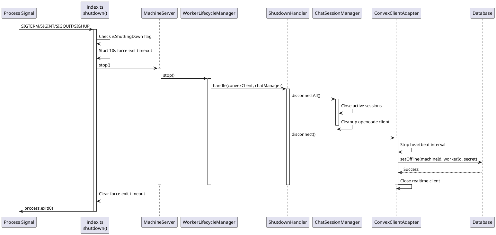

# Worker Graceful Shutdown Codemap

## Title

Worker Graceful Shutdown and Signal Handling

## Description

Implements comprehensive graceful shutdown handling for the worker service to ensure proper cleanup of resources when the process is terminated. This includes handling multiple termination signals (SIGTERM, SIGINT, SIGQUIT, SIGHUP), cleaning up chat sessions, marking the worker as offline in the database, and forcing exit if shutdown takes too long.

## Problem Statement

When a worker process is terminated (via kill, Ctrl+C, or system shutdown), it needs to:
1. Close all active chat sessions properly
2. Mark itself as offline in the database immediately
3. Disconnect from Convex cleanly
4. Complete all cleanup within a reasonable timeout

Without proper signal handling, workers would remain marked as "online" until the stale detection cron job runs (up to 3.5 minutes later).

## Solution

Implemented comprehensive signal handling with:
- Multiple signal handlers (SIGTERM, SIGINT, SIGQUIT, SIGHUP)
- Uncaught exception and unhandled rejection handlers
- 10-second timeout to force exit if graceful shutdown hangs
- Prevention of multiple concurrent shutdown attempts
- Proper cleanup order (sessions → convex → exit)

## Sequence Diagram



## Worker Service Files

### Main Entry Point

- `services/worker/src/index.ts` - Main entry point with signal handlers
  - **Enhanced shutdown function**:
    ```typescript
    async function shutdown(signal: string): Promise<void>
    ```
  - **Signal handlers**:
    - SIGINT (Ctrl+C)
    - SIGTERM (kill command)
    - SIGQUIT (quit signal)
    - SIGHUP (terminal closed)
    - uncaughtException
    - unhandledRejection
  - **Features**:
    - Prevents multiple concurrent shutdowns
    - 10-second timeout to force exit
    - Logs signal that triggered shutdown
    - Proper exit codes (0 for success, 1 for error)

### Presentation Layer

- `services/worker/src/presentation/MachineServer.ts` - Server lifecycle management
  - **Function**:
    ```typescript
    async stop(): Promise<void>
    ```
  - Delegates to WorkerLifecycleManager

### Application Layer

- `services/worker/src/application/WorkerLifecycleManager.ts` - FSM-based lifecycle
  - **Function**:
    ```typescript
    async stop(): Promise<void>
    ```
  - Transitions FSM to STOPPING state
  - Calls handleStopping() internally

- `services/worker/src/application/stateHandlers/ShutdownHandler.ts` - Shutdown logic
  - **Function**:
    ```typescript
    async handle(
      convexClient: ConvexClientAdapter | null,
      chatManager: ChatSessionManager | null
    ): Promise<void>
    ```
  - Orchestrates cleanup in correct order
  - Best-effort cleanup (catches and logs errors without throwing)

- `services/worker/src/application/ChatSessionManager.ts` - Chat session management
  - **New Function**:
    ```typescript
    async disconnectAll(): Promise<void>
    ```
  - Closes all active chat sessions
  - Cleans up opencode client instance
  - Logs progress for each session

### Infrastructure Layer

- `services/worker/src/infrastructure/convex/ConvexClientAdapter.ts` - Convex connection
  - **Function**:
    ```typescript
    async disconnect(): Promise<void>
    ```
  - Stops heartbeat interval
  - Calls backend setOffline mutation
  - Closes realtime client connection

## Backend Files

### Worker Status Management

- `services/backend/convex/workers.ts` - Worker backend functions
  - **Function**:
    ```typescript
    export const setOffline = mutation({
      args: {
        machineId: v.string(),
        workerId: v.string(),
        secret: v.string(),
      },
      handler: async (ctx, args): Promise<void>
    })
    ```
  - Validates worker exists and secret matches
  - Updates worker status to "offline"
  - Updates lastHeartbeat timestamp
  - Triggers machine status update

- `services/backend/convex/machines.ts` - Machine status updates
  - **Function**:
    ```typescript
    export const updateMachineStatus = internalMutation({
      args: { machineId: v.string() },
      handler: async (ctx, args): Promise<void>
    })
    ```
  - Queries all workers for the machine
  - Marks machine offline if no workers are online

## Contracts

### Worker Service Types

```typescript
// From services/worker/src/index.ts

/**
 * Shutdown function signature
 * @param signal - Name of signal that triggered shutdown
 */
type ShutdownFunction = (signal: string) => Promise<void>;

/**
 * Signal handler function that wraps shutdown
 */
type SignalHandler = () => void;
```

### ChatSessionManager Types

```typescript
// From services/worker/src/application/ChatSessionManager.ts

/**
 * Information about an active chat session
 */
interface SessionInfo {
  sessionId: string;
  model: string;
  startedAt: number;
}

/**
 * Disconnect all active sessions and cleanup resources
 */
async disconnectAll(): Promise<void>;
```

### Backend API Contracts

```typescript
// From services/backend/convex/workers.ts

export const setOffline = mutation({
  args: {
    machineId: v.string(),
    workerId: v.string(),
    secret: v.string(),
  },
  handler: async (ctx, args): Promise<void> => {
    // Validate worker and secret
    // Update status to offline
    // Trigger machine status update
  },
});
```

## Configuration

### Shutdown Timeout

- **Default**: 10 seconds
- **Location**: `services/worker/src/index.ts`
- **Rationale**: 
  - Convex setOffline mutation: ~1-2 seconds
  - Chat session cleanup: ~1-2 seconds per session
  - Buffer for network delays: ~5-6 seconds
  - Total: 10 seconds provides safe margin

### Signals Handled

| Signal | Trigger | Example |
|--------|---------|---------|
| SIGINT | Ctrl+C | User interrupts in terminal |
| SIGTERM | Kill command | `kill <pid>` or systemd stop |
| SIGQUIT | Quit with core dump | Ctrl+\ or `kill -QUIT` |
| SIGHUP | Terminal closed | Terminal window closed, SSH disconnected |
| uncaughtException | Unhandled error | Synchronous error not caught |
| unhandledRejection | Unhandled promise | Async error not caught |

## Shutdown Flow

### Normal Shutdown (< 10 seconds)

1. Signal received (e.g., SIGTERM)
2. Check if shutdown already in progress
3. Set isShuttingDown flag
4. Start 10-second force-exit timer
5. Call server.stop()
6. ChatSessionManager closes all sessions
7. ConvexClientAdapter marks worker offline in DB
8. ConvexClientAdapter closes connections
9. Clear force-exit timer
10. Log success and exit with code 0

### Timeout Shutdown (≥ 10 seconds)

1. Signal received
2. Shutdown begins normally
3. 10 seconds elapse
4. Timeout fires
5. Log warning about timeout
6. Force exit with code 1

### Error During Shutdown

1. Signal received
2. Shutdown begins
3. Error occurs in cleanup
4. Error caught and logged
5. Continue best-effort cleanup
6. Exit with code 1

## Testing Scenarios

### Manual Testing

1. **Normal Ctrl+C**:
   ```bash
   pnpm start
   # Wait for "Worker is running"
   # Press Ctrl+C
   # Verify "Graceful shutdown completed" message
   # Check UI shows worker offline
   ```

2. **Kill command**:
   ```bash
   pnpm start &
   PID=$!
   # Wait for startup
   kill $PID
   # Verify graceful shutdown in logs
   ```

3. **Force kill (should be caught by stale detection)**:
   ```bash
   pnpm start &
   PID=$!
   kill -9 $PID  # SIGKILL cannot be caught
   # Wait 2-3 minutes
   # Verify stale detection marks worker offline
   ```

4. **Terminal close**:
   ```bash
   # In new terminal window
   pnpm start
   # Close terminal window
   # Verify worker marked offline via SIGHUP
   ```

### Expected Behavior

| Scenario | Immediate Offline | Stale Detection | Notes |
|----------|-------------------|-----------------|-------|
| Ctrl+C | ✅ Yes | N/A | SIGINT caught |
| kill <pid> | ✅ Yes | N/A | SIGTERM caught |
| kill -9 <pid> | ❌ No | ✅ Yes (2-3 min) | SIGKILL not catchable |
| Terminal close | ✅ Yes | N/A | SIGHUP caught |
| Uncaught error | ✅ Yes | N/A | uncaughtException caught |
| Process crash | ❌ No | ✅ Yes (2-3 min) | No signal sent |

## Related Documentation

- [Worker FSM Lifecycle](./worker-fsm-lifecycle.codemap.md)
- [Worker Stale Detection](./worker-stale-detection.codemap.md)
- [Graceful Shutdown (Nx)](../docs/graceful-shutdown.md)

## Improvements Made

### Before

- Only handled SIGINT and SIGTERM
- No timeout mechanism
- No protection against multiple shutdown attempts
- ChatSessionManager had TODO comment for disconnectAll
- No handling of uncaught errors

### After

- ✅ Handles 6 different termination scenarios
- ✅ 10-second timeout prevents hanging
- ✅ Flag prevents duplicate shutdown attempts
- ✅ ChatSessionManager.disconnectAll() implemented
- ✅ Uncaught exceptions/rejections trigger graceful shutdown
- ✅ Proper cleanup order (sessions → database → exit)
- ✅ Detailed logging shows shutdown progress

## Future Enhancements

1. **Configurable timeout**: Make shutdown timeout configurable via environment variable
2. **Shutdown hooks**: Allow plugins to register cleanup callbacks
3. **Graceful chat interruption**: Send "shutting down" message to active chat sessions
4. **Metrics**: Track shutdown duration and reasons in monitoring system
5. **Health check**: Expose endpoint to verify worker is shutting down gracefully


