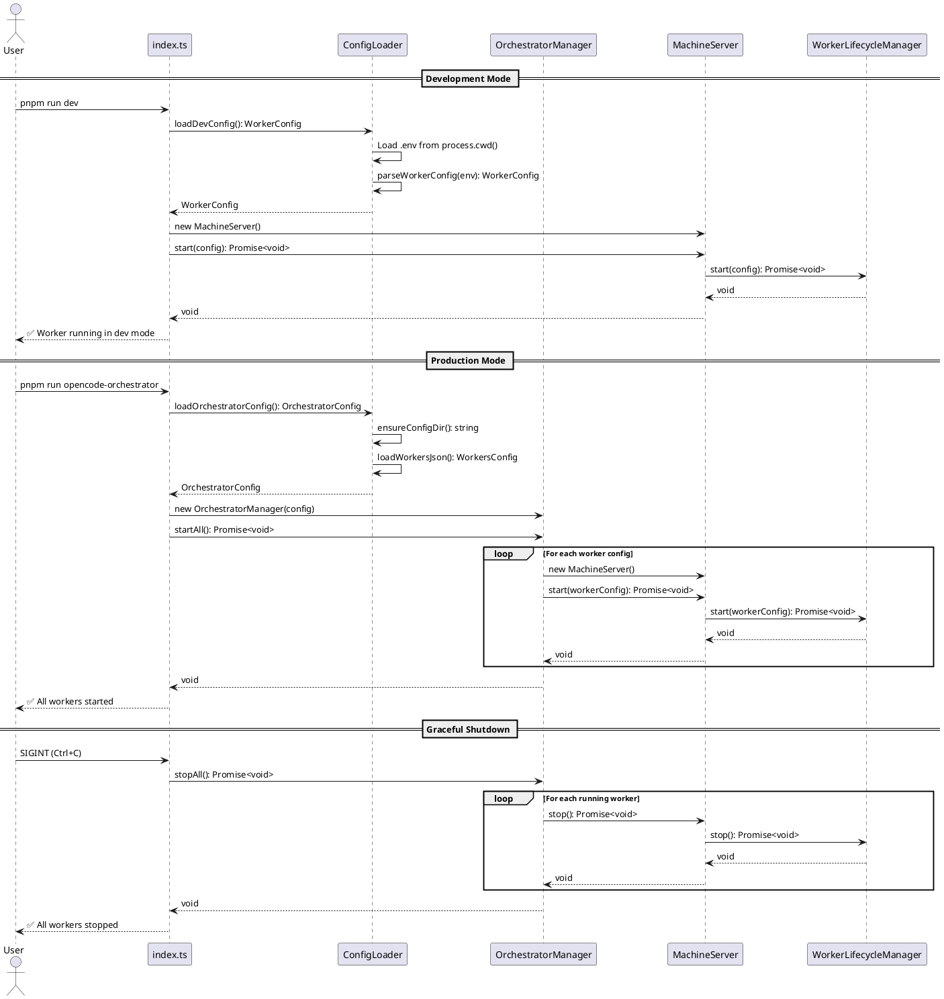

# Worker Orchestrator Configuration Codemap

## Title

Multi-Worker Orchestration with Persistent Configuration

## Description

Enables the worker service to run in two modes:
1. **Development Mode** (`pnpm run dev`) - Single worker using .env file in current directory
2. **Production Mode** (`pnpm run opencode-orchestrator`) - Multiple workers from `~/.config/opencode-orchestrator/workers.json`

This allows local development with .env while supporting production deployments with multiple workers across different directories.

## Sequence Diagram



## Worker Configuration Files

### Development Mode Config
- `services/worker/.env` - Development environment variables
  - `WORKER_TOKEN` - Worker authentication token
  - `CONVEX_URL` - Convex backend URL
  - Working directory: `process.cwd()`

### Production Mode Config
- `~/.config/opencode-orchestrator/workers.json` - Multi-worker configuration (JSONC supported)
  ```jsonc
  {
    "workers": [
      // Worker configuration with mandatory fields
      {
        "token": "machine_abc123:worker_xyz789:secret_def456ghi789jkl012",
        "working_directory": "~/Documents/Projects/my-project",  // Mandatory
        "convex_url": "https://your-deployment.convex.cloud"
      }
    ]
  }
  ```
  
  **Important**:
  - Supports JSONC format (comments with `//` or `/* */`)
  - All three fields are **mandatory** per worker
  - `working_directory` supports tilde expansion and relative paths

## Configuration Layer

### Config Files Structure

```
services/worker/src/config/
├── index.ts           # Public API exports
├── env.ts            # Development .env config loader
├── orchestrator.ts   # Production workers.json loader (NEW)
└── types.ts          # Shared configuration types (NEW)
```

### New Configuration Types

```typescript
// From services/worker/src/config/types.ts
export interface WorkerConfig {
  /** Machine ID extracted from worker token */
  machineId: string;
  /** Worker ID extracted from worker token */
  workerId: string;
  /** Cryptographic secret extracted from worker token */
  secret: string;
  /** Convex backend URL */
  convexUrl: string;
  /** Original worker token */
  workerToken: string;
  /** Working directory for this worker (MANDATORY) */
  workingDirectory: string;
}

export interface WorkerConfigEntry {
  /** Worker authentication token (MANDATORY) */
  token: string;
  /** Working directory path - supports ~ expansion (MANDATORY) */
  working_directory: string;
  /** Convex backend URL (MANDATORY) */
  convex_url: string;
}

export interface WorkersConfig {
  workers: WorkerConfigEntry[];
}

export interface OrchestratorConfig {
  /** Path to configuration directory */
  configDir: string;
  /** Path to workers.json file */
  workersJsonPath: string;
  /** Parsed worker configurations */
  workers: WorkerConfig[];
}
```

### Configuration Loader

```typescript
// From services/worker/src/config/orchestrator.ts

/**
 * Get the configuration directory path.
 * Creates directory if it doesn't exist.
 */
export function getConfigDir(): string;

/**
 * Expand tilde (~) in paths to user home directory.
 */
export function expandPath(filepath: string): string;

/**
 * Load workers configuration from workers.json.
 * Creates template file if it doesn't exist.
 * Supports JSONC format (strips comments before parsing).
 */
export async function loadWorkersJson(): Promise<WorkersConfig>;

/**
 * Strip comments from JSON content to support JSONC format.
 */
function stripJsonComments(content: string): string;

/**
 * Parse a single worker config entry into WorkerConfig.
 */
export function parseWorkerConfigEntry(entry: WorkerConfigEntry): WorkerConfig;

/**
 * Load orchestrator configuration (production mode).
 */
export async function loadOrchestratorConfig(): Promise<OrchestratorConfig>;

/**
 * Load development configuration from .env.
 */
export async function loadDevConfig(): Promise<WorkerConfig | null>;
```

## Orchestrator Manager

### Orchestrator Manager Implementation

```typescript
// From services/worker/src/orchestrator/OrchestratorManager.ts

export interface WorkerInstance {
  config: WorkerConfig;
  server: MachineServer;
  isRunning: boolean;
}

/**
 * Manages multiple worker instances.
 * Handles startup, shutdown, and monitoring of all workers.
 */
export class OrchestratorManager {
  private workers: Map<string, WorkerInstance>;
  
  constructor(config: OrchestratorConfig);
  
  /**
   * Start all configured workers.
   */
  async startAll(): Promise<void>;
  
  /**
   * Stop all running workers gracefully.
   */
  async stopAll(): Promise<void>;
  
  /**
   * Get status of all workers.
   */
  getStatus(): WorkerInstance[];
  
  /**
   * Check if all workers are running.
   */
  isAllRunning(): boolean;
}
```

## Entry Points

### Development Mode Entry Point
- `services/worker/src/entries/dev.ts` - Development mode entry (single worker)
  - Invoked by `pnpm run dev` or `pnpm start`
  - Uses `loadDevConfig()` for single worker from `.env`
  - Working directory: `process.cwd()`
  - Supports interactive setup on first run

### Production Mode Entry Point  
- `services/worker/src/entries/orchestrator.ts` - Production mode entry (multi-worker)
  - Invoked by `pnpm run opencode-orchestrator` 
  - Uses `loadOrchestratorConfig()` for multi-worker setup
  - Creates `OrchestratorManager` instance
  - Handles graceful shutdown of all workers
  - Parses JSONC format (strips comments before validation)

## Package.json Scripts

```json
{
  "scripts": {
    "dev": "bun --watch src/entries/dev.ts",
    "opencode-orchestrator": "bun run src/entries/orchestrator.ts",
    "start": "bun run src/entries/dev.ts"
  }
}
```

**Entry Points Documentation**: See `src/entries/README.md` for detailed information about each entry point.

## Implementation Changes

### Modified Files

1. `services/worker/src/config/env.ts`
   - Update `WorkerConfig` interface to include mandatory `workingDirectory`
   - Update `parseWorkerConfig()` to accept optional working directory (defaults to `process.cwd()`)

2. `services/worker/src/config/index.ts`
   - Re-export new types and functions
   - Add `loadDevConfig()` function

3. `services/worker/src/entries/dev.ts` (moved from `src/index.ts`)
   - Development mode entry point
   - Support both dev and production modes
   - Update to use `workingDirectory` from config

4. `services/worker/src/application/WorkerLifecycleManager.ts`
   - Update to use `config.workingDirectory` instead of `process.cwd()`

5. `services/worker/package.json`
   - Update scripts to point to `src/entries/` folder

### New Files

1. `services/worker/src/config/types.ts`
   - Shared configuration type definitions
   - `WorkerConfig`, `WorkerConfigEntry`, `WorkersConfig`, `OrchestratorConfig`
   - All fields marked as mandatory

2. `services/worker/src/config/orchestrator.ts`
   - Orchestrator configuration loader with JSONC support
   - `stripJsonComments()` - Strips `//` and `/* */` comments
   - `getConfigDir()`, `expandPath()`, `loadWorkersJson()`, etc.
   - Validation with mandatory field checks

3. `services/worker/src/orchestrator/OrchestratorManager.ts`
   - Multi-worker orchestration manager
   - `OrchestratorManager` class

4. `services/worker/src/entries/orchestrator.ts` (moved from `src/orchestrator/index.ts`)
   - Main entry point for orchestrator mode
   - CLI handling and graceful shutdown

5. `services/worker/src/entries/README.md`
   - Documentation for all entry points
   - Usage instructions and configuration details

## Configuration File Location

- **Development**: `.env` in `services/worker/`
- **Production**: `~/.config/opencode-orchestrator/workers.json`
- **Config Directory**: `~/.config/opencode-orchestrator/`

## Backward Compatibility

- Existing `.env` based development workflow continues to work
- `pnpm run dev` behaves exactly as before
- `pnpm run start` attempts orchestrator mode first, falls back to dev mode
- No breaking changes to existing MachineServer or WorkerLifecycleManager APIs

## Migration Path

1. **For Local Development**: No changes needed, continue using `.env`
2. **For Production Deployment**: 
   - Create `~/.config/opencode-orchestrator/workers.json`
   - Add worker configurations
   - Run `pnpm run opencode-orchestrator`

## Error Handling

- Missing workers.json → Create template file with instructions
- Invalid worker token → Log error, skip that worker, continue with others
- Worker startup failure → Log error, continue with other workers
- Graceful shutdown → Stop all workers with timeout, force exit if needed

