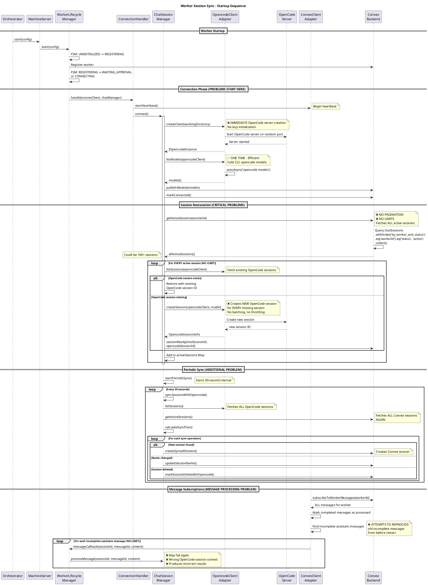

# Worker Session Sync - Sequence Analysis

## Description

This codemap documents the worker session synchronization sequence that occurs during worker startup and runtime. It identifies the multiple problematic patterns in how sessions are fetched, restored, and synced with OpenCode.

## Critical Issues Identified

### 1. Model Fetching - EVERY STARTUP (PROBLEM)
**Question**: When a worker starts, how many times does it try to fetch models?
**Answer**: **EXACTLY ONCE** per worker startup

The worker fetches models during the `ChatSessionManager.connect()` call:
- Location: `ChatSessionManager.connect()` line 53-64
- Calls: `opencodeAdapter.listModels()` → CLI command `opencode models`
- This happens **once per worker startup** in the connection phase
- ✅ This is actually **efficient** - models only fetched once

### 2. Session Restoration - NO LIMITS (CRITICAL PROBLEM)
**Question**: When a worker starts, are there any limits on how many sessions that it attempts to start?
**Answer**: **NO LIMITS WHATSOEVER** ❌

The worker attempts to restore **ALL active sessions** without any pagination or limits:
- Location: `ChatSessionManager.restoreActiveSessions()` line 258-350
- Backend query: `getActiveSessions` fetches ALL active sessions using `.collect()`
- **CRITICAL**: No pagination, no limits, no batching
- **RISK**: With 100+ sessions, this will cause:
  - Memory exhaustion
  - Connection timeouts
  - OpenCode server overload (creating sessions for all)

### 3. OpenCode Client Creation - IMMEDIATE (PROBLEM)
**Question**: When a worker starts, does it immediately establish an opencode server and client pair?
**Answer**: **YES, IMMEDIATELY** during connection phase

Sequence:
1. Worker transitions to `CONNECTING` state
2. `ConnectionHandler.handle()` called
3. `ChatSessionManager.connect()` called immediately
4. `OpencodeClientAdapter.createClient()` creates server/client pair
5. **All sessions are restored immediately** after client creation

**PROBLEM**: No lazy initialization, no waiting for actual user activity

### 4. Old Message Processing - ATTEMPT TO RESUME (MAJOR PROBLEM)
**Question**: When a worker starts, does it attempt to re-process old messages?
**Answer**: **YES, for incomplete assistant messages** ❌

Location: `ConvexClientAdapter.startChatSubscriptions()` lines 287-310
```typescript
// On first load, mark all existing messages as processed
// EXCEPT incomplete assistant messages (these need processing)
if (!messagesInitialized) {
  for (const message of messages) {
    // Mark completed messages as processed
    if (message.completed) {
      processedMessages.add(messageKey);
    }
  }
  
  // Check for any incomplete assistant messages that need processing
  const incompleteAssistantMessages = messages.filter(
    (m) => m.role === 'assistant' && !m.completed
  );
  
  if (incompleteAssistantMessages.length > 0) {
    // ATTEMPTS TO PROCESS THESE
  }
}
```

**CRITICAL PROBLEM**: 
- Worker tries to resume incomplete messages from BEFORE the restart
- These messages likely failed or were interrupted
- No context about the OpenCode session state
- May fail again or produce incorrect results
- **NO LIMIT** on how many old messages it attempts to process

## Startup Sequence Diagram



## Problems Summary

### Critical Issues

1. **No Session Restoration Limits** ❌
   - Fetches ALL active sessions at once
   - No pagination or batching
   - Risk: Memory exhaustion with 100+ sessions

2. **Eager OpenCode Server Creation** ❌
   - Creates OpenCode server immediately on startup
   - Should wait for first user message
   - Wastes resources for idle workers

3. **Unlimited Session Creation** ❌
   - Creates OpenCode sessions for ALL missing sessions
   - No throttling or batching
   - Risk: OpenCode server overload

4. **Old Message Reprocessing** ❌
   - Attempts to resume incomplete messages from before restart
   - No context about why they failed
   - May produce incorrect results
   - No limit on how many to retry

5. **Sync Inefficiency** ⚠️
   - Fetches ALL sessions every 30 seconds
   - No incremental/delta syncing
   - Redundant full scans

### Recommended Fixes

1. **Add Session Restoration Limits**
   - Implement pagination (e.g., 10 sessions at a time)
   - Add configurable max sessions per worker
   - Lazy-load sessions on demand

2. **Lazy OpenCode Initialization**
   - Don't create OpenCode client until first message
   - Initialize on-demand per user activity

3. **Throttle Session Creation**
   - Batch session creation (e.g., 5 at a time)
   - Add delays between batches
   - Implement rate limiting

4. **Fix Old Message Handling**
   - Don't reprocess incomplete messages from before restart
   - Mark them as failed/expired
   - Only process new messages after startup

5. **Optimize Sync**
   - Implement incremental sync using timestamps
   - Only fetch sessions modified since last sync
   - Add sync skip if no activity

## Worker Files

### Entry Points
- `services/worker/src/entries/orchestrator.ts` - Multi-worker orchestrator entry
- `services/worker/src/entries/dev.ts` - Development mode entry

### Core Orchestration
- `services/worker/src/orchestrator/OrchestratorManager.ts` - Manages multiple worker instances

### Presentation Layer
- `services/worker/src/presentation/MachineServer.ts` - Worker server interface

### Application Layer
- `services/worker/src/application/WorkerLifecycleManager.ts` - FSM-based lifecycle management
- `services/worker/src/application/ChatSessionManager.ts` - **Session management and sync logic** ⚠️
- `services/worker/src/application/OpencodeConvexSync.ts` - Sync calculation logic
- `services/worker/src/application/stateHandlers/ConnectionHandler.ts` - Connection phase handler

### Infrastructure Layer
- `services/worker/src/infrastructure/opencode/OpencodeClientAdapter.ts` - OpenCode SDK wrapper
- `services/worker/src/infrastructure/convex/ConvexClientAdapter.ts` - **Convex client and subscriptions** ⚠️

## Backend Files

### Chat API
- `services/backend/convex/chat.ts` - **Session and message operations** ⚠️
  - `getActiveSessions` query (line 342-368) - NO PAGINATION ❌
  - `subscribeToWorkerMessages` query (line 717-752) - Returns ALL messages ❌
  - `createSyncedSession` mutation (line 831-895)
  - `updateSessionName` mutation (line 761-789)
  - `markSessionDeletedInOpencode` mutation (line 797-819)

### Schema
- `services/backend/convex/schema.ts` - Database schema
  - `chatSessions` table (line 318-339)
  - `chatMessages` table
  - `workerSyncState` table (line 302-303)

## Key Types

### Session Types

```typescript
// From services/worker/src/application/OpencodeConvexSync.ts
export interface OpencodeSession {
  id: string;
  title?: string;
}

export interface ConvexSession {
  chatSessionId: ChatSessionId;
  opencodeSessionId?: OpencodeSessionId;
  name?: string;
  deletedInOpencode?: boolean;
}

export interface SyncPlan {
  nameUpdates: Array<{ chatSessionId: ChatSessionId; newName: string }>;
  deletions: Array<{ chatSessionId: ChatSessionId }>;
  newSessions: Array<{ opencodeSessionId: string; title?: string }>;
}

export interface SyncResult {
  nameUpdates: number;
  deletions: number;
  newSessions: number;
  errors: Array<{ operation: string; error: string }>;
}
```

### Internal Session Info

```typescript
// From services/worker/src/application/ChatSessionManager.ts (line 512-518)
interface SessionInfo {
  chatSessionId: ChatSessionId;
  opencodeSessionId?: OpencodeSessionId;
  model: string;
  startedAt: number;
  isInitializing?: boolean;
}
```

### Worker Config

```typescript
// From services/worker/src/config/types.ts
export interface WorkerConfig {
  machineId: string;
  workerId: string;
  token: string;
  workingDirectory: string;
  convexUrl: string;
}
```

## Function Signatures

### Worker Layer

```typescript
// ChatSessionManager
async connect(): Promise<void>
async startSession(chatSessionId: ChatSessionId, model: string): Promise<void>
async processMessage(chatSessionId: ChatSessionId, messageId: string, content: string): Promise<void>
private async restoreActiveSessions(): Promise<void>
private async syncSessionsWithOpencode(): Promise<void>
private startPeriodicSync(): void

// OpencodeClientAdapter
async createClient(directory: string): Promise<IOpencodeInstance>
async listModels(client: IOpencodeInstance): Promise<Array<{id: string, name: string, provider: string}>>
async createSession(client: IOpencodeInstance, model: string): Promise<OpencodeSessionInfo>
async listSessions(client: IOpencodeInstance): Promise<OpencodeSessionInfo[]>
async *sendPrompt(client: IOpencodeInstance, sessionId: SessionId, content: string, model?: string): AsyncIterableIterator<string>

// ConvexClientAdapter
startChatSubscriptions(): void
onConnect(callback: () => Promise<void>): void
onSessionStart(callback: (sessionId: ChatSessionId, model: string) => Promise<void>): void
onMessage(callback: (sessionId: ChatSessionId, messageId: string, content: string) => Promise<void>): void
async getActiveSessions(): Promise<ConvexSession[]>
async publishModels(models: Array<{id: string, name: string, provider: string}>): Promise<void>
```

### Backend Layer

```typescript
// chat.ts
export const getActiveSessions = query({
  args: { workerId: v.string() },
  handler: async (ctx, args): Promise<Array<{
    chatSessionId: ChatSessionId;
    opencodeSessionId?: OpencodeSessionId;
    workerId: string;
    model: string;
    status: string;
    createdAt: number;
    lastActivity: number;
    name?: string;
    lastSyncedNameAt?: number;
    deletedInOpencode?: boolean;
  }>>
})

export const subscribeToWorkerMessages = query({
  args: { workerId: v.string() },
  handler: async (ctx, args): Promise<Array<{
    messageId: string;
    sessionId: string;
    role: 'user' | 'assistant';
    content: string;
    timestamp: number;
    completed: boolean;
  }>>
})

export const createSyncedSession = mutation({
  args: {
    opencodeSessionId: v.string(),
    workerId: v.string(),
    model: v.string(),
    name: v.optional(v.string())
  },
  handler: async (ctx, args): Promise<ChatSessionId>
})

export const updateSessionName = mutation({
  args: {
    chatSessionId: v.string(),
    name: v.string()
  },
  handler: async (ctx, args): Promise<boolean>
})

export const markSessionDeletedInOpencode = mutation({
  args: { chatSessionId: v.string() },
  handler: async (ctx, args): Promise<void>
})
```

## Contracts

### Session Restoration Flow

**Worker → Backend**
```typescript
Request: GET getActiveSessions
{
  workerId: string
}

Response: ConvexSession[]
{
  chatSessionId: ChatSessionId,
  opencodeSessionId?: OpencodeSessionId,
  workerId: string,
  model: string,
  status: string,
  createdAt: number,
  lastActivity: number,
  name?: string,
  deletedInOpencode?: boolean
}
```

### Session Sync Flow

**Worker → OpenCode**
```typescript
Request: listSessions()
Response: OpencodeSessionInfo[]
{
  id: string,
  title?: string,
  projectID?: string,
  directory?: string,
  parentID?: string
}
```

**Worker → Backend**
```typescript
// Create synced session
Request: createSyncedSession
{
  opencodeSessionId: string,
  workerId: string,
  model: string,
  name?: string
}
Response: ChatSessionId

// Update session name
Request: updateSessionName
{
  chatSessionId: string,
  name: string
}
Response: boolean

// Mark session deleted
Request: markSessionDeletedInOpencode
{
  chatSessionId: string
}
Response: void
```

### Message Processing Flow

**Backend → Worker (Subscription)**
```typescript
Subscription: subscribeToWorkerMessages
{
  workerId: string
}

Real-time Updates: Message[]
{
  messageId: string,
  sessionId: string,
  role: 'user' | 'assistant',
  content: string,
  timestamp: number,
  completed: boolean
}
```

## Performance Characteristics

### Startup Time Complexity

| Operation | Complexity | Notes |
|-----------|-----------|-------|
| Model Fetch | O(1) | Single CLI call, ~50-100 models |
| Session Fetch | O(N) | N = all active sessions, NO LIMIT ❌ |
| Session Restoration | O(N * M) | N sessions × M operations per session ❌ |
| OpenCode Session Creation | O(N) | One per missing session ❌ |
| Message Fetch | O(M) | M = all messages for worker ❌ |

### Runtime Complexity

| Operation | Frequency | Complexity | Notes |
|-----------|-----------|-----------|-------|
| Periodic Sync | Every 30s | O(N + M) | N OpenCode + M Convex sessions ❌ |
| Message Subscription | Real-time | O(M) | M = total messages |
| Heartbeat | Every 5s | O(1) | ✅ Efficient |

### Memory Usage

| Data Structure | Size | Growth |
|---------------|------|--------|
| activeSessions Map | O(N) | Unbounded ❌ |
| processedMessages Set | O(M) | Unbounded ❌ |
| seenSessions Set | O(N) | Unbounded ❌ |

## Risk Assessment

### High Risk ⛔
1. **Memory exhaustion** with 100+ sessions (no limits)
2. **OpenCode server overload** during startup (creates all sessions)
3. **Incorrect message processing** (reprocessing old failed messages)

### Medium Risk ⚠️
1. **Slow startup time** with many sessions
2. **Network congestion** from sync operations
3. **Database load** from repeated full scans

### Low Risk ℹ️
1. Model fetching (done once, efficient)
2. Heartbeat mechanism (efficient, O(1))

