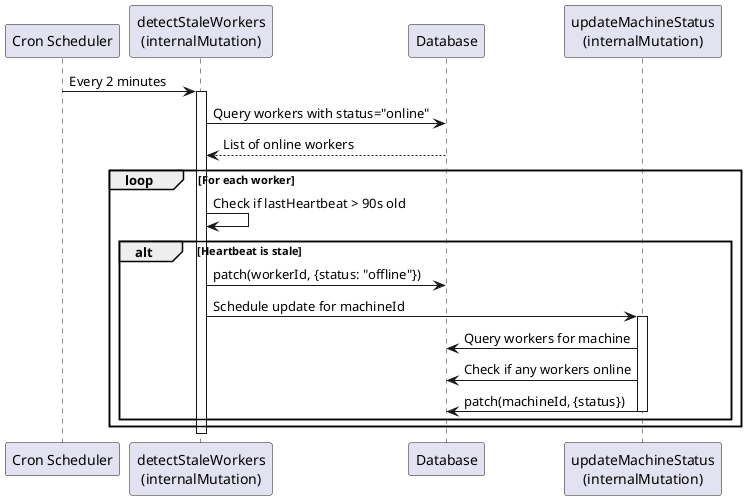

# Worker Stale Detection Codemap

## Title

Worker Stale Detection and Auto-Offline

## Description

Implements automatic detection of stale workers that have stopped sending heartbeats and marks them as offline. This ensures the UI accurately reflects worker status even when workers crash or lose network connectivity without gracefully shutting down.

## Problem Statement

When a worker goes offline unexpectedly (crash, network loss, etc.), it stops sending heartbeats but remains marked as "online" in the database. The UI continues showing these workers as online because there's no mechanism to detect stale heartbeats and update the status.

## Solution

Add a scheduled cron job that runs every 2 minutes to:
1. Query all workers marked as "online"
2. Check their `lastHeartbeat` timestamp
3. Mark workers as offline if heartbeat is older than 90 seconds (3x the 30-second heartbeat interval)
4. Update machine status for affected machines

## Sequence Diagram



## Backend Files

### Cleanup Tasks

- `services/backend/convex/cleanupTasks.ts` - Scheduled cleanup tasks
  - **New Function**:
    ```typescript
    detectStaleWorkers(): Promise<StaleWorkersCleanupResult>
    ```
  - **Modified Function**:
    ```typescript
    runAllCleanupTasks(): Promise<AllCleanupResults>
    ```

### Contracts

```typescript
// From services/backend/convex/cleanupTasks.ts

/**
 * Result of detecting and marking stale workers as offline
 */
export interface StaleWorkersCleanupResult extends CleanupResult {
  /** Number of workers marked as offline */
  markedOfflineCount: number;
  /** List of affected machine IDs */
  affectedMachineIds: string[];
}

/**
 * Extended cleanup results including stale workers
 */
export interface AllCleanupResults {
  success: boolean;
  results: {
    loginRequests: LoginRequestsCleanupResult;
    loginCodes: CleanupResult;
    staleWorkers: StaleWorkersCleanupResult;
  };
}

/**
 * Detect workers with stale heartbeats and mark them offline.
 * A worker is considered stale if its lastHeartbeat is older than 90 seconds.
 * This is 3x the heartbeat interval (30s) to allow for network delays.
 */
export const detectStaleWorkers = internalMutation({
  args: {},
  handler: async (ctx, _args): Promise<StaleWorkersCleanupResult> => {
    const now = Date.now();
    const STALE_THRESHOLD_MS = 90_000; // 90 seconds
    const staleTimestamp = now - STALE_THRESHOLD_MS;

    // Find workers marked as online with stale heartbeats
    const staleWorkers = await ctx.db
      .query('workers')
      .filter((q) => 
        q.and(
          q.eq(q.field('status'), 'online'),
          q.or(
            // lastHeartbeat is too old
            q.lt(q.field('lastHeartbeat'), staleTimestamp),
            // lastHeartbeat doesn't exist (shouldn't happen but handle it)
            q.eq(q.field('lastHeartbeat'), undefined)
          )
        )
      )
      .collect();

    const affectedMachineIds = new Set<string>();
    let markedOfflineCount = 0;

    // Mark stale workers as offline
    for (const worker of staleWorkers) {
      await ctx.db.patch(worker._id, {
        status: 'offline',
        lastHeartbeat: now, // Update timestamp to prevent repeated processing
      });
      affectedMachineIds.add(worker.machineId);
      markedOfflineCount++;
    }

    // Update machine statuses for all affected machines
    for (const machineId of affectedMachineIds) {
      await ctx.scheduler.runAfter(0, internal.machines.updateMachineStatus, {
        machineId,
      });
    }

    return {
      success: true,
      deletedCount: 0, // Not deleting, just updating status
      markedOfflineCount,
      affectedMachineIds: Array.from(affectedMachineIds),
    };
  },
});

/**
 * Master cleanup function that runs all cleanup tasks.
 */
export const runAllCleanupTasks = internalMutation({
  args: {},
  handler: async (ctx, _args): Promise<AllCleanupResults> => {
    const results = {
      loginRequests: await ctx.runMutation(internal.cleanupTasks.cleanupExpiredLoginRequests, {}),
      loginCodes: await ctx.runMutation(internal.cleanupTasks.cleanupExpiredLoginCodes, {}),
      staleWorkers: await ctx.runMutation(internal.cleanupTasks.detectStaleWorkers, {}),
    };

    return {
      success: true,
      results,
    };
  },
});

// Cron job registration - runs every 2 minutes
cleanupCronJobs.interval(
  'detect stale workers',
  { minutes: 2 },
  internal.cleanupTasks.detectStaleWorkers
);
```

## Configuration

### Heartbeat Timing

- **Worker heartbeat interval**: 30 seconds (defined in `services/worker/src/infrastructure/convex/ConvexClientAdapter.ts`)
- **Stale threshold**: 90 seconds (3x heartbeat interval)
- **Cleanup interval**: 2 minutes (cron job frequency)

### Rationale

- 90-second threshold provides buffer for:
  - Network delays/retries
  - Temporary connectivity issues
  - Server processing delays
- 2-minute cleanup interval ensures timely detection without excessive database queries
- Workers will be marked offline at most 210 seconds (3.5 minutes) after last heartbeat

## Testing Scenarios

### Manual Testing

1. **Start a worker** and verify it shows as online
2. **Kill the worker process** (Ctrl+C or kill -9)
3. **Wait 2-3 minutes** and verify worker shows as offline
4. **Verify machine status** updates to offline when last worker goes offline

### Edge Cases

1. **Worker restarts during cleanup window**: Worker sends new heartbeat, won't be marked stale
2. **Multiple workers on same machine**: Machine stays online until all workers are stale
3. **Worker with no lastHeartbeat**: Treated as stale and marked offline
4. **Graceful shutdown**: Worker calls `setOffline` immediately, no need to wait for cleanup

## Related Files

### Worker Service

- `services/worker/src/infrastructure/convex/ConvexClientAdapter.ts`
  - Heartbeat configuration: `HEARTBEAT_INTERVAL_MS = 30000` (30 seconds)
  - `startHeartbeat()`: Sends heartbeat every 30 seconds
  - `disconnect()`: Gracefully marks worker offline on shutdown

### Backend

- `services/backend/convex/workers.ts`
  - `heartbeat`: Updates worker lastHeartbeat timestamp
  - `setOffline`: Manually marks worker offline (graceful shutdown)
- `services/backend/convex/machines.ts`
  - `updateMachineStatus`: Updates machine status based on worker statuses

### Database Schema

- `services/backend/convex/schema.ts`
  - Workers table with `status` and `lastHeartbeat` fields
  - Index: `by_machine_id` (used by cleanup to update machine status)

## Future Enhancements

1. **Configurable thresholds**: Make stale threshold configurable per deployment
2. **Metrics/logging**: Track how often workers go stale (indicates crashes/network issues)
3. **Alerts**: Notify users when workers frequently go stale
4. **Health dashboard**: Show worker uptime and reliability metrics


