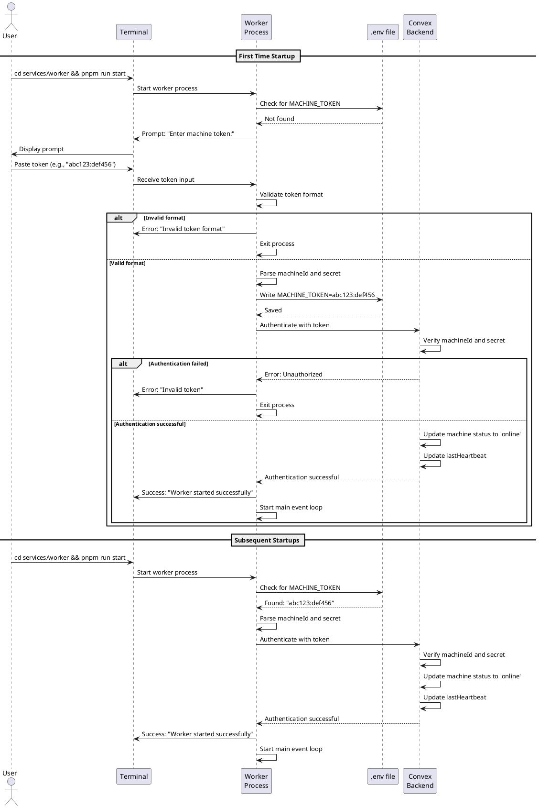

# Worker Startup and Registration Codemap

## Title

Worker Process Startup and Machine Token Registration

## Description

This codemap details the worker process startup flow, focusing on the initial setup where the worker prompts for and stores the machine token. The worker process runs on the user's physical machine and connects to Convex using the machine token obtained from the web UI.

Key features:
- Interactive prompt for machine token on first run
- Store machine token in `.env` file
- Load configuration from `.env` on subsequent runs
- Validate token format (`<machine_id>:<machine_secret>`)
- Authenticate with Convex backend
- Update machine status to 'online'

## Sequence Diagram



## Worker Files

### Entry Point
- `services/worker/src/index.ts` - Main entry point
  ```typescript
  import { MachineServer } from './presentation/MachineServer';
  import { loadConfig, promptForToken, saveToken } from './config';
  
  async function main() {
    console.log('🚀 Starting Opencode Worker...\n');
    
    // Load or prompt for machine token
    let config = await loadConfig();
    
    if (!config.machineToken) {
      console.log('No machine token found.');
      const token = await promptForToken();
      await saveToken(token);
      config = await loadConfig();
    }
    
    // Start the machine server
    const server = new MachineServer();
    await server.start(config);
    
    console.log('✅ Worker is running and connected to Convex');
  }
  
  main().catch((error) => {
    console.error('❌ Failed to start worker:', error);
    process.exit(1);
  });
  ```

### Configuration Management
- `services/worker/src/config/index.ts` - Configuration loading and saving
  ```typescript
  import * as dotenv from 'dotenv';
  import * as fs from 'fs/promises';
  import * as path from 'path';
  import * as readline from 'readline';
  
  export interface WorkerConfig {
    machineToken: string | null;
    machineId: string | null;
    machineSecret: string | null;
  }
  
  /**
   * Load configuration from .env file.
   * Parses MACHINE_TOKEN into machineId and machineSecret.
   */
  export async function loadConfig(): Promise<WorkerConfig> {
    dotenv.config();
    
    const machineToken = process.env.MACHINE_TOKEN || null;
    
    if (!machineToken) {
      return {
        machineToken: null,
        machineId: null,
        machineSecret: null,
      };
    }
    
    const [machineId, machineSecret] = parseToken(machineToken);
    
    return {
      machineToken,
      machineId,
      machineSecret,
    };
  }
  
  /**
   * Prompt user for machine token via stdin.
   */
  export async function promptForToken(): Promise<string> {
    const rl = readline.createInterface({
      input: process.stdin,
      output: process.stdout,
    });
    
    return new Promise((resolve) => {
      rl.question('Enter machine token (from web UI): ', (answer) => {
        rl.close();
        resolve(answer.trim());
      });
    });
  }
  
  /**
   * Save machine token to .env file.
   */
  export async function saveToken(token: string): Promise<void> {
    const envPath = path.join(process.cwd(), '.env');
    const envContent = `MACHINE_TOKEN=${token}\n`;
    
    await fs.writeFile(envPath, envContent, 'utf-8');
    console.log('✅ Machine token saved to .env\n');
  }
  
  /**
   * Parse machine token into machineId and machineSecret.
   * Format: <machine_id>:<machine_secret>
   */
  function parseToken(token: string): [string, string] {
    const parts = token.split(':');
    
    if (parts.length !== 2) {
      throw new Error('Invalid token format. Expected: <machine_id>:<machine_secret>');
    }
    
    return [parts[0], parts[1]];
  }
  ```

### Machine Server
- `services/worker/src/presentation/MachineServer.ts` - Server implementation
  ```typescript
  import type { WorkerConfig } from '../config';
  
  export interface StartConfig {
    machineId: string;
    machineSecret: string;
  }
  
  export class MachineServer {
    private _isRunning: boolean = false;
    private _machineId: string | null = null;
    private _machineSecret: string | null = null;
    
    /**
     * Start the machine server.
     * Authenticates with Convex and begins listening for commands.
     */
    async start(config: WorkerConfig): Promise<void> {
      if (this._isRunning) {
        throw new Error('Machine server is already running');
      }
      
      if (!config.machineId || !config.machineSecret) {
        throw new Error('Machine ID and secret are required');
      }
      
      console.log('🔐 Authenticating with Convex...');
      
      // TODO: Authenticate with Convex
      // TODO: Update machine status to 'online'
      // TODO: Subscribe to commands
      // TODO: Initialize worker manager
      
      this._machineId = config.machineId;
      this._machineSecret = config.machineSecret;
      this._isRunning = true;
      
      console.log(`✅ Authenticated as machine: ${this._machineId}`);
    }
    
    /**
     * Stop the machine server gracefully.
     */
    async stop(): Promise<void> {
      if (!this._isRunning) {
        return;
      }
      
      console.log('🛑 Stopping machine server...');
      
      // TODO: Update machine status to 'offline'
      // TODO: Close Convex connection
      // TODO: Cleanup workers
      
      this._isRunning = false;
      console.log('✅ Machine server stopped');
    }
  }
  ```

## Backend Files

### Mutations
- `services/backend/convex/machines.ts` - Machine authentication
  ```typescript
  /**
   * Authenticate machine and update status to online.
   * Called by worker process on startup.
   */
  export const authenticate = mutation({
    args: {
      machineId: v.string(),
      secret: v.string(),
    },
    handler: async (ctx, args) => {
      // Find machine by ID
      const machine = await ctx.db
        .query('machines')
        .withIndex('by_machine_id', (q) => q.eq('machineId', args.machineId))
        .first();
      
      if (!machine) {
        throw new Error('Machine not found');
      }
      
      // Verify secret
      if (machine.secret !== args.secret) {
        throw new Error('Invalid secret');
      }
      
      // Update status to online
      await ctx.db.patch(machine._id, {
        status: 'online',
        lastHeartbeat: Date.now(),
      });
      
      return {
        success: true,
        machineId: machine.machineId,
        name: machine.name,
      };
    },
  });
  
  /**
   * Update machine heartbeat.
   * Called periodically by worker to maintain online status.
   */
  export const heartbeat = mutation({
    args: {
      machineId: v.string(),
      secret: v.string(),
    },
    handler: async (ctx, args) => {
      const machine = await ctx.db
        .query('machines')
        .withIndex('by_machine_id', (q) => q.eq('machineId', args.machineId))
        .first();
      
      if (!machine || machine.secret !== args.secret) {
        throw new Error('Unauthorized');
      }
      
      await ctx.db.patch(machine._id, {
        lastHeartbeat: Date.now(),
      });
    },
  });
  ```

## Environment Variables

### `.env` File Format
```bash
# Machine authentication token (format: <machine_id>:<machine_secret>)
MACHINE_TOKEN=abc123def456:xyz789ghi012
```

## Implementation Checklist

- [ ] Create `config/index.ts` with token management functions
- [ ] Update `index.ts` to handle first-run vs subsequent-run flows
- [ ] Implement token validation and parsing
- [ ] Add `.env` file read/write logic
- [ ] Create `machines.authenticate` mutation in backend
- [ ] Create `machines.heartbeat` mutation in backend
- [ ] Update `MachineServer.start()` to authenticate with Convex
- [ ] Add error handling for invalid tokens
- [ ] Add graceful shutdown handler
- [ ] Test first-run flow (prompt for token)
- [ ] Test subsequent-run flow (load from .env)
- [ ] Test invalid token handling
- [ ] Add `.env` to `.gitignore`

## User Experience

### First Time Running Worker

```bash
$ cd services/worker
$ pnpm run start

🚀 Starting Opencode Worker...

No machine token found.
Enter machine token (from web UI): abc123:def456

✅ Machine token saved to .env

🔐 Authenticating with Convex...
✅ Authenticated as machine: abc123
✅ Worker is running and connected to Convex
```

### Subsequent Runs

```bash
$ cd services/worker
$ pnpm run start

🚀 Starting Opencode Worker...

🔐 Authenticating with Convex...
✅ Authenticated as machine: abc123
✅ Worker is running and connected to Convex
```

## Notes

- Token format is `<machine_id>:<machine_secret>` for easy parsing
- `.env` file should be added to `.gitignore` to prevent token leakage
- Worker process should handle SIGINT/SIGTERM for graceful shutdown
- Machine status should be updated to 'offline' on shutdown
- Heartbeat mechanism will be added later to detect stale connections
- Worker name will be added in a future iteration (currently just machine-level)

