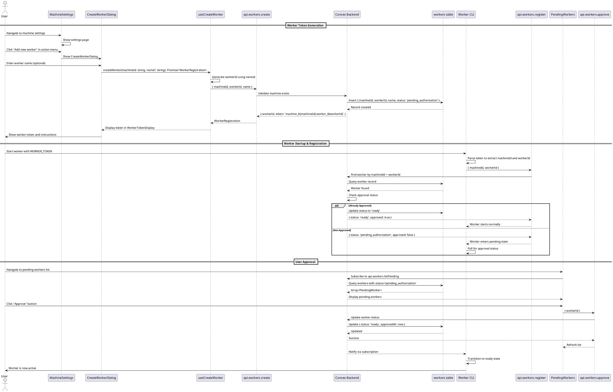

# Worker Token Authentication Flow

## Title

Worker Token Authentication and Authorization Flow

## Description

This flow replaces the machine token authentication with individual worker tokens. Instead of a single machine token that compromises the entire cluster if leaked, each worker gets its own token that requires explicit user approval before the worker can start.

Key features:
- Generate unique worker tokens in format `machine_<machine_id>:worker_<worker_id>`
- Worker registration requires user approval
- Workers enter `pending_authorization` state until approved
- User can view and approve pending worker requests
- Approved workers transition to `ready` state
- Machine compromise only affects that specific worker, not the entire cluster

## Sequence Diagram



## Frontend Files

### Pages
- `apps/webapp/src/app/app/machine/[machineId]/settings/page.tsx` - Machine settings page (existing, needs update)
  - Update to show "Add new worker" action menu instead of just settings icon

### Components

#### New Components
- `apps/webapp/src/modules/assistant/components/CreateWorkerDialog.tsx` - Dialog for creating new workers
  ```typescript
  export interface CreateWorkerDialogProps {
    /** Machine ID to create worker for */
    machineId: string;
    /** Whether dialog is open */
    open: boolean;
    /** Callback when dialog open state changes */
    onOpenChange: (open: boolean) => void;
  }

  /**
   * Dialog for creating a new worker token.
   * Displays the generated token and instructions after creation.
   */
  export function CreateWorkerDialog({ 
    machineId, 
    open, 
    onOpenChange 
  }: CreateWorkerDialogProps): JSX.Element;
  ```

- `apps/webapp/src/modules/assistant/components/WorkerTokenDisplay.tsx` - Displays worker token after creation
  ```typescript
  export interface WorkerTokenDisplayProps {
    /** Worker registration info containing token */
    registration: WorkerRegistration;
    /** Callback when user dismisses the display */
    onDismiss: () => void;
  }

  /**
   * Displays the worker token with copy functionality and setup instructions.
   */
  export function WorkerTokenDisplay({ 
    registration, 
    onDismiss 
  }: WorkerTokenDisplayProps): JSX.Element;
  ```

- `apps/webapp/src/modules/assistant/components/PendingWorkersList.tsx` - Lists pending worker authorization requests
  ```typescript
  export interface PendingWorkersListProps {
    /** Machine ID to show pending workers for */
    machineId: string;
  }

  /**
   * Displays list of workers pending authorization with approve/reject actions.
   */
  export function PendingWorkersList({ 
    machineId 
  }: PendingWorkersListProps): JSX.Element;
  ```

- `apps/webapp/src/modules/assistant/components/WorkersList.tsx` - Lists all workers for a machine
  ```typescript
  export interface WorkersListProps {
    /** Machine ID to show workers for */
    machineId: string;
  }

  /**
   * Displays all workers for a machine with status indicators.
   */
  export function WorkersList({ 
    machineId 
  }: WorkersListProps): JSX.Element;
  ```

#### Updated Components
- `apps/webapp/src/modules/assistant/components/MachineSettingsContent.tsx` - Update to include worker management
  - Add "Add new worker" button
  - Add PendingWorkersList component
  - Add WorkersList component

### Hooks

#### New Hooks
- `apps/webapp/src/modules/assistant/hooks/useCreateWorker.ts` - Hook for creating workers
  ```typescript
  export interface WorkerRegistration {
    workerId: string;
    token: string; // Format: machine_<machineId>:worker_<workerId>
  }

  export interface CreateWorkerReturn {
    createWorker: (machineId: string, name?: string) => Promise<WorkerRegistration>;
    isCreating: boolean;
    error: Error | null;
  }

  /**
   * Hook for creating new worker tokens.
   * Generates workerId and calls backend mutation.
   */
  export function useCreateWorker(): CreateWorkerReturn;
  ```

- `apps/webapp/src/modules/assistant/hooks/usePendingWorkers.ts` - Hook for fetching pending workers
  ```typescript
  export interface PendingWorker {
    workerId: string;
    machineId: string;
    name?: string;
    status: 'pending_authorization';
    createdAt: number;
  }

  export interface PendingWorkersData {
    workers: PendingWorker[] | undefined;
    loading: boolean;
    error: Error | null;
  }

  /**
   * Hook for fetching workers pending authorization for a machine.
   */
  export function usePendingWorkers(machineId: string): PendingWorkersData;
  ```

- `apps/webapp/src/modules/assistant/hooks/useApproveWorker.ts` - Hook for approving workers
  ```typescript
  export interface ApproveWorkerReturn {
    approveWorker: (workerId: string) => Promise<void>;
    isApproving: boolean;
    error: Error | null;
  }

  /**
   * Hook for approving pending worker authorization requests.
   */
  export function useApproveWorker(): ApproveWorkerReturn;
  ```

- `apps/webapp/src/modules/assistant/hooks/useWorkers.ts` - Hook for fetching all workers for a machine
  ```typescript
  export interface Worker {
    workerId: string;
    machineId: string;
    name?: string;
    status: 'pending_authorization' | 'ready' | 'online' | 'offline';
    createdAt: number;
    approvedAt?: number;
    lastHeartbeat?: number;
  }

  export interface WorkersData {
    workers: Worker[] | undefined;
    loading: boolean;
    error: Error | null;
  }

  /**
   * Hook for fetching all workers for a machine.
   */
  export function useWorkers(machineId: string): WorkersData;
  ```

### Types
- `apps/webapp/src/modules/assistant/types.ts` - Update with worker types
  ```typescript
  // Add to existing types:

  export interface WorkerRegistration {
    workerId: string;
    token: string; // Format: machine_<machineId>:worker_<workerId>
  }

  export interface Worker {
    workerId: string;
    machineId: string;
    name?: string;
    status: 'pending_authorization' | 'ready' | 'online' | 'offline';
    createdAt: number;
    approvedAt?: number;
    lastHeartbeat?: number;
  }

  export interface PendingWorker {
    workerId: string;
    machineId: string;
    name?: string;
    status: 'pending_authorization';
    createdAt: number;
  }
  ```

## Backend Files

### Schema
- `services/backend/convex/schema.ts` - Add workers table
  ```typescript
  export default defineSchema({
    // ... existing tables ...

    /**
     * Worker registrations for individual assistant instances.
     * Each worker requires explicit user approval before it can start.
     * Workers are tied to a specific machine.
     */
    workers: defineTable({
      workerId: v.string(),           // Client-generated nanoid
      machineId: v.string(),          // Reference to parent machine
      name: v.optional(v.string()),   // Optional user-friendly name
      status: v.union(
        v.literal('pending_authorization'),
        v.literal('ready'),
        v.literal('online'),
        v.literal('offline')
      ),
      createdAt: v.number(),          // When worker was created
      approvedAt: v.optional(v.number()), // When worker was approved
      approvedBy: v.optional(v.id('users')), // User who approved
      lastHeartbeat: v.optional(v.number()), // Last activity timestamp
    })
      .index('by_worker_id', ['workerId'])
      .index('by_machine_id', ['machineId'])
      .index('by_machine_and_worker', ['machineId', 'workerId'])
      .index('by_status', ['status'])
      .index('by_machine_and_status', ['machineId', 'status']),
  });
  ```

### Mutations & Queries

- `services/backend/convex/workers.ts` - Worker operations (NEW FILE)
  ```typescript
  import { v } from 'convex/values';
  import { SessionIdArg } from 'convex-helpers/server/sessions';
  import { getAuthUserOptional } from '../modules/auth/getAuthUser';
  import { mutation, query } from './_generated/server';

  /**
   * Create a new worker token.
   * Called from the web UI when user adds a new worker to a machine.
   */
  export const create = mutation({
    args: {
      ...SessionIdArg,
      machineId: v.string(),
      workerId: v.string(),
      name: v.optional(v.string()),
    },
    handler: async (ctx, args) => {
      // Verify user is authenticated
      const user = await getAuthUserOptional(ctx, args);
      if (!user) {
        throw new Error('Unauthorized: Must be logged in to create a worker');
      }

      // Verify machine exists and user owns it
      const machine = await ctx.db
        .query('machines')
        .withIndex('by_machine_id', (q) => q.eq('machineId', args.machineId))
        .first();

      if (!machine) {
        throw new Error('Machine not found');
      }

      if (machine.userId !== user._id) {
        throw new Error('Unauthorized: You do not own this machine');
      }

      // Check if worker ID already exists
      const existing = await ctx.db
        .query('workers')
        .withIndex('by_machine_and_worker', (q) => 
          q.eq('machineId', args.machineId).eq('workerId', args.workerId)
        )
        .first();

      if (existing) {
        throw new Error('Worker ID already exists. Please try again.');
      }

      // Create worker record with pending status
      await ctx.db.insert('workers', {
        workerId: args.workerId,
        machineId: args.machineId,
        name: args.name,
        status: 'pending_authorization',
        createdAt: Date.now(),
      });

      // Return registration info
      return {
        workerId: args.workerId,
        token: `machine_${args.machineId}:worker_${args.workerId}`,
      };
    },
  });

  /**
   * Register a worker and check authorization status.
   * Called by the worker process on startup.
   */
  export const register = mutation({
    args: {
      machineId: v.string(),
      workerId: v.string(),
    },
    handler: async (ctx, args) => {
      // Find worker by machine ID and worker ID
      const worker = await ctx.db
        .query('workers')
        .withIndex('by_machine_and_worker', (q) => 
          q.eq('machineId', args.machineId).eq('workerId', args.workerId)
        )
        .first();

      if (!worker) {
        throw new Error('Worker not found. Please check your worker token.');
      }

      // Check if already approved
      if (worker.status === 'ready' || worker.status === 'online') {
        // Update to online
        await ctx.db.patch(worker._id, {
          status: 'online',
          lastHeartbeat: Date.now(),
        });

        return {
          status: 'ready',
          approved: true,
          workerId: worker.workerId,
          name: worker.name,
        };
      }

      // Still pending authorization
      return {
        status: 'pending_authorization',
        approved: false,
        workerId: worker.workerId,
        name: worker.name,
      };
    },
  });

  /**
   * Approve a pending worker authorization request.
   * Called from the web UI when user approves a worker.
   */
  export const approve = mutation({
    args: {
      ...SessionIdArg,
      workerId: v.string(),
    },
    handler: async (ctx, args) => {
      // Verify user is authenticated
      const user = await getAuthUserOptional(ctx, args);
      if (!user) {
        throw new Error('Unauthorized: Must be logged in to approve workers');
      }

      // Find worker
      const worker = await ctx.db
        .query('workers')
        .withIndex('by_worker_id', (q) => q.eq('workerId', args.workerId))
        .first();

      if (!worker) {
        throw new Error('Worker not found');
      }

      // Verify user owns the machine
      const machine = await ctx.db
        .query('machines')
        .withIndex('by_machine_id', (q) => q.eq('machineId', worker.machineId))
        .first();

      if (!machine || machine.userId !== user._id) {
        throw new Error('Unauthorized: You do not own this machine');
      }

      // Update worker status to ready
      await ctx.db.patch(worker._id, {
        status: 'ready',
        approvedAt: Date.now(),
        approvedBy: user._id,
      });

      return { success: true };
    },
  });

  /**
   * List all workers for a machine.
   */
  export const list = query({
    args: {
      ...SessionIdArg,
      machineId: v.string(),
    },
    handler: async (ctx, args) => {
      // Verify user is authenticated
      const user = await getAuthUserOptional(ctx, args);
      if (!user) {
        return [];
      }

      // Verify user owns the machine
      const machine = await ctx.db
        .query('machines')
        .withIndex('by_machine_id', (q) => q.eq('machineId', args.machineId))
        .first();

      if (!machine || machine.userId !== user._id) {
        return [];
      }

      // Get all workers for this machine
      const workers = await ctx.db
        .query('workers')
        .withIndex('by_machine_id', (q) => q.eq('machineId', args.machineId))
        .collect();

      return workers.map((worker) => ({
        workerId: worker.workerId,
        machineId: worker.machineId,
        name: worker.name,
        status: worker.status,
        createdAt: worker.createdAt,
        approvedAt: worker.approvedAt,
        lastHeartbeat: worker.lastHeartbeat,
      }));
    },
  });

  /**
   * List pending workers for a machine.
   */
  export const listPending = query({
    args: {
      ...SessionIdArg,
      machineId: v.string(),
    },
    handler: async (ctx, args) => {
      // Verify user is authenticated
      const user = await getAuthUserOptional(ctx, args);
      if (!user) {
        return [];
      }

      // Verify user owns the machine
      const machine = await ctx.db
        .query('machines')
        .withIndex('by_machine_id', (q) => q.eq('machineId', args.machineId))
        .first();

      if (!machine || machine.userId !== user._id) {
        return [];
      }

      // Get pending workers for this machine
      const workers = await ctx.db
        .query('workers')
        .withIndex('by_machine_and_status', (q) => 
          q.eq('machineId', args.machineId).eq('status', 'pending_authorization')
        )
        .collect();

      return workers.map((worker) => ({
        workerId: worker.workerId,
        machineId: worker.machineId,
        name: worker.name,
        status: worker.status as 'pending_authorization',
        createdAt: worker.createdAt,
      }));
    },
  });

  /**
   * Update worker heartbeat to maintain online status.
   * Called periodically by the worker process.
   */
  export const heartbeat = mutation({
    args: {
      machineId: v.string(),
      workerId: v.string(),
    },
    handler: async (ctx, args) => {
      const worker = await ctx.db
        .query('workers')
        .withIndex('by_machine_and_worker', (q) => 
          q.eq('machineId', args.machineId).eq('workerId', args.workerId)
        )
        .first();

      if (!worker) {
        throw new Error('Unauthorized: Worker not found');
      }

      // Only update heartbeat if worker is ready or online
      if (worker.status === 'ready' || worker.status === 'online') {
        await ctx.db.patch(worker._id, {
          status: 'online',
          lastHeartbeat: Date.now(),
        });
      }
    },
  });

  /**
   * Delete a worker.
   * Called from the web UI when user removes a worker.
   */
  export const remove = mutation({
    args: {
      ...SessionIdArg,
      workerId: v.string(),
    },
    handler: async (ctx, args) => {
      // Verify user is authenticated
      const user = await getAuthUserOptional(ctx, args);
      if (!user) {
        throw new Error('Unauthorized: Must be logged in to remove workers');
      }

      // Find worker
      const worker = await ctx.db
        .query('workers')
        .withIndex('by_worker_id', (q) => q.eq('workerId', args.workerId))
        .first();

      if (!worker) {
        throw new Error('Worker not found');
      }

      // Verify user owns the machine
      const machine = await ctx.db
        .query('machines')
        .withIndex('by_machine_id', (q) => q.eq('machineId', worker.machineId))
        .first();

      if (!machine || machine.userId !== user._id) {
        throw new Error('Unauthorized: You do not own this machine');
      }

      // Delete worker
      await ctx.db.delete(worker._id);

      return { success: true };
    },
  });
  ```

### Updated Files

- `services/backend/convex/machines.ts` - Update to remove authenticate mutation (no longer needed)
  - Keep `create`, `list`, `delete`, `heartbeat` mutations
  - Remove `authenticate` mutation (replaced by worker registration)

## Worker Service Files

### Configuration
- `services/worker/src/config/index.ts` - Update token parsing
  ```typescript
  /**
   * Parse worker token into machineId and workerId.
   * Token format: machine_<machineId>:worker_<workerId>
   */
  function parseWorkerToken(token: string): [string, string] {
    const parts = token.split(':');
    if (parts.length !== 2) {
      throw new Error('Invalid token format. Expected: machine_<machineId>:worker_<workerId>');
    }

    const machineId = parts[0].replace('machine_', '');
    const workerId = parts[1].replace('worker_', '');

    if (!machineId || !workerId) {
      throw new Error('Invalid token format. Expected: machine_<machineId>:worker_<workerId>');
    }

    return [machineId, workerId];
  }

  export interface WorkerConfig {
    machineId: string;
    workerId: string;
    convexUrl?: string;
  }

  /**
   * Load worker configuration from environment.
   */
  export async function loadConfig(): Promise<WorkerConfig | null> {
    const token = process.env.WORKER_TOKEN;
    if (!token) {
      return null;
    }

    const [machineId, workerId] = parseWorkerToken(token);

    return {
      machineId,
      workerId,
      convexUrl: process.env.CONVEX_URL,
    };
  }

  /**
   * Save worker token to .env file.
   */
  export async function saveToken(token: string): Promise<void> {
    // Validate token format
    parseWorkerToken(token);

    // Save to .env
    const envPath = path.join(process.cwd(), '.env');
    const content = `WORKER_TOKEN=${token}\n`;
    await fs.writeFile(envPath, content, 'utf-8');
  }
  ```

### Infrastructure
- `services/worker/src/infrastructure/convex/ConvexClientAdapter.ts` - Update authentication
  ```typescript
  /**
   * Register worker and check authorization status.
   * Returns approval status and waits if pending.
   */
  async register(): Promise<{ approved: boolean; status: string }> {
    const result = await this._client.mutation(api.workers.register, {
      machineId: this._config.machineId,
      workerId: this._config.workerId,
    });

    return result;
  }

  /**
   * Wait for worker approval.
   * Polls the backend until worker is approved.
   */
  async waitForApproval(): Promise<void> {
    console.log('⏳ Waiting for authorization approval...');
    console.log('   Please approve this worker in the web UI');

    while (true) {
      const result = await this.register();
      
      if (result.approved) {
        console.log('✅ Worker approved! Starting...');
        return;
      }

      // Wait 5 seconds before checking again
      await new Promise(resolve => setTimeout(resolve, 5000));
    }
  }
  ```

### Presentation
- `services/worker/src/presentation/MachineServer.ts` - Update startup flow
  ```typescript
  async start(config: WorkerConfig): Promise<void> {
    if (this._isRunning) {
      throw new Error('Worker is already running');
    }

    if (!config.machineId || !config.workerId) {
      throw new Error('Machine ID and worker ID are required');
    }

    console.log('🔐 Registering worker...');

    // Create Convex client
    this._convexClient = new ConvexClientAdapter(convexUrl, config);

    try {
      // Register and check approval status
      const registration = await this._convexClient.register();

      if (!registration.approved) {
        // Wait for approval
        await this._convexClient.waitForApproval();
      } else {
        console.log('✅ Worker already approved');
      }

      // Continue with normal startup
      // TODO: Initialize workers, subscribe to events, etc.

      this._isRunning = true;
    } catch (error) {
      throw new Error(
        `Failed to register worker: ${error instanceof Error ? error.message : String(error)}`
      );
    }
  }
  ```

### Entry Point
- `services/worker/src/index.ts` - Update to use WORKER_TOKEN
  ```typescript
  async function main(): Promise<void> {
    // ... existing arg parsing ...

    console.log('🚀 Starting Opencode Worker...\n');

    // Load or prompt for worker token
    let config = await loadConfig();

    if (!config) {
      console.log('No worker token found.');
      const token = await promptForToken();

      try {
        await saveToken(token);
        config = await loadConfig();
      } catch (error) {
        console.error(
          '❌ Invalid token format:',
          error instanceof Error ? error.message : String(error)
        );
        process.exit(1);
      }
    }

    if (!config.machineId || !config.workerId) {
      console.error('❌ Failed to parse worker token');
      process.exit(1);
    }

    const server = new MachineServer();

    // ... rest of startup flow ...
  }
  ```

### Environment
- `services/worker/env.example` - Update example
  ```bash
  # Worker authentication token (format: machine_<machine_id>:worker_<worker_id>)
  # Get this token from the web UI when creating a new worker
  WORKER_TOKEN=machine_abc123:worker_xyz789

  # Convex backend URL (optional, defaults to production)
  CONVEX_URL=https://your-deployment.convex.cloud
  ```

## Contracts

### Frontend → Backend

**Worker Creation Request**
```typescript
{
  machineId: string;      // Parent machine ID
  workerId: string;       // Generated by frontend using nanoid
  name?: string;          // Optional user-friendly name
}
```

**Worker Creation Response**
```typescript
{
  workerId: string;
  token: string;          // Format: "machine_${machineId}:worker_${workerId}"
}
```

**Worker Approval Request**
```typescript
{
  workerId: string;       // Worker to approve
}
```

**Worker List Response**
```typescript
Array<{
  workerId: string;
  machineId: string;
  name?: string;
  status: 'pending_authorization' | 'ready' | 'online' | 'offline';
  createdAt: number;
  approvedAt?: number;
  lastHeartbeat?: number;
}>
```

### Worker → Backend

**Worker Registration Request**
```typescript
{
  machineId: string;      // From token
  workerId: string;       // From token
}
```

**Worker Registration Response**
```typescript
{
  status: 'pending_authorization' | 'ready';
  approved: boolean;
  workerId: string;
  name?: string;
}
```

## Implementation Checklist

### Backend
- [ ] Add `workers` table to schema with indexes
- [ ] Create `services/backend/convex/workers.ts` with all mutations/queries
- [ ] Update `services/backend/convex/machines.ts` to remove `authenticate` mutation
- [ ] Test worker creation, approval, and listing flows

### Frontend
- [ ] Create `CreateWorkerDialog` component
- [ ] Create `WorkerTokenDisplay` component
- [ ] Create `PendingWorkersList` component
- [ ] Create `WorkersList` component
- [ ] Update `MachineSettingsContent` to include worker management
- [ ] Create `useCreateWorker` hook
- [ ] Create `usePendingWorkers` hook
- [ ] Create `useApproveWorker` hook
- [ ] Create `useWorkers` hook
- [ ] Update types in `types.ts`
- [ ] Test UI flows for creating, approving, and listing workers

### Worker Service
- [ ] Update `config/index.ts` to parse worker tokens
- [ ] Update `ConvexClientAdapter` with `register` and `waitForApproval` methods
- [ ] Update `MachineServer` startup flow to handle approval
- [ ] Update `index.ts` to use WORKER_TOKEN
- [ ] Update `env.example` with new token format
- [ ] Test worker startup with pending and approved states

## Migration Notes

### Breaking Changes
- Machine tokens are replaced with worker tokens
- Existing workers using machine tokens will need to be re-registered with worker tokens
- The `machines.authenticate` mutation is removed

### Migration Steps
1. Deploy backend changes (add workers table, new mutations)
2. Deploy frontend changes (new UI for worker management)
3. Update worker service code
4. Notify users to re-register their workers with new worker tokens
5. After migration period, remove old machine token authentication code

## Security Improvements

### Before (Machine Token)
- Single token for entire machine
- If compromised, entire cluster is affected
- No approval process
- No granular control

### After (Worker Token)
- Individual token per worker
- If compromised, only that worker is affected
- Requires explicit user approval
- Granular control over each worker
- Can revoke individual workers without affecting others

## Notes

- Worker tokens use format `machine_<machineId>:worker_<workerId>` for clarity
- Workers enter `pending_authorization` state until approved by user
- Approved workers transition to `ready` state, then `online` when active
- Users can view and approve pending workers in machine settings
- Worker approval requires machine ownership verification
- Heartbeat mechanism maintains online status for active workers
- Workers can be individually removed without affecting the machine or other workers

