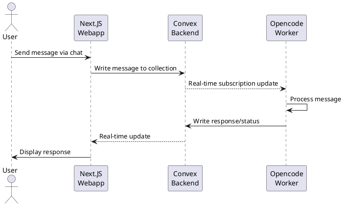
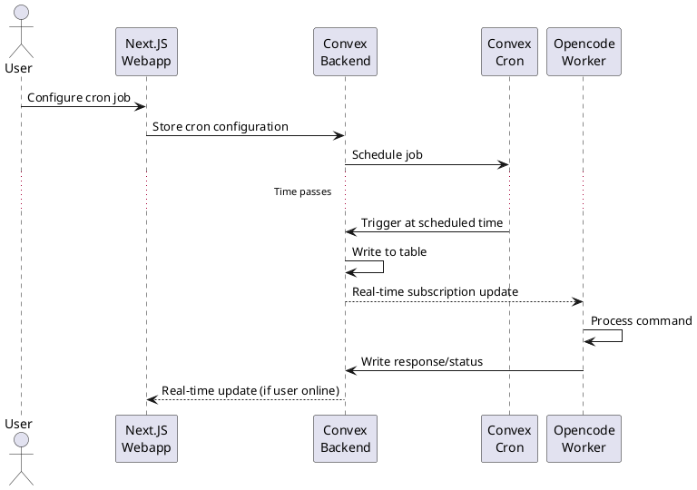
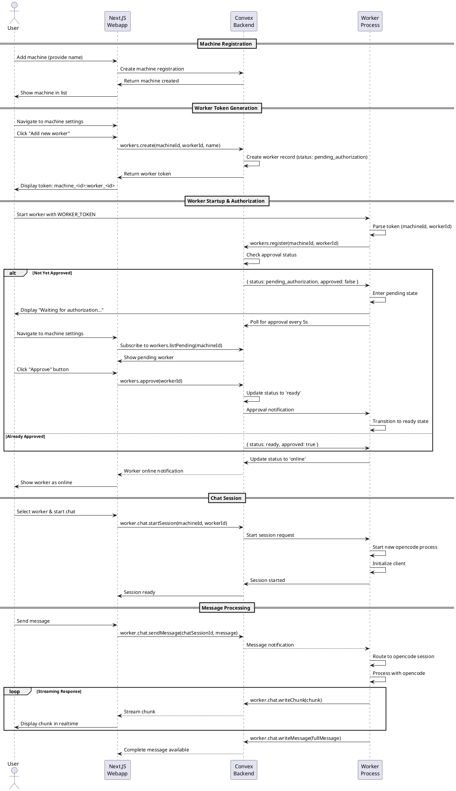

# Opencode Orchestrator

## Overview

A distributed system for orchestrating local workers through a web interface, enabling users to delegate tasks to machines running the Opencode worker.

### System Components

1. **Next.JS Webapp** - Web interface for users to orchestrate workers via chat
2. **Convex Backend** - Realtime backend that captures messages in a stateful way and facilitates communication between workers and frontend
3. **Opencode Worker** - Local application that subscribes to a Convex collection and processes delegated tasks
   - **Development Mode**: Single worker using `.env` configuration for local development
   - **Production Mode**: Multi-worker orchestration from centralized `~/.config/opencode-orchestrator/workers.json` configuration

## Core Flows

### Flow 1: Ad-hoc Message Processing

Users can send messages in real-time that are processed immediately by the Opencode worker.



### Flow 2: Scheduled Job Processing

Users can configure cron jobs that are handled by Convex, which writes to a table at specified times for worker processing.



### Flow 3: Worker Registration and Usage

Complete flow from machine registration to executing worker tasks with individual worker token authentication.



#### Key Components

**Machine Registration**

- Machines are created from the web UI with a user-friendly name
- Each machine belongs to a specific user
- Machines track online/offline status via heartbeat
- No direct authentication token - workers authenticate individually

**Worker Token Management**

- Each worker gets a unique token: `machine_<machineId>:worker_<workerId>`
- Workers require explicit user approval before they can start
- Token format clearly identifies both machine and worker
- Individual worker compromise doesn't affect other workers or the machine

**Worker Authorization Flow**

Workers have two independent status dimensions:

1. **Approval Status** (authorization dimension):

   - `pending` - Waiting for user approval (initial state)
   - `approved` - User has authorized this worker
   - `revoked` - User has revoked authorization

2. **Operational Status** (runtime dimension):
   - `offline` - Worker is not running
   - `online` - Worker is actively connected

Key behaviors:

- New workers start with `approvalStatus: pending` and `status: offline`
- Worker polls backend every 5 seconds for approval
- User approves workers through machine settings UI
- Once approved, `approvalStatus` becomes `approved` (permanent unless revoked)
- When worker connects, `status` changes to `online`
- When worker disconnects, `status` changes to `offline`
- Approved workers remain approved across restarts (offline → online transitions)
- Workers can be individually revoked without affecting others

**Chat Interface**

- `worker.chat.startSession(machineId, workerId)` - Initializes opencode process
- `worker.chat.sendMessage(chatSessionId, message)` - Sends user message
- `worker.chat.writeChunk(chunk)` - Streams response chunks
- `worker.chat.writeMessage(fullMessage)` - Sends complete message

**Dual Channel Response**

- Chunk channel: Real-time streaming updates
- Message channel: Complete message delivery
- Frontend subscribes to chunks for live updates

## Design Decisions

### Authentication & Security

**Worker Token Authentication**

- Format: `machine_<machine_id>:worker_<worker_id>:secret_<secret>`
- Each worker gets a unique token with cryptographic secret generated from the web UI
- Workers require explicit user approval before they can start
- Individual worker compromise doesn't affect the entire cluster
- **Development Mode**: Tokens stored in worker's `.env` file as `WORKER_TOKEN`
- **Production Mode**: Tokens stored in `~/.config/opencode-orchestrator/workers.json` with additional configuration

**Security Benefits**

- **Granular Control**: Each worker can be approved/revoked independently
- **Reduced Blast Radius**: Compromised token only affects one worker
- **Audit Trail**: Track which user approved which worker and when
- **Explicit Authorization**: No worker can start without user approval
- **Machine Isolation**: Machine record has no authentication credentials

### Worker Deployment & Configuration

**Development Mode**

- Single worker process for local development
- Configuration via `.env` file in worker directory
- Working directory: `process.cwd()` (current directory)
- Command: `pnpm run dev` (with auto-reload)
- Use case: Local development, testing, single project

**Production Mode**

- Multi-worker orchestration from centralized configuration
- Configuration via `~/.config/opencode-orchestrator/workers.json`
- Supports JSONC format (JSON with `//` and `/* */` comments)
- Each worker has explicit `working_directory` (mandatory)
- Command: `pnpm run opencode-orchestrator`
- Use case: Production deployments, multiple projects, persistent configuration

**Configuration Format (Production)**

```jsonc
{
  "workers": [
    // Main project worker
    {
      "token": "machine_abc123:worker_xyz789:secret_def456ghi789jkl012",
      "working_directory": "~/Documents/Projects/main-project",  // Required
      "convex_url": "https://your-deployment.convex.cloud"
    }
  ]
}
```

**Worker Behavior**

- Workers start in parallel with isolated failure handling
- Partial failures don't affect other workers
- Graceful shutdown with 30-second timeout
- Path expansion: Supports `~` (home directory) and relative paths
- Validation: All fields mandatory with clear error messages

### Worker Identity & Concurrency

**Directory-Bound Workers**

- Workers are bound to specific directories on the machine
- Worker identity persists across machine restarts
- Multiple concurrent chat sessions are supported per worker
- Each chat session spawns its own opencode process and session
- Enables parallel task execution within the same worker context
- **Production Mode**: Multiple workers can run across different directories simultaneously

**Session Lifecycle & Timeouts**

- Default session idle timeout: 5 minutes
- If opencode process is terminated and user sends a message:
  1. Worker starts new opencode process
  2. Runs `client.sessions` command
  3. Resumes session using session ID from Convex
- All chat messages include session ID for routing and recovery

### State Management & Recovery

**Stateless Worker Process**

- All worker registrations and state are stored in Convex
- Worker state is fully recoverable using only the worker token
- Worker process can die and restart without data loss
- On restart, worker queries Convex to restore:
  - Approval status (persistent across restarts)
  - Active chat sessions
  - Pending tasks

**Implications**

- Convex is the source of truth for all orchestration state
- Workers are stateless execution environments
- Graceful recovery from worker crashes
- Simplified worker deployment (no local state to backup)
- Workers automatically resume approved status on restart
- Approval status is independent of operational status (offline/online)

### ID Allocation Strategy

**Client-Generated IDs**

The system uses nanoid for all primary identifiers to maintain control over ID generation and avoid dependency on Convex's auto-generated IDs.

| Entity       | ID Source            | Generated By       | Notes                                           |
| ------------ | -------------------- | ------------------ | ----------------------------------------------- |
| Machine      | `machine_id`         | Frontend (webapp)  | Used in worker token                            |
| Worker       | `worker_id`          | Frontend (webapp)  | Part of worker token                            |
| Chat Session | `chatSessionId`      | Backend (Convex)   | Primary identifier for database and routing     |
| Chat Session | `opencodeSessionId`  | OpenCode SDK       | Maps to OpenCode's internal session for AI chat |

**Session ID Mapping**

Chat sessions use TWO distinct IDs to bridge the orchestration layer and AI layer:

- **ChatSessionId** (Convex-generated): Primary identifier used for database operations, frontend routing, and URL state
- **OpencodeSessionId** (SDK-generated): Secondary identifier used for AI model interactions via OpenCode SDK
- The mapping between these IDs is stored in Convex (`chatSessions.opencodeSessionId`) for session restoration

**Branded Types**

The system uses TypeScript branded types to prevent confusion between different session types:
- `ChatSessionId` - Chat conversation sessions
- `OpencodeSessionId` - OpenCode AI sessions  
- `AuthSessionId` - User authentication sessions

**Rationale**

- **Predictable IDs**: nanoid provides consistent, URL-safe identifiers
- **Decoupled from DB**: Not dependent on Convex's internal ID scheme
- **Session Restoration**: Mapping is persisted to survive worker restarts
- **Cross-system Identity**: IDs are meaningful across system boundaries
- **Type Safety**: Branded types prevent accidental ID confusion at compile time

**Convex Internal IDs**

- Convex-generated IDs are ignored for business logic
- Used only for internal DB operations (indexes, relations)
- All queries/mutations use the custom IDs as primary identifiers

## Discussion Notes

_Additional notes and open questions._
