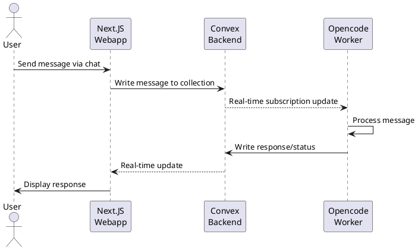
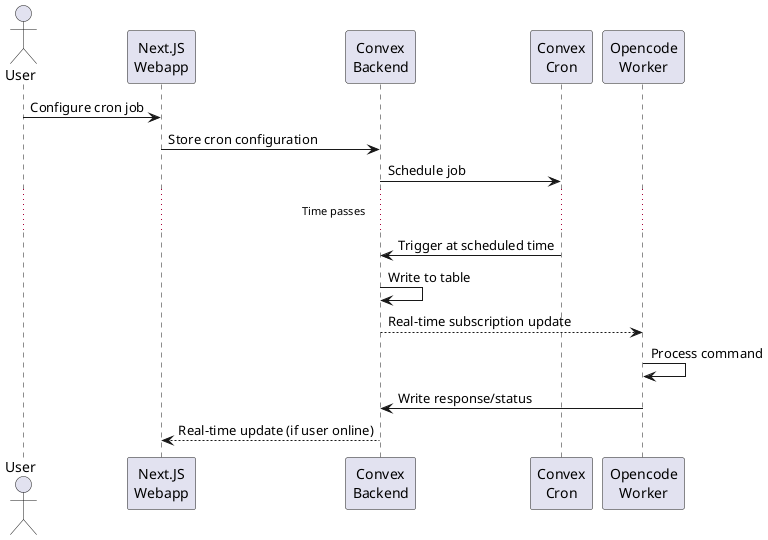
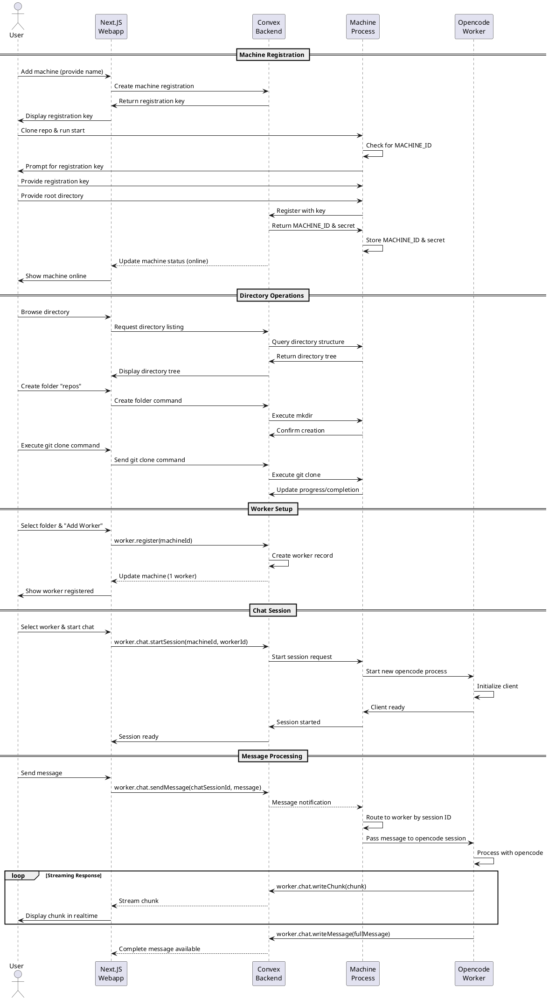

# Opencode Orchestrator

## Overview

A distributed system for orchestrating local workers through a web interface, enabling users to delegate tasks to machines running the Opencode worker.

### System Components

1. **Next.JS Webapp** - Web interface for users to orchestrate workers via chat
2. **Convex Backend** - Realtime backend that captures messages in a stateful way and facilitates communication between workers and frontend
3. **Opencode Worker** - Local application that subscribes to a Convex collection and processes delegated tasks

## Core Flows

### Flow 1: Ad-hoc Message Processing

Users can send messages in real-time that are processed immediately by the Opencode worker.

### Flow 2: Scheduled Job Processing

Users can configure cron jobs that are handled by Convex, which writes to a table at specified times for worker processing.

### Flow 3: Worker Registration and Usage

Complete flow from machine registration to executing worker tasks.

#### Key Components

**Machine Registration**

- Registration key-based authentication
- Persistent storage of MACHINE_ID and secret
- Root directory configuration for sandboxed operations

**Worker Management**

- Workers are associated with specific directories on machines
- `worker.register(machineId)` creates worker instance
- Multiple workers can exist per machine

**Chat Interface**

- `worker.chat.startSession(machineId, workerId)` - Initializes opencode process
- `worker.chat.sendMessage(chatSessionId, message)` - Sends user message
- `worker.chat.writeChunk(chunk)` - Streams response chunks
- `worker.chat.writeMessage(fullMessage)` - Sends complete message

**Dual Channel Response**

- Chunk channel: Real-time streaming updates
- Message channel: Complete message delivery
- Frontend subscribes to chunks for live updates

## Design Decisions

### Authentication & Security

**Machine Token**

- Format: `<machine_id>:<machine_secret>`
- Generated automatically when user creates a machine from the UI
- Token is one-time use during registration
- Machine authenticates to Convex using the combined token
- Both ID and secret are generated client-side using nanoid

### Worker Identity & Concurrency

**Directory-Bound Workers**

- Workers are bound to specific directories on the machine
- Worker identity persists across machine restarts
- Multiple concurrent chat sessions are supported per worker
- Each chat session spawns its own opencode process and session
- Enables parallel task execution within the same worker context

**Session Lifecycle & Timeouts**

- Default session idle timeout: 5 minutes
- If opencode process is terminated and user sends a message:
  1. Worker starts new opencode process
  2. Runs `client.sessions` command
  3. Resumes session using session ID from Convex
- All chat messages include session ID for routing and recovery

### State Management & Recovery

**Stateless Machine Process**

- All worker registrations are stored in Convex
- Machine state is fully recoverable using only the machine token
- Machine process can die and restart without data loss
- On restart, machine queries Convex to restore:
  - List of registered workers
  - Active chat sessions
  - Pending tasks

**Implications**

- Convex is the source of truth for all orchestration state
- Machines are stateless execution environments
- Graceful recovery from machine crashes
- Simplified machine deployment (no local state to backup)

### ID Allocation Strategy

**Client-Generated IDs**

The system uses nanoid for all primary identifiers to maintain control over ID generation and avoid dependency on Convex's auto-generated IDs.

| Entity       | ID Source    | Generated By      | Notes                                  |
| ------------ | ------------ | ----------------- | -------------------------------------- |
| Machine      | `machine_id` | Frontend (webapp) | Part of machine token                  |
| Worker       | `worker_id`  | Machine process   | Reported to Convex during registration |
| Chat Session | `session_id` | Opencode          | Source of truth for session identity   |

**Rationale**

- **Predictable IDs**: nanoid provides consistent, URL-safe identifiers
- **Decoupled from DB**: Not dependent on Convex's internal ID scheme
- **Session Resumption**: Opencode session IDs can be used directly without translation
- **Cross-system Identity**: IDs are meaningful across system boundaries

**Convex Internal IDs**

- Convex-generated IDs are ignored for business logic
- Used only for internal DB operations (indexes, relations)
- All queries/mutations use the custom IDs as primary identifiers

## Discussion Notes

_Additional notes and open questions._
